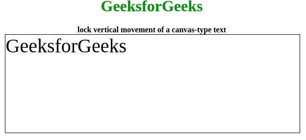

# 如何使用 Fabric.js 锁定文本画布的垂直移动？

> 原文:[https://www . geeksforgeeks . org/如何锁定使用织物的文本画布的垂直移动-js/](https://www.geeksforgeeks.org/how-to-lock-the-vertical-movement-of-a-text-canvas-using-fabric-js/)

在本文中，我们将看到如何使用 FabricJS 锁定文本画布的垂直移动。画布意味着书写的文本是可移动的、可旋转的、可调整大小的，并且可以根据需要拉伸，但是我们将锁定垂直移动，以便它不能上下移动。此外，文本本身不能像文本框一样编辑。
为了实现这一点，我们将使用一个名为 FabricJS 的 JavaScript 库。使用 CDN 导入库后，我们将在主体标签中创建一个包含文本的**画布**块。在此之后，我们将初始化由 FabricJS 提供的画布和文本的实例，并使用 **lockMovementY** 属性来锁定垂直移动，并在文本上渲染画布，如下例所示。

**语法:**

```html
fabric.Text(text, lockMovementY: boolean);
```

**参数:**该函数接受两个参数，如上所述，如下所述:

*   **文本:**指定要写入的文本。
*   **lockMovementX:** 指定是启用还是禁用垂直移动锁定，默认禁用。

**程序:**我们可以使用 FabricJS 来锁定画布状文本的垂直移动，如下图所示。

## 超文本标记语言

```html
<!DOCTYPE html>
<html>

<head>
    <title>
        Lock vertical movement of a canvas-type text with JavaScript
    </title>

    <!-- Loading the FabricJS library -->
    <script src=
"https://cdnjs.cloudflare.com/ajax/libs/fabric.js/3.6.2/fabric.min.js">
    </script>
    <style>
        h1 {
            color: green;
        }
    </style>
</head>

<body>
    <center>
        <h1>GeeksforGeeks</h1>
        <b>lock vertical movement of a canvas-type text</b>
        <canvas id="canvas" width="600" height="200"
                style="border:1px solid #000000;">
        </canvas>

        <script>
            // Create a new instance of Canvas
            var canvas = new fabric.Canvas("canvas");

            // Create a new Text instance
            var text = new fabric.Text('GeeksforGeeks', {
                lockMovementY: true
            });

            // Render the text on Canvas
            canvas.add(text);
        </script>
    </center>
</body>

</html>
```

**输出:**

