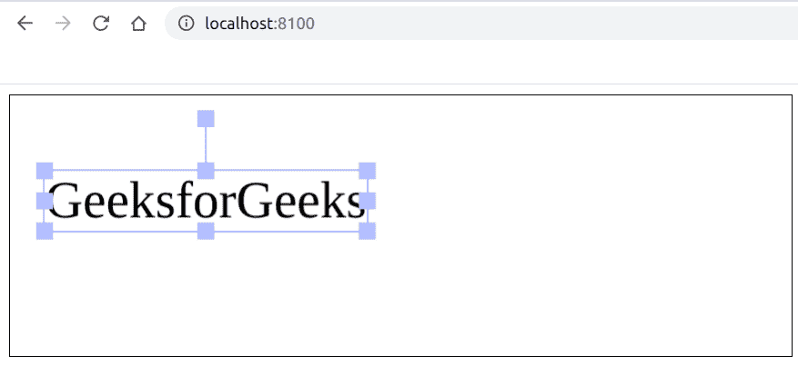

# 如何用 Fabric.js 让文本画布中的控制角不透明？

> 原文:[https://www . geesforgeks . org/how-make-control-corners-in-text-canvas-use-fabric-js/](https://www.geeksforgeeks.org/how-to-make-controlling-corners-opaque-in-text-canvas-using-fabric-js/)

在本文中，我们将看到如何使用 FabricJS 使画布状文本的控制角变得不透明。画布意味着书写的文本是可移动的、可旋转的、可调整大小的，并且可以拉伸。但是在本文中，我们将使控制角变得不透明。此外，文本本身不能像文本框一样编辑。

**方法:**为了实现这一点，我们将使用一个名为 FabricJS 的 JavaScript 库。使用 CDN 导入库后，我们将在主体标签中创建一个包含文本的*画布*块。在这之后，我们将初始化由 FabricJS 提供的 Canvas 和 Text 的实例，并使用**透明角**属性使控制角不透明，并在 Text 上渲染 Canvas，如下例所示。

**语法:**

```
 fabric.text(text :string, transparentCorners: boolean); 
```

**参数:**该函数接受两个参数，如上所述，如下所述:

*   **文本:**指定文本。
*   **透明角:**指定是保持控制角透明还是不透明。

**程序:**本示例使用 FabricJS 相对于画布状文本的顶部进行定位，如下所示。

```
<!DOCTYPE html>
<html>

<head>
    <title>
        How to make controlling corners opaque
        in text canvas using Fabric.js ?
    </title>

    <!-- Loading the FabricJS library -->
    <script src=
"https://cdnjs.cloudflare.com/ajax/libs/fabric.js/3.6.2/fabric.min.js">
    </script>
</head>

<body>
    <canvas id="canvas" width="600" height="200" 
        style="border:1px solid #000000;">
    </canvas>

    <script>

        // Create a new instace of Canvas
        var canvas = new fabric.Canvas("canvas");

        // Create a new Text instance
        var text = new fabric.Text('GeeksforGeeks', {
            transparentCorners: false
        });
        // Render the text on Canvas
        canvas.add(text);
    </script>
</body>

</html>
```

**输出:**
