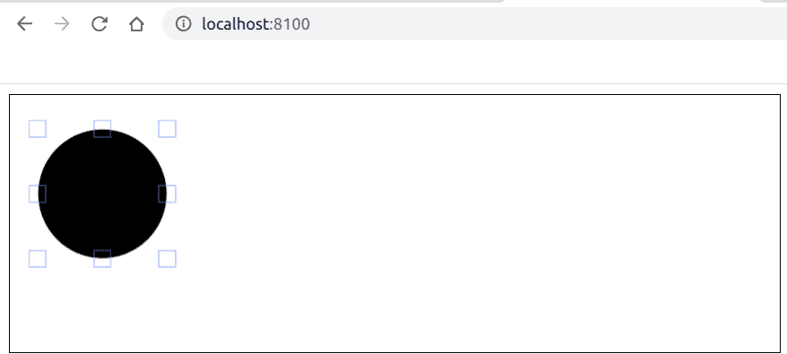

# 如何用 Fabric.js 去除画布圆的控制边框？

> 原文:[https://www . geeksforgeeks . org/如何移除-控制-画布-圆圈-使用-织物-js/](https://www.geeksforgeeks.org/how-to-remove-controlling-borders-of-a-canvas-circle-using-fabric-js/)

在本文中，我们将看到如何使用 FabricJS 移除画布圆圈的控制边框。画布意味着圆是可移动的，可以根据需要拉伸。此外，当涉及到初始笔画颜色、填充颜色、笔画宽度或半径时，可以对圆进行自定义。

**方法:**为了使其成为可能，我们将使用一个名为 FabricJS 的 JavaScript 库。使用 CDN 导入库后，我们将在主体标签中创建一个包含我们的圆的*画布*块。之后，我们将初始化由 FabricJS 提供的 Canvas 和 Circle 的实例，并使用 **hasBorders** 属性移除圆形的控制边界，并在 Canvas 上渲染圆形，如下例所示。

**语法:**

```
fabric.Circle({
    radius: number,
    hasBorders: boolean
});
```

**参数:**该函数接受两个参数，如上所述，如下所述:

*   **半径:**指定半径。
*   **有边框:**指定是否显示边框。默认值为真。

**示例:**本示例使用 FabricJS 移除画布圆的控制边框。请注意，您必须单击对象才能看到边框。

```
<!DOCTYPE html>
<html>

<head>
    <title>
        How to remove controlling borders of
        a canvas circle using FabricJS?
    </title>

    <!-- FabricJS CDN -->
    <script src=
"https://cdnjs.cloudflare.com/ajax/libs/fabric.js/3.6.2/fabric.min.js">
    </script>
</head>

<body>
    <canvas id="canvas" width="600" height="200" 
        style="border:1px solid #000000">
    </canvas>

    <script>

        // Initiate a Canvas instance
        var canvas = new fabric.Canvas("canvas");

        // Initiate a Circle instance
        var circle = new fabric.Circle({
            radius: 50,
            hasBorders: false
        });

        // Render the circle in canvas
        canvas.add(circle);
    </script>
</body>

</html>
```

**输出:**
