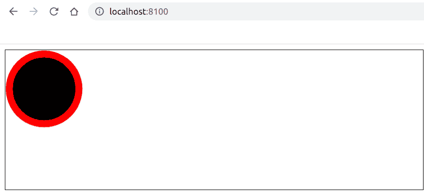

# 如何用 Fabric.js 设置画布圆的笔画宽度？

> 原文:[https://www . geesforgeks . org/如何使用织物设置画布圆的笔画宽度-js/](https://www.geeksforgeeks.org/how-to-set-stroke-width-of-a-canvas-circle-using-fabric-js/)

在本文中，我们将看到如何使用 FabricJS 设置画布圆的笔画宽度。画布意味着圆是可移动的，可以根据需要拉伸。此外，当涉及到初始笔画颜色、填充颜色、笔画宽度或半径时，可以定制该圆。

**方法:**为了使其成为可能，我们将使用一个名为 FabricJS 的 JavaScript 库。使用 CDN 导入库后，我们将在主体标签中创建一个包含我们的圆的*画布*块。之后，我们将初始化 FabricJS 提供的 Canvas 和 Circle 实例，并分别使用**描边**和**描边宽度**属性设置圆形的描边颜色和描边宽度，并在 Canvas 上渲染圆形，如下例所示。

**语法:**

```
fabric.Circle({
    radius: number,
    stroke: string,
    strokeWidth: number
}); 

```

**参数:**该功能接受三个参数，如上所述，描述如下:

*   **半径:**指定半径。
*   **笔画:**指定笔画颜色。
*   **笔画宽度:**指定笔画宽度。

**示例:**本示例使用 FabricJS 设置画布圆的笔画宽度。

```
<!DOCTYPE html>
<html>

<head>
    <title> 
        How to set stroke width of a 
        canvas circle using FabricJS?
    </title>

    <!-- FabricJS CDN -->
    <script src=
"https://cdnjs.cloudflare.com/ajax/libs/fabric.js/3.6.2/fabric.min.js">
    </script>
</head>

<body>
    <canvas id="canvas" width="600" height="200" 
        style="border:1px solid #000000">
    </canvas>

    <script>

        // Initiate a Canvas instance
        var canvas = new fabric.Canvas("canvas");

        // Initiate a Circle instance
        var circle = new fabric.Circle({
            radius: 50,
            stroke: "red",
            strokeWidth: 10
        });

        // Render the circle in canvas
        canvas.add(circle);
    </script>
</body>

</html>
```

**输出:**

