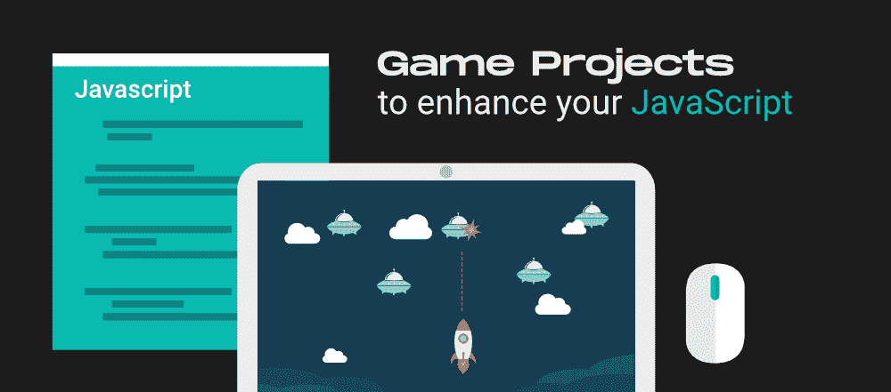

# 7 个有趣的游戏项目提升你的 JavaScript 技能

> 原文:[https://www . geesforgeks . org/7-有趣-游戏-项目-提升-你的-JavaScript-技能/](https://www.geeksforgeeks.org/7-interesting-game-projects-to-enhance-your-javascript-skills/)

**JavaScript** 确实是科技世界中最受欢迎、需求最多、使用最多的编程语言之一。该语言为–**客户端和服务器端开发**提供了重要支持。此外，它还有广泛的应用，如网络开发、移动应用开发、游戏开发、创建网络服务器等。你需要知道 JavaScript 正在被众多知名科技公司使用，包括**谷歌、微软、脸书、**以及更多。因此，简而言之，如果你期待学习 JavaScript，那么这将是对你来说最有回报和最有价值的职业决定之一。

现在，正如他们所说，最好的学习方式是‘边做边学’——你绝对应该尝试构建几个重要的 JavaScript项目来提升你的 JavaScript 技能。特别是，你可以考虑用 JavaScript 创建几个**游戏项目，因为这不仅会让你精通 JavaScript，而且你学习 JavaScript 和项目开发的旅程也会变得更加精彩、有趣和愉快。有众多的 JavaScript 游戏项目，如*文字争夺战、外星入侵者游戏、*等。你可以考虑。带着同样的担忧，在这篇文章中，我们将查看 **7 个最有趣的游戏项目**的列表，这些项目肯定会帮助你**提升你的 JavaScript 技能**。**

让我们开始吧:

### 1.神奇八球

神奇八球基本上是一款早在 50 年代就已经开发出来的算命游戏。好奇想知道它是怎么预测运势的？用户一提问(用户可能会问 Raju 你叫什么名字？还是你的名字不是拉朱？)谁的答案选择是或不是，魔球揭示的答案，你可以看到它的表面。

但事实是，像“不”这样与“是”或“否”相关的可能性是存在的，当然不是！！，以后再问，我真的不在乎，还有很多(数量可能超过 10 个)。所有这些都让这个游戏项目变得有趣，你必须从:–

*   *创建* **魔法八球** *页面的结构，该页面将呈现一个矩形空间，要求您键入问题。然后，您将看到一个“摇动”按钮，它在您眼前展示了与“是/否”响应相关的可能性。*
*   *在 HTML 中准备好结构后，你将使用一些 JavaScript 和 CSS 代码来适当显示表面写有* *数字 8 的魔球。*
*   *现在是添加相关逻辑的时候了，这将有助于生成一系列证明是/否答案选择的预测。*
*   *最后，您必须通过键入“JavaScript 比 C 或 C++更好吗？”来测试这个预测性的魔术八球游戏项目。*

### 2.抛硬币游戏

抛硬币游戏，顾名思义，将提醒你那些日子，你即将开始一场板球比赛，通过正面或反面作为决定因素。此外，这个双人游戏(第一个玩家显然是你，第二个肯定是电脑)会告诉你当前的分数，以及你需要额外得分才能赢得与电脑的比赛的信息，然后在“头”或“尾”之间进行选择。

仍然没有被这个游戏将呈现的观点所迷惑！！看看实现这个游戏的步骤，它的赢家将在五次猜测中被宣布，这些猜测要求很高的 CSS 样式&按照适当的 JavaScript 语法编码的 DOM 操作、条件和游戏逻辑函数:–

*   *创建<按钮>、<分区>以及属性。这些属性将在 HTML 元素中。*
*   *添加标签<脚本>。然后尽量不要避免将事件监听器(根据事件* **【正面】或【反面】** *触发的运行结果)附加到<按钮>上，这将很好地实现 fnClick 功能。*
*   *现在在 fnClick 函数中有效地应用 Math.random()。因此，作为这个游戏项目的结果，一个抛硬币游戏从现在开始为你服务，模拟像正面或反面这样的结果，次数是包括你在内的用户想要的 5 次。*

### 3.单词加扰

这个竞技和解决问题的游戏项目可以训练 8 到 59 岁不同年龄段**的人的大脑。这是因为你需要从以无意义的方式排列的字母中猜出合适的单词。在你确定了合适的单词并且游戏发现它是正确的之后，计算机会生成一条消息，“太棒了！！这个词是正确的”。**

**否则，计算机会生成类似“对不起！！请尝试找到正确的”。所有这些难道不会鼓励你更多地了解它的代码吗？看，你需要:**

*   ***生成字母没有按有意义的顺序排列的单词列表。***
*   ***使用 addEventListener():在游戏中添加猜测单词的事件，每当你回答一个可以正确也可以不正确的单词时，这个事件就会调用自己。***

**荣誉！！你现在可以自由地训练你的大脑来扩展你的词汇量和解决问题的能力，从而击败竞争对手。**

### **4.点击形状游戏**

**使用 JavaScript 和一些 CSS 样式点击形状游戏项目给你 1 秒钟的时间，你必须赢得 15 分。想想你将如何获得这些分数！！为了获得它们，你可以多次点击鼠标光标来生成任何形状，如圆形、矩形等。其选择已经被编程。**

**现在，看看下面的活动，当你通过 JavaScript 构建这个令人惊叹的**点击形状游戏项目**时，你会做些什么:–**

*   ***通过 JavaScript 操纵元素。***
*   ***定制事件监听器以访问与用户交互的特权。***
*   ***使用 JavaScript 超时和日期方法。***

### **5.追逐者方块游戏**

**追逐者盒子游戏项目是最简单的追逐游戏之一，即使是初学者也可以在没有或很少指导的情况下玩。现在，你可能会思考这个游戏是关于什么的！！所以，在这个游戏中，你会看到两个盒子，一个是绿色的，另一个是红色的。使用键盘按钮，继续移动红色方框，直到它到达绿色方框的表面。**

**为了构建这个可以灵活玩的追逐者盒子游戏，你应该编写 JavaScript 代码，比如移动红色盒子，在红色盒子穿过绿色盒子后停止它的移动。你现在还在等什么？通过应用包含各种变量和函数的 JavaScript 代码片段来创建这个有趣的追逐者盒子游戏。**

### **6.外星入侵者游戏**

**这个外星入侵者游戏项目模仿了入侵一个充满外星人的区域的本质，这样你就可以在 15 到 40 秒的特定时间内杀死他们。在这个项目中，你将学习如何处理一些外星人会以你为目标的情况，无论如何你都需要逃离那里。**

**无缝地，为了创建这个严肃的**外星入侵者游戏**，你需要一些 JavaScript 函数，它们是:-**

*   ***功能 draw():用于将外星人移向正在向他们射击的玩家。***
*   ***功能 moveShooter():将玩家从一个位置移动到另一个位置(比如向左或向右)。***
*   ***功能 remove():在外星人被射杀后将其移除。***
*   ***功能射击():这让玩家射击外星人。***

### **7.元素捕捉游戏**

**元素捕捉游戏，根据它的名字，让你从垂直方向一个接一个落下的元素中挑选许多元素。此外，计算机将显示在您正在播放的持续时间内有多少元素被您拾取。通过这个游戏项目，您将了解到使用不需要任何库的 JavaScript 程序动态更新文档的结构和内容是多么灵活。**

**思考你将使用哪些功能？所以，你将利用:-**

*   ***getBoundingClientRect():用于估计一个接一个落下的元素(从视口)的大小和相对位置。***
*   ***querySelector():用于通过更新你在游戏中选择的元素数量来选择元素。***