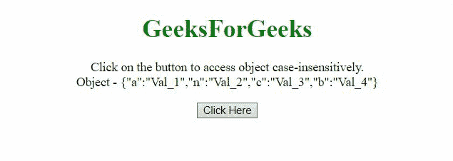
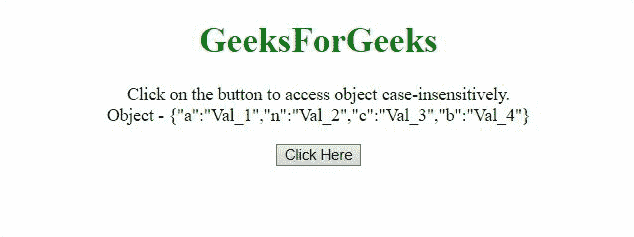

# 在 JavaScript 中不区分大小写地访问对象属性

> 原文:[https://www . geesforgeks . org/access-object-property-case-unsensitive-in-JavaScript/](https://www.geeksforgeeks.org/access-object-property-case-insensitively-in-javascript/)

如何在不区分大小写的情况下访问对象的属性，在本文中，我们将讨论如何在 JavaScript 中不区分大小写地访问对象属性。

**方法 1:** 在这种方法中，将键传递给函数，在比较时，使用 [**toLowerCase()方法**](https://www.geeksforgeeks.org/javascript-string-prototype-tolowercase/) 将传递的键和对象的键转换为小写。然后比较这些键，如果它们相同，则返回它的值。

**示例:**

```

<!DOCTYPE html>
<html>
    <head>
        <title>
            Access Object property 
          case-insensitively in JavaScript
        </title>
    </head>
    <body style="text-align: center;">
        <h1 style="color: green;">
            GeeksForGeeks
        </h1>
        <p id="GFG_UP"></p>
        <button onclick="gfg_Run()">
            Click Here
        </button>
        <p id="GFG_DOWN"></p>
        <script>
            var el_up = document.getElementById("GFG_UP");
            var el_down = document.getElementById("GFG_DOWN");
            var GFG_Object = {
                a: "Val_1",
                n: "Val_2",
                c: "Val_3",
                b: "Val_4",
            };
            el_up.innerHTML = 
              "Click on the button to access object "+
              "case-insensitively.<br>Object - " 
              + JSON.stringify(GFG_Object);
            function findVal(obj, prop) {
                prop = (prop + "").toLowerCase();
                for (var p in obj) {
                    if (obj.hasOwnProperty(p) && prop == 
                        (p + "").toLowerCase()) {
                        return obj[p];
                    }
                }
            }
            function gfg_Run() {
                var key = "A";
                el_down.innerHTML = "Key - '" + 
                  key + "'<br>Value - '"
                  + findVal(GFG_Object, key) + "'";
            }
        </script>
    </body>
</html>
```

**输出:**



**方法 2:** 这里的方法和前面的例子一样，使用 [**Object.keys()方法**](https://www.geeksforgeeks.org/object-keys-javascript/) ，以紧凑的方式进行操作。

**示例:**

```
<!DOCTYPE html>
<html>
    <head>
        <title>
            Access Object property 
          case-insensitively in JavaScript
        </title>
    </head>
    <body style="text-align: center;">
        <h1 style="color: green;">
            GeeksForGeeks
        </h1>
        <p id="GFG_UP"></p>
        <button onclick="gfg_Run()">
            Click Here
        </button>
        <p id="GFG_DOWN"></p>
        <script>
            var el_up = document.getElementById("GFG_UP");
            var el_down = document.getElementById("GFG_DOWN");
            var GFG_Object = {
                a: "Val_1",
                n: "Val_2",
                c: "Val_3",
                b: "Val_4",
            };
            el_up.innerHTML = 
              "Click on the button to access object "+
              "case-insensitively.<br>Object - " 
              + JSON.stringify(GFG_Object);
            function gfg_Run() {
                var ObjKey = "A";
                el_down.innerHTML = "Key - '" 
                  + ObjKey + "'<br>Value - '" 
+ GFG_Object[Object.keys(GFG_Object).find((key) => 
          key.toLowerCase() === ObjKey.toLowerCase())];
                +"'";
            }
        </script>
    </body>
</html>
```

**输出:**

