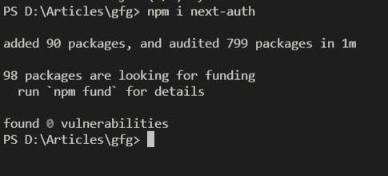
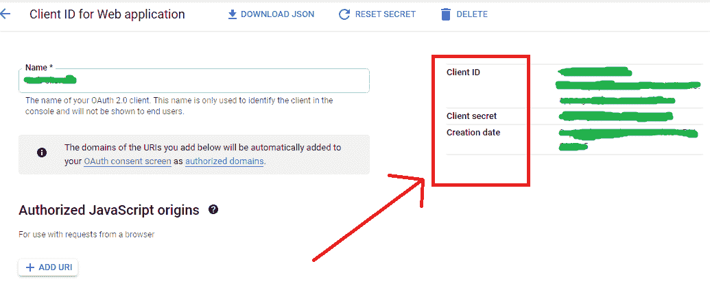
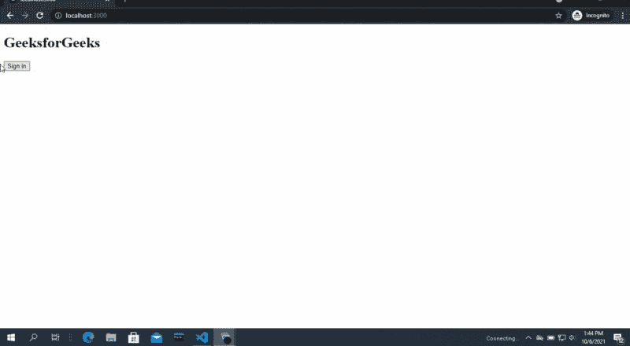

# 使用 NextAuth 在 Next.js 中添加用户认证

> 原文:[https://www . geesforgeks . org/add-user-auth-in-next-js-using-next auth/](https://www.geeksforgeeks.org/adding-user-authentication-in-next-js-using-nextauth/)

在本文中，我们将学习如何在我们的 NextJS 项目中添加用户身份验证。NextJS 是一个基于 React 的框架。它有能力为不同的平台开发漂亮的网络应用程序，如视窗、Linux 和 mac。动态路径的链接有助于有条件地呈现您的 NextJS 组件。

**方法:**为了在我们的项目中首先添加用户认证，我们将安装 nextauth 模块。之后，我们将使用[…nextauth]创建一个动态文件。js 名称。然后，我们将在该文件中添加不同的提供程序进行身份验证。之后，我们将在主页上添加登录和注销选项。

**创建下一个应用程序:**

**步骤 1:** 您可以使用以下命令创建一个新的 NextJs 项目:

```
npx create-next-app gfg
```

**项目结构:**会是这样的。


**步骤 2:** 使用以下命令安装下一个身份验证:

```
npm i next-auth
```



**第三步:**现在去谷歌开发者控制台，获取你的 Oauth API ID 和密钥。



**步骤 4:** 现在在页面/api 目录内创建一个新文件夹，并命名该文件夹授权。在该文件夹中创建一个名为**[…下一个作者】的新文件。js** 并在那个文件中添加下面的代码。

```
import NextAuth from "next-auth"
import GoogleProvider from "next-auth/providers/google"

export default NextAuth({

  providers: [
    GoogleProvider({
      clientId: CLIENT_ID,
      clientSecret: CLIENT_SECRET,
    }),
  ],
})
```

这里我们首先从 next-auth 导入 NextAuth 和 GoogleProvider。之后，我们只使用谷歌作为我们的认证提供商。

**第 5 步:**现在我们将在每个页面上添加 Provider，为此，我们将在我们的 _app.js 文件中添加 Provider。在您的**app . js**文件中添加以下代码。

```
import { Provider } from "next-auth/client"

export default function App({
  Component,
  pageProps: { session, ...pageProps },
}) {
  return (
    <Provider session={session}>
      <Component {...pageProps} />
    </Provider>
  )
}
```

**第六步:**现在我们可以在主页上添加登录和注销按钮了。为此，我们将使用 useSession()钩子来检查用户是否登录。我们将在我们的**索引. js** 文件中添加下面的代码。

```
import { useSession, signIn, signOut } from "next-auth/client"

export default function Component() {
  const { data: session } = useSession()
  if (session) {
    return (
      <>
        <h1>GeeksforGeeks</h1>
        <button onClick={() => signOut()}>Sign out</button>
      </>
    )
  }
  return (
    <>
      <h1>GeeksforGeeks</h1>
      <button onClick={() => signIn()}>Sign in</button>
    </>
  )
}
```

这里我们首先检查会话是否存在。如果会话存在，这意味着用户已经登录，那么我们将显示用户注销按钮，但是如果用户没有登录，那么我们将显示登录按钮。

**运行应用程序的步骤:**现在使用以下代码运行应用程序:

```
npm run dev
```

### 输出

