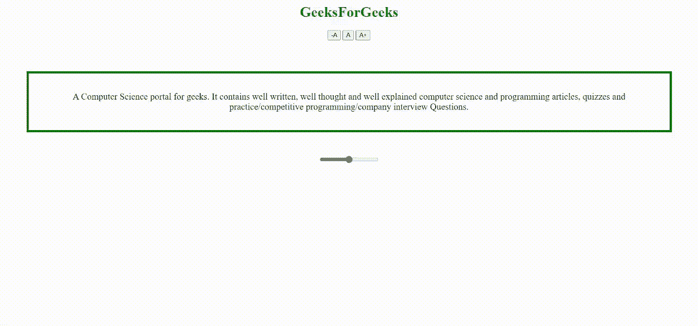

# 允许用户使用 JavaScript 更改网页的字体大小

> 原文:[https://www . geesforgeks . org/允许用户使用 javascript 更改网页字体大小/](https://www.geeksforgeeks.org/allow-users-to-change-font-size-of-a-webpage-using-javascript/)

如果你看过一些网站，尤其是一些印度政府门户网站，你会注意到页面最右上角有三个小按钮，看起来像这样: **-A A A+** 。这些按钮通常允许网站用户将整个页面或页面的某个部分的字体大小更改为特定的大小，以提高页面的可读性。在这篇文章中，我们将学习如何使用 JavaScript 为特定的 div 实现这个特性。然而，按钮的使用只为用户提供了几个改变字体大小的选项。使用 HTML 滑块允许用户在很大范围内选择字体大小，从而给用户更多的选择。因此，除了按钮之外，我们还将使用 HTML 滑块来实现相同的功能。

**进场:**

1.  定义由

    标签、滑块和 3 个按钮组成的

    标签。
2.  创建一个 JavaScript 函数来改变 div 部分内容的字体大小。使用 *OnClick()* 事件进行按钮点击&移动滑块，使用 *OnChange()* 事件。
3.  在点击按钮的情况下，使用 DOM 访问标签，从 javascript 本身更改字体大小属性的值。
4.  在移动滑块的情况下，再次使用 DOM 访问用户已经设置的滑块的值，并将该值用作标签的字体大小值。

我们将遵循上述方法来构建字体大小控制器&将使其逐步进行。

**第一步:**创建一个简单的 HTML 页面，包含三个按钮、一个由段落组成的 div 和一个滑块。我们将使用按钮或滑块来更改这个 div 内容的字体大小。我们将只应用基本的 CSS 样式。

## 超文本标记语言

```html
<!DOCTYPE html>
<html>

<body>
    <center>
        <h1 style="color: green">GeeksForGeeks</h1>
        <button type="button" name="btn1">-A</button>
        <button type="button" name="btn2">A</button>
        <button type="button" name="btn3">A+</button>
        <br /><br />
        <div style="padding: 20px; margin: 50px;
            font-size: 20px; border: 5px solid green;"
            id="container" class="container">

            <p>
                A Computer Science portal for geeks. 
                It contains well written, well thought 
                and well explained computer ming science 
                and programarticles,quizzes and practice/ 
                competitive programming/company interview 
                questions.
            </p>
        </div>

        <input type="range" min="10" max="30" 
                    id="slider" value="20" />
    </center>
</body>

</html>
```

**第二步:**我们将编写一个 JavaScript 函数，当用户点击按钮或移动滑块时，改变 div 的字体大小。通过使用 JavaScript 事件可以观察到这种变化。利用 *onClick()* 事件观察用户是否点击了按钮，利用 *onChange()* 事件感知用户是否移动了滑块。为两个触发器事件创建两个函数(即。 *onClick* 和 *onChange* 。

对于按钮功能，将为 *onClick* 事件创建一个参数化函数，其中每个按钮将发送一个唯一的数字，该数字将是 div 的字体大小。使用文档对象模块，我们可以访问我们的< div >标签，并从 javascript 本身更改字体大小属性的值。

对于滑块功能，将为 *onChange* 事件创建一个普通的非参数化函数。使用文档对象模块，我们可以访问用户设置的滑块值，并将该值用作我们的< div >标签的字体大小值。

## java 描述语言

```html
<script>
   var cont = document.getElementById("container");
   function changeSizeByBtn(size) {

     // Set value of the parameter as fontSize
     cont.style.fontSize = size;
   }
   function changeSizeBySlider() {
     var slider = document.getElementById("slider");

     // Set slider value as fontSize
     cont.style.fontSize = slider.value;
   }
</script>
```

**步骤 3:** 为按钮和滑块的事件属性添加适当的功能。单击按钮或移动滑块，您应该会看到 div 内容的字体大小正在发生变化。

**完整代码:**

## 超文本标记语言

```html
<!DOCTYPE html>
<html>

<body>
    <center>
        <h1 style="color: green">GeeksForGeeks</h1>
        <button type="button" 
            onclick="changeSizeByBtn(15)" name="btn1">
            -A
        </button>

        <button type="button" 
            onclick="changeSizeByBtn(20)" name="btn2">
            A
        </button>

        <button type="button" onclick="changeSizeByBtn(25)"
            name="btn3">
            A+
        </button>
        <br /><br />

        <div style="padding: 20px; margin: 50px;
            font-size: 20px; border: 5px solid green;" 
            id="container" class="container">

            <p>
                A Computer Science portal for geeks. 
                It contains well written, well thought 
                and well explained computer scienc and 
                programming articles quizzes and practice/ 
                competitive programming/company interview 
                questions.
            </p>
        </div>

        <input type="range" min="10" max="30" id="slider"
            onchange="changeSizeBySlider()" value="20" />
    </center>

    <script>
        var cont = document.getElementById("container");

        function changeSizeByBtn(size) {

            // Set value of the parameter as fontSize
            cont.style.fontSize = size;
        }

        function changeSizeBySlider() {
            var slider = document.getElementById("slider");

            // Set slider value as fontSize
            cont.style.fontSize = slider.value;
        }
    </script>
</body>

</html>
```

**输出:**



使用 JavaScript 更改字体大小