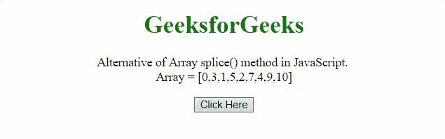
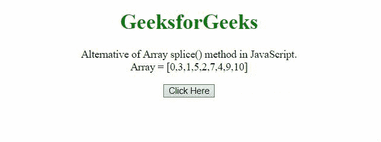

# JavaScript 中数组拼接()方法的替代

> 原文:[https://www . geesforgeks . org/替代数组拼接方法 in-javascript/](https://www.geeksforgeeks.org/alternative-of-array-splice-method-in-javascript/)

**数组拼接()方法**是 JavaScript 的一种方法，在本文中，我们将讨论这种方法的替代方法。下面讨论两个例子。

**方法 1:** 在这种方法中，startIndex(从哪里开始移除元素)和 count(要移除的元素数量)是变量。如果计数未通过，则将其视为 1。运行 while 循环，直到计数大于 0，并开始移除所需的元素并将其推入新数组。循环结束后返回这个新数组。

**示例:**

## java 描述语言

```
<!DOCTYPE HTML>
<html>
<head>
    <title>
        Alternative of Array splice() method in JavaScript
    </title>
</head>
<body style="text-align:center;">
    <h1 style="color:green;"> 
            GeeksforGeeks 
    </h1>
    <p id="GFG_UP">
    </p>

    <button onclick="myGFG()">
        Click Here
    </button>
    <p id="GFG_DOWN">
    </p>

    <script>
        var arr = [0, 3, 1, 5, 2, 7, 4, 9, 10];
        var up = document.getElementById("GFG_UP");
        up.innerHTML =
"Alternative of Array splice() method in JavaScript."+
             " <br>Array = [" + arr + "]";
        var down = document.getElementById("GFG_DOWN");
        function mySplice(arr, ind, ct) {
          // if ct(count) not passed in function call.
          if (typeof ct == 'undefined') {
          ct = 1;
          }
          var rem = [];
          while (ct--) {
            var indRem = ind + CT;
          //pushing the elements rem array
            rem.push(arr[indRem]);
         // removing the element from original array.
            arr[indRem] = arr.pop();
          }
         // returning the removed elements
          return rem;
        }
        function myGFG() {
        down.innerHTML =
          "Removed Elements - " + mySplice(arr, 4, 3);
        }
    </script>
</body>
</html>
```

**输出:**



**方法 2:** 在该方法中，**切片()方法**用于获取移除的元素，该方法也用于获取输出数组。这种方法还需要参数将新元素插入到数组中。

**示例:**

## java 描述语言

```
<!DOCTYPE HTML>
<html>
<head>
    <title>
        Alternative of Array splice()
        method in JavaScript
    </title>
</head>
<body style="text-align:center;">
    <h1 style="color:green;"> 
            GeeksforGeeks 
    </h1>
    <p id="GFG_UP">
    </p>

    <button onclick="myGFG()">
        Click Here
    </button>
    <p id="GFG_DOWN">
    </p>

    <script>
        var arr = [0, 3, 1, 5, 2, 7, 4, 9, 10];
        var up = document.getElementById("GFG_UP");
        up.innerHTML = "Alternative of Array splice() "+
        "method in JavaScript.<br>Array = [" + arr + "]";
        var down = document.getElementById("GFG_DOWN");
        Array.prototype.altSplice = function(s, tRemv, insert ) {

            var rem = this.slice( s, s + tRemv );
            var temp =
         this.slice(0, s).concat( insert, this.slice( s + tRemv ) );
            this.length = 0;
            this.push.apply(this, temp );
            return rem;
        };
        function myGFG() {
            down.innerHTML =
            "Splice result - " +
             arr.altSplice(3, 2, 6) +
              "<br>Original array - " + arr;
        }
    </script>
</body>
</html>
```

**输出:**

