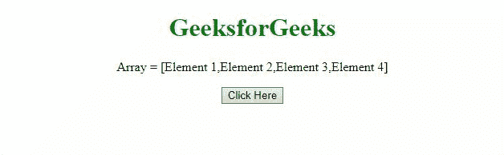

# JavaScript 中 push()方法的替代方法

> 原文:[https://www . geeksforgeeks . org/替代方法-javascript 中的推送方法/](https://www.geeksforgeeks.org/alternatives-of-push-method-in-javascript/)

任务是在 JavaScript 的帮助下不使用 [push()方法](https://www.geeksforgeeks.org/javascript-array-prototype-push-function/)进行推送操作。下面讨论两种方法。

**方法 1:** 使用 [**长度属性**](https://www.geeksforgeeks.org/javascript-array-length-property/) 在数组末尾插入元素。

*   **示例:**该示例实现了上述方法。

    ```
    <!DOCTYPE html>
    <html>
        <head>
            <title>
                Alternatives of push() method in Javascript
            </title>
        </head>

        <body style="text-align: center;">
            <h1 style="color: green;">
                GeeksforGeeks
            </h1>
            <p id="GFG_UP"></p>
            <button onclick="myGFG()">
                Click Here
            </button>
            <p id="GFG_DOWN"></p>
       <script>
         var arr = ["Element 1", "Element 2", 
                     "Element 3", "Element 4"];
         var up = document.getElementById("GFG_UP");
          up.innerHTML = "Array = [" + arr + "]";
         var element = "Element x";
         var down = document.getElementById("GFG_DOWN");
         function myGFG() {
          arr[arr.length] = element;
        down.innerHTML = "Elements of array = [" + arr + "]";
                }
            </script>
        </body>
    </html>
    ```

*   **输出:**
    

**接近 2** 使用 **[]符号**在数组末尾插入元素。

*   **示例:**该示例实现了上述方法。

    ```
    <!DOCTYPE html>
    <html>
        <head>
            <title>
                Alternatives of push() method in Javascript
            </title>
        </head>

        <body style="text-align: center;">
            <h1 style="color: green;">
                GeeksforGeeks
            </h1>
            <p id="GFG_UP"></p>
            <button onclick="myGFG()">
                Click Here
            </button>
            <p id="GFG_DOWN"></p>
      <script>
       var arr = ["Element 1", "Element 2", 
                  "Element 3", "Element 4"];
       var up = document.getElementById("GFG_UP");
       up.innerHTML = "Array = [" + arr + "]";
       var element = "Element x";
       var down = document.getElementById("GFG_DOWN");
       function myGFG() {
       arr = [arr, element];
      down.innerHTML = "Elements of array = [" + arr + "]";
                }
            </script>
        </body>
    </html>
    ```

*   **输出:**
    