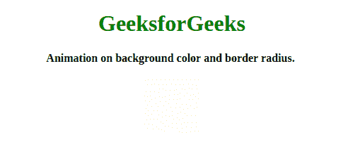
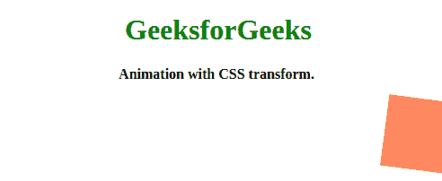
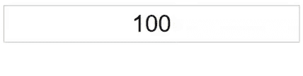
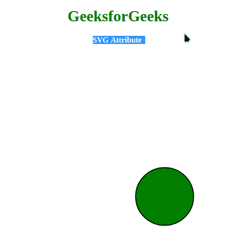

# Anime.js |不同属性的动画

> 原文:[https://www . geesforgeks . org/anime-js-animation-with-differential-properties/](https://www.geeksforgeeks.org/anime-js-animation-with-different-properties/)

[**Anime.js**](https://www.geeksforgeeks.org/introduction-to-anime-js/) 是一个小型、轻量级的 JavaScript 库，拥有一个简单而小巧的强大 API。它与 DOM 元素、CSS 和 JavaScript 对象一起工作。动画与 CSS 属性我们可以动画任何 CSS 属性。下面几个例子描述了不同的 CSS 属性:

**例 1:** 首先我们要设置一个目标，div 或者元素可以是 class 或者 id，我们要把它做成动画。 [**CSS 底色**](https://www.geeksforgeeks.org/css-background-color-property/) 是我们这里从**蓝色**改为 **#F75** 的 CSS 属性之一。 [**CSS 边框半径**](https://www.geeksforgeeks.org/css-border-radius-property/) 是我们在这里改变的另一个 CSS 属性。我们将使用缓和，easeInOutQuad 意味着只是褪色和显示，之后我们将使用**循环–true**来继续重复动画。这里我们展示了 backgroundColor 和 borderRadius，您可以设置任何 css 属性的动画。

## 超文本标记语言

```
<!DOCTYPE html>
<html>
    <head>
        <title>animejs</title>
        <script src=
"https://cdnjs.cloudflare.com/ajax/libs/animejs/3.2.0/anime.min.js">
       </script>
    </head>
    <body>
        <center>
            <h1 style="color: green;">GeeksforGeeks</h1>
            <b>
                Animation on background 
                color and border radius.
            </b>
            <br><br>
            <div style="background: blue; 
                        height: 80px;
                        width: 80px;">
            </div>
        </center>
        <script>
            let animation = anime({
                targets: "div",
                backgroundColor: "#F75",
                borderRadius: "50px",
                easing: "easeInOutQuad",
                loop: true,
            });
        </script>
    </body>
</html>
```

**输出:**



**示例 2:** 在本例中，我们将使用 CSS 变换对进行动画制作。首先，我们必须设置一个目标，div 或元素可以是类或 id，我们想要制作动画。 [**CSS translateX()功能**](https://www.geeksforgeeks.org/css-translatex-function/) 将设置为 450，将 450 移动到正 x 轴。我们将使用 [**CSS 旋转()功能**](https://www.geeksforgeeks.org/css-rotate-function/) 旋转–720 度。CSS 背景色是 CSS 属性，但不是 CSS 翻译的一部分，但我们可以用来改变颜色。 [**CSS 方向属性**](https://www.geeksforgeeks.org/css-direction-property/) 设置为交替(向后移动第四个)。然后将 CSS 持续时间设置为 2000 时间(以毫秒为单位)。之后我们将使用**循环–true**继续重复动画。

## 超文本标记语言

```
<!DOCTYPE html>
<html>
    <head>
        <title>animejs</title>
        <script src=
"https://cdnjs.cloudflare.com/ajax/libs/animejs/3.2.0/anime.min.js">
       </script>
    </head>
    <body>
        <center>
            <h1 style="color: green;">GeeksforGeeks</h1>
            <b>
                Animation on background 
                color and border radius.
            </b>
            <br><br>
        </center>
            <div style="background: blue; 
                               height: 80px;
                               width: 80px;">
            </div>
        <script>
            let animation = anime({
                targets: "div",

               // Move 250 into positive x-axis
                translateX: 450, 

               // Degree you want to rotate
                rotate: "720", 
                backgroundColor: "#f75",
                direction: "alternate",
                duration: "2000",
                loop: true,
            });
        </script>
    </body>
</html>
```

**输出:**



**示例 3:** 任何包含数值的对象属性都可以设置动画。在这里，我们刚刚更改了 object 属性的值，并更新了 dom 和 easy:linear 用于对其进行线性动画制作，您可以更改 round 值以查看其用途。

## 超文本标记语言

```
<!DOCTYPE html>
<html>
    <head>
        <title>animejs</title>
        <script src=
"https://cdnjs.cloudflare.com/ajax/libs/animejs/3.2.0/anime.min.js">
        </script>
    </head>
    <body>
        <div></div>
        <script>
            var div = document.querySelector("div");

            var object = {
                prop1: 10,
                prop2: "0%",
            };

            let animation = anime({
                targets: object,
                prop1: 70,
                prop2: "96%",
                easing: "linear",
                round: 1,
                update: function () {
                    div.innerHTML = JSON.stringify(object);
                },
            });
        </script>
    </body>
</html>
```

**输出:**


**示例 4:** 这里，值将包含从值–到值(Dom Attribute)。例如输入字段中的值(数字)

## 超文本标记语言

```
<!DOCTYPE html>
<html>
    <head>
        <title>animejs</title>
        <script src=
"https://cdnjs.cloudflare.com/ajax/libs/animejs/3.2.0/anime.min.js">
        </script>
    </head>
    <body>
        <input style="text-align: center;" type="text" />
        <script>
            let animation = anime({
                targets: "input",
                value: [0, 100],
                round: 1,
                easing: "easeInOutExpo",
            });
        </script>
    </body>
</html>
```

**输出:**



**示例 5:** 在本例中，我们将设置 SVG 属性的动画。我们在位置 150，150 创建了一个半径为 50 的圆，然后我们在圆上应用动画，将中心移动到 200，200，并使半径为 60。

## 超文本标记语言

```
<!DOCTYPE html>
<html>
    <head>
        <title>animejs</title>
        <script src=
"https://cdnjs.cloudflare.com/ajax/libs/animejs/3.2.0/anime.min.js">
        </script>
    </head>
    <body>
        <center>
            <h1 style="color: green;">GeeksforGeeks</h1>
            <b>
                SVG Attribute
            </b>
            <br><br>
            <svg height="400" width="400">
                <circle cx="50" cy="50" r="40" 
                        stroke="black" stroke-width="2" 
                        fill="green"/>
            </svg>
        </center>
        <script>
            let animation = anime({
                targets: ["circle"],
                cx: "300",
                cy: "300",
                r: "60",
                baseFrequency: 0,
                scale: 1,
                loop: true,
                direction: "alternate",
                easing: "easeInOutExpo",
            });
        </script>
    </body>
</html>
```

**输出:**

