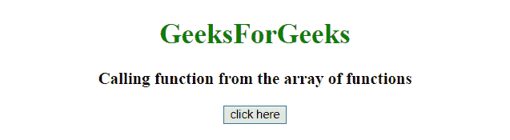
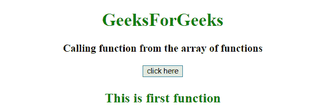
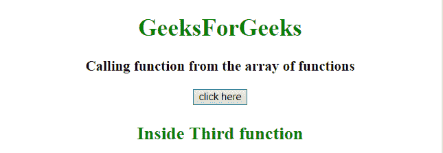

# JavaScript 中的函数数组

> 原文:[https://www . geesforgeks . org/JavaScript 函数数组/](https://www.geeksforgeeks.org/array-of-functions-in-javascript/)

给定一个包含函数的数组，任务是使用 JavaScript 以不同的方式访问它的元素。

**进场:**

*   声明一个函数数组。
*   函数数组像数组函数一样处理索引。

**示例 1:** 在本例中，函数调用是从数组的元素开始的，但函数是在其他地方定义的。我们可以在调用时向函数传递参数。

```
<!DOCTYPE HTML> 
<html> 
    <head> 
        <title> 
            Array of functions in javascript
        </title>
    </head> 

    <body style = "text-align:center;"> 

        <h1 style = "color:green;" > 
            GeeksForGeeks 
        </h1>

        <p id = "GFG_UP" style =
            "font-size: 19px; font-weight: bold;">
        </p>

        <button onClick = "GFG_Fun()">
            click here
        </button>

        <p id = "GFG_DOWN" style = 
            "color: green; font-size: 24px; font-weight: bold;">
        </p>

        <script>
            var up = document.getElementById('GFG_UP');
            var down = document.getElementById('GFG_DOWN');

            function firstFun(str) {
                down.innerHTML = str;
            }
            function secondFun(str) {
                down.innerHTML = str;
            }
            function thirdFun(str) {
                down.innerHTML = str;
            }

            // Declare array of functions
            var arrayOfFunction = [
                firstFun,
                secondFun,
                thirdFun     
            ]

            up.innerHTML = "Calling function from the array of functions";

            // Function call
            function GFG_Fun() {
                arrayOfFunction[0]("This is first function");
            }
        </script> 
    </body> 
</html>                    
```

**输出:**

*   **点击按钮前:**
    
*   **点击按钮后:**
    

**例 2:** 在本例中，函数(匿名)本身被定义为数组的元素。我们可以通过访问数组中后跟()的元素来访问它。

```
<!DOCTYPE HTML> 
<html> 
    <head> 
        <title> 
            Array of functions in JavaScript
        </title>
    </head> 

    <body style = "text-align:center;"> 

        <h1 style = "color:green;" > 
            GeeksForGeeks 
        </h1>

        <p id = "GFG_UP" style = 
            "font-size: 19px; font-weight: bold;">
        </p>

        <button onClick = "GFG_Fun()">
            click here
        </button>

        <p id = "GFG_DOWN" style =
            "color: green; font-size: 24px; font-weight: bold;">
        </p>

        <script>
            var up = document.getElementById('GFG_UP');
            var down = document.getElementById('GFG_DOWN');

            // Declare an array of functions
            var arrayOfFunction = [
                function() {
                    down.innerHTML = "Inside First function";
                },

                function() {
                    down.innerHTML = "Inside Second function";
                },

                function() {
                    down.innerHTML = "Inside Third function";
                }     
            ]

            up.innerHTML = "Calling function from the array of functions";

            function GFG_Fun() {
                arrayOfFunction[2]();
            }
        </script> 
    </body> 
</html>                    
```

**输出:**

*   **点击按钮前:**
    
*   **点击按钮后:**
    