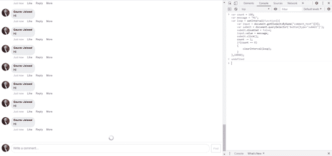

# 使用 JavaScript 在 facebook 帖子上自动评论

> 原文:[https://www . geesforgeks . org/auto-comment-on-a-Facebook-post-use-JavaScript/](https://www.geeksforgeeks.org/auto-comment-on-a-facebook-post-using-javascript/)

在本文中，我们将学习如何在脸书帖子中自动评论。你可以用这种方法祝你的朋友生日快乐，或者只是评论任何事情。当你想在一篇文章上评论很多次时，这很有用。您只需要指定将在一个时间间隔内自动注释的计数和消息。此外，您不需要安装任何东西就可以使用这种方法。

**进场:**

1.  初始化计数和消息值。
2.  然后定义一个每次都会调用的区间函数。
3.  创建一个指向注释部分输入字段的输入变量。
4.  创建一个指向注释按钮的提交变量。
5.  因为注释按钮默认是禁用的，所以首先启用它。
6.  设置要写入输入的消息。
7.  点击提交。
8.  减少计数。
9.  如果计数变为零，则清除间隔函数。
10.  设置时间间隔为 10000 毫秒，这意味着每 10 秒钟后将调用该功能。

**以下是步骤:**

*   使用**m.facebook.com**进入脸书页面
*   登录并打开任何帖子。
*   在 Chrome 中按 Ctrl+Shift+I 打开开发者模式
*   导航到控制台。
*   现在，运行下面的脚本。

```
var count = 100;
var message = "Hi";
var loop = setInterval(function(){
    var input = document.getElementsByName("comment_text")[0];
    var submit = document.querySelector('button[type="submit"]');
    submit.disabled = false;
    input.value = message;
    submit.click();
    count -= 1;
    if(count == 0)
    {
        clearInterval(loop);
    }
}, 10000);
```

**输出:**



输出

**注意:**请确保有稳定的互联网连接可用，这样脚本才能顺利运行。还要确保使用**m.facebook.com**而不是**www.facebook.com**访问 facebook，因为此脚本仅适用于移动版 facebook。

> 本教程仅用于教育目的，请不要用它来打扰任何人或任何不道德的方式。