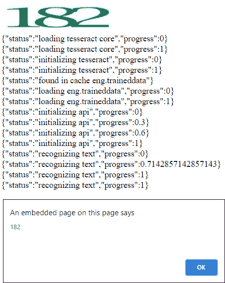

# 使用 JavaScript 的自动验证码验证

> 原文:[https://www . geesforgeks . org/automatic-验证码-验证-使用-javascript/](https://www.geeksforgeeks.org/automatic-captcha-verification-using-javascript/)

**验证码:**验证码是一个用来通过僵尸工具保护网站的程序。它产生一些测试，人类可以阅读并通过，但目前的计算机做不到。例如，人类可以阅读扭曲的文本，但计算机不能阅读。验证码是完全自动化的公共图灵测试的缩写，用来区分计算机和人类。

市面上有很多检测验证码的付费软件。Tessaract.js 库用于从文本中识别数字。

**注意:**它的预测不是 100%准确，但是它可以通过使用 str.replace(“”、“”)方法来提高准确性。只有数字验证码可以用这种方法轻松解决。


**示例:**

```
<!DOCTYPE html>
<html>

<head>
    <title>
        Auto captcha verification
    </title>

    <script src =
'https://cdn.rawgit.com/naptha/tesseract.js/1.0.10/dist/tesseract.js'>
    </script>
</head>

<body>
    

    <div id = "GFG"></div>

    <!-- script for auto captcha verification -->
    <script>
        let progress = document.querySelector('#GFG');

        Tesseract.recognize('https://i.ibb.co/L97ShyB/download.jpg')

        .progress(function(p) {
            progress.innerHTML += JSON.stringify(p) + "<br>"
        })

        .then(function(result) {
            var captcha = result.text;
            alert(captcha)
        })
    </script>
</body>

</html>                    
```

**输出:**
