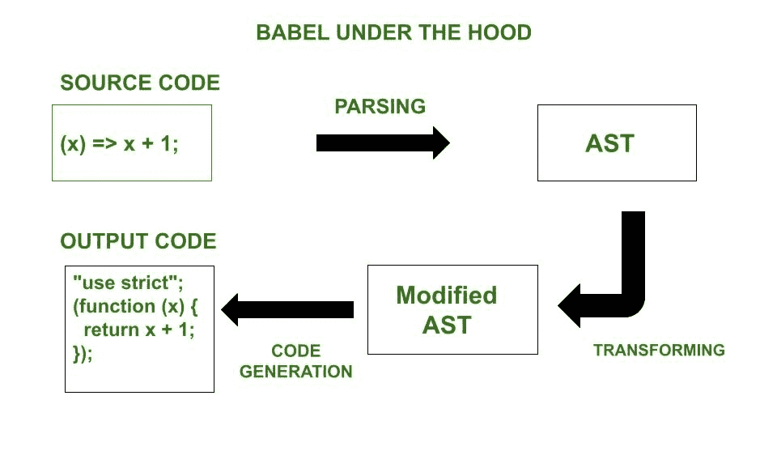

# 巴比伦在 ES6

> 原文:[https://www.geeksforgeeks.org/babel-in-es6/](https://www.geeksforgeeks.org/babel-in-es6/)

Babel transpiler 是一个免费的开源工具，可以将 [ECMAScript 2015 (ES6)](https://www.geeksforgeeks.org/introduction-to-es6/) 代码转换为向后兼容的 JavaScript 版本，可以在新旧浏览器上运行。



**编辑流程**

JavaScript 是浏览器理解的语言。我们使用各种浏览器来运行我们的应用程序，包括 Chrome、Firefox、Internet Explorer、Microsoft Edge、Opera 和 UC Browser。从 ES5 开始，我们就有了 ES6、ES7 和 ES8。作为 ES6 版本的一部分，引入了许多新功能，但并非所有浏览器都完全支持这些功能。目前还不确定什么时候所有的浏览器都能支持所有发布的 ES 版本。如果我们计划在代码中使用 ES6 或 ES7 或 ES8 功能，由于缺乏对新功能的支持，代码可能会在一些旧浏览器中中断。因此，我们需要一个工具来编译我们在 ES5 中的最终代码。这就是巴贝尔的作用。

**transfiling:**将编程语言翻译成特定的目标语言称为 transfiling。巴别塔 transpiler 可以解析现代 JavaScript 代码，并使用旧的语法结构重写它，这样它也可以在过时的浏览器上工作。除了语法结构和运算符，语言增强还可能包括函数。比如数学。trunc(n)删除数字的小数部分，例如数学。trunc(1.47)返回 1。一些(过时的)JavaScript 引擎不支持数学。trunc，所以这样的代码会失败。因为我们谈论的是新函数，而不是语法变化，所以没有必要对任何东西进行转换。我们只需要声明这个函数。当新特性是一个方法或对象时，我们需要使用 Babel-polyfill 和 transpilation 来使它在旧的浏览器上工作。

让我们考虑一下 ES6 的箭头功能特性来理解 Babel。例如，您可能想要这个箭头函数的 Javascript 代码

## java 描述语言

```
(x) => x + 1;
```

要编译成浏览器支持的 JavaScript 代码:

## java 描述语言

```
"use strict";

(function (x) {

  return x + 1;

});
```

该过程包括三个主要步骤:

**1。解析:**巴贝尔获取源代码，并将其解析为抽象语法树。AST 是一种数据结构，它将源代码的结构表示为树。

**2。转换:**巴贝尔从最后一步开始转换 ast，并对其进行操作，使得结果 AST 代表浏览器兼容的代码。

**3。代码生成:**浏览器支持的代码是从巴别塔最后一步生成的 AST 中派生出来的。

## java 描述语言

```
"use strict";

(function (x) {

  return x + 1;

});
```