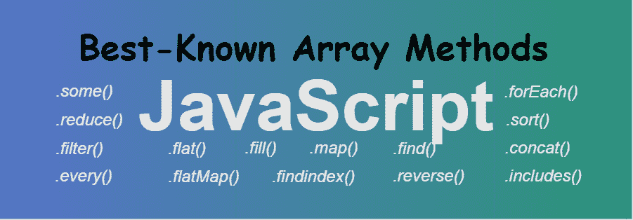

# 最著名的 JavaScript 数组方法

> 原文:[https://www . geesforgeks . org/最知名-javascript-array-methods/](https://www.geeksforgeeks.org/best-known-javascript-array-methods/)



数组是所有语言中用于存储不同元素的特殊变量。JavaScript 数组包含一些内置属性，每个 JavaScript 开发人员都应该知道如何使用它们，以及何时何地使用它们。我们可以根据自己的需求使用它们来添加、移除、迭代或操作数据。有一些 **[基本的 JavaScript 数组方法](https://www.geeksforgeeks.org/javascript-basic-array-methods/)** 每个开发人员都应该知道。

**1。 [some()方法:](https://www.geeksforgeeks.org/javascript-array-prototype-function/)** 该方法检查数组中是否至少有一个元素满足自变量函数检查的条件。

*   **例:**

    ```
    <script> 

    // JavaScript to illustrate
    // lastIndexOf() method
    function isGreaterThan5(element, index, array) { 
        return element > 5; 
    } 

    function func() { 

        // Original array 
        var array = [2, 5, 8, 1, 4]; 

        // Checking for condition in array 
        var value = array.some(isGreaterThan5); 

        document.write(value); 
    } 

    func(); 
    </script>
    ```

*   **输出:**

    ```
    true
    ```

**2。 [reduce()方法:](https://www.geeksforgeeks.org/javascript-array-reduce-method/)**JavaScript 中的 array reduce()方法用于将数组缩减为单个值，并为数组的每个值(从左到右)执行一个提供的函数，该函数的返回值存储在累加器中。

*   **例:**

    ```
    <script>

    // Original array
    var numbers = [88, 50, 25, 10];

    // Performing reduce method
    var sub = numbers.reduce(geeks);

    function geeks(total, num) {
        return total - num;
    }

    document.write(sub)
    </script>
    ```

*   **输出:**

    ```
    3
    ```

**3。 [map()方法:](https://www.geeksforgeeks.org/javascript-array-map-method/)**JavaScript 中的 map()方法通过对父数组中的每个元素调用特定的函数来创建一个数组。这是一种非突变方法。通常，map()方法用于迭代数组，并在数组的每个元素上调用函数。

*   **例:**

    ```
    <script>

    // Original array
    var numbers = [4, 9, 16, 25];

    // Performing map method
    var sub = numbers.map(geeks);

    function geeks() {
        return numbers.map(Math.sqrt);
    }

    document.write(sub)
    </script>
    ```

*   **输出:**

    ```
    2, 3, 4, 5
    ```

**4。 [every()方法:](https://www.geeksforgeeks.org/javascript-array-prototype-every-function/)** 该方法检查数组的所有元素是否满足作为参数传递给它的函数提供的给定条件。

*   **例:**

    ```
    <script> 

    // JavaScript code for every() function 
    function ispositive(element, index, array) { 
        return element > 0; 
    } 

    function func() { 

        var arr = [ 11, 89, 23, 7, 98 ]; 

        // Check for positive number 
        var value = arr.every(ispositive); 

        document.write(value); 
    } 

    func(); 
    </script> 
    ```

*   **输出:**

    ```
    true
    ```

**5。 [flat()方法:](#)** 该方法创建一个包含多个数组的新数组。基本上是从包含多个数组的数组创建一个简单的数组。

*   **例:**

    ```
    <script> 

    //Original array
    var arr = [ [11, 89], [23, 7], 98 ]; 

    // Performing flat method
    var geeks = arr.flat();

    document.write(geeks)
    </script> 
    ```

*   **输出:**

    ```
    11, 89, 23, 7, 98
    ```

**6。 [flatMap()方法:](https://www.geeksforgeeks.org/javascript-array-flatmap/)** 此方法用于将输入数组元素展平为新数组。这种方法首先在映射函数的帮助下映射每个元素，然后将输入数组元素展平成一个新数组。

*   **例:**

    ```
    <script> 

    const myAwesomeArray = [[1], [2], [3], [4], [5]]

    var geeks = myAwesomeArray.flatMap(arr => arr * 10)
    console.log(geeks);

    </script>                    
    ```

*   **输出:**

    ```
    10, 20, 30, 40, 50
    ```

**7。 [filter()方法:](https://www.geeksforgeeks.org/javascript-array-filter/)** 此方法用于从给定数组创建新数组，该数组仅由给定数组中满足自变量函数设置的条件的元素组成。

*   **例:**

    ```
    <script> 

    function isPositive(value) { 
        return value > 0; 
    } 

    function func() { 
        var filtered = [112, 52, 0, -1, 944]
        .filter(isPositive); 
        document.write(filtered); 
    } 

    func(); 
    </script>
    ```

*   **输出:**

    ```
    112, 52, 944
    ```

**8。 [findindex()方法:](https://www.geeksforgeeks.org/javascript-array-findindex-method/)** 该方法返回给定数组中满足所提供测试函数的第一个元素的索引。否则返回-1。

*   **例:**

    ```
    <script>

    var array = [ 10, 20, 30, 110, 60 ]; 

    function finding_index(element) { 
        return element > 25;
    } 

    document.write(array.findIndex(finding_index)); 
    </script>
    ```

*   **输出:**

    ```
    2
    ```

**9。 [find()方法:](https://www.geeksforgeeks.org/javascript-array-find-method/)** 此方法用于获取数组中满足所提供条件的第一个元素的值。它检查数组中的所有元素，只要第一个元素满足条件，就会打印出来。

*   **例:**

    ```
    <script> 

    // Input array contain some elements. 
    var array = [10, 20, 30, 40, 50]; 

    // Function (return element > 10). 
    var found = array.find(function(element) { 
        return element > 20; 
    }); 

    // Printing desired values. 
    document.write(found); 
    </script> 
    ```

*   **输出:**

    ```
    30
    ```

**10。 [fill()方法:](https://www.geeksforgeeks.org/javascript-array-fill-function/)** 这个方法用来给数组填充一个给定的静态值。该值可用于填充整个数组，也可用于填充数组的一部分。

*   **例:**

    ```
    <script> 

    // JavaScript code for fill() function 
    function func() {

        var arr = [1, 23, 46, 58]; 

        // Here value = 87, start index = 1 and 
        // and last index = 3 
        arr.fill(87, 1, 3); 
        document.write(arr); 
    } 

    func(); 
    </script> 
    ```

*   **输出:**

    ```
    1, 87, 87, 58
    ```

**11 时。 [forEach()方法:](https://www.geeksforgeeks.org/javascript-array-foreach/)** 这个方法为数组的每个元素调用一次提供的函数。所提供的函数可以对给定数组的元素执行任何类型的操作。

*   **例:**

    ```
    <script> 
    function func() { 

        // Original array 
        const items = [1, 29, 47]; 
        const copy = []; 

        items.forEach(function(item){ 
            copy.push(item*item); 
        }); 

        document.write(copy); 
    } 

    func(); 
    </script> 
    ```

*   **输出:**

    ```
    1, 841, 2209
    ```

**12 时。[排序()方法:](https://www.geeksforgeeks.org/javascript-sort-method/)** 此方法用于对数组进行排序。数组可以是任何类型，如字符串、数字、字符等。

*   **例:**

    ```
    <script>

    // Original array
    var numbers = [88, 50, 25, 10];

    // Performing sort method
    var sub = numbers.sort(geeks);

    function geeks(a, b) {
        return a - b;
    }

    document.write(sub)
    </script>                    
    ```

*   **输出:**

    ```
    10, 25, 50, 88
    ```

**13。 [concat()方法:](https://www.geeksforgeeks.org/javascript-array-prototype-concat-function/)** 该方法用于将两个或多个数组合并在一起。此函数不会改变作为参数传递的原始数组。

*   **例:**

    ```
    <script>

    // JavaScript code for concat() function 
    function func() { 
        var num1 = [11, 12, 13], 
            num2 = [14, 15, 16], 
            num3 = [17, 18, 19]; 

        document.write(num1.concat(num2, num3)); 
    } 
    func(); 
    </script> 
    ```

*   **输出:**

    ```
    11, 12, 13, 14, 15, 16, 17, 18, 19
    ```

**14。[包括()方法:](https://www.geeksforgeeks.org/javascript-array-includes-function/)** 该方法用于知道数组中是否存在特定元素，并相应地返回真或假，即如果该元素存在，则返回真，否则返回假

*   **例:**

    ```
    <script> 

        // Taking input as an array A 
        // having some elements. 
        var A = [ 1, 2, 3, 4, 5 ]; 

        // Include() function is called to 
        // test whether the searching element 
        // is present in given array or not. 
        a = A.includes(2) 

        // Printing result of function. 
        document.write(a); 
    </script> 
    ```

*   **输出:**

    ```
    true
    ```

**15。[反转()方法:](https://www.geeksforgeeks.org/javascript-array-prototype-reverse/)** 此方法用于阵列的原地反转。数组的第一个元素成为最后一个元素，反之亦然。

*   **例:**

    ```
    <script> 

    function func() { 

        //Original Array 
        var arr = [34, 234, 567, 4]; 
        document.write("Original array: " + arr); 

        //Reversed array 
        var new_arr = arr.reverse(); 
        document.write("<br>Newly reversed array: "); 
        document.write(new_arr); 
    } 
    func(); 
    </script> 
    ```

*   **输出:**

    ```
    Original array: 34, 234, 567, 4
    Newly reversed array: 4, 567, 234, 34
    ```