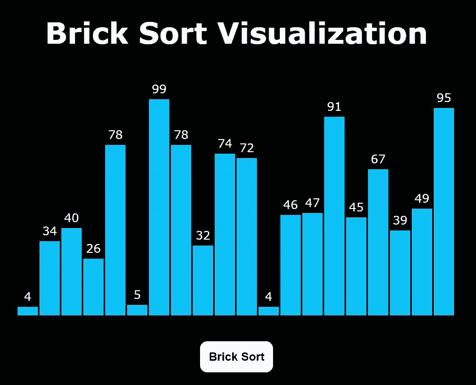

# 使用 JavaScript 的砖块排序可视化

> 原文:[https://www . geesforgeks . org/brick-sort-visualization-use-JavaScript/](https://www.geeksforgeeks.org/brick-sort-visualization-using-javascript/)

这基本上是[冒泡排序](https://www.geeksforgeeks.org/bubble-sort/)的变体。该算法分为两个阶段——奇数阶段和偶数阶段。在奇数阶段，我们对奇数索引元素执行冒泡排序，在偶数阶段，我们对偶数索引元素执行冒泡排序。

去了解更多。请参考[砖块分类](https://www.geeksforgeeks.org/odd-even-sort-brick-sort/)。

**GUI(图形用户界面)**比程序更有助于理解。在本文中，我们将使用 JavaScript 可视化砖块排序。

**先决条件:**

*   [砖块分类。](https://www.geeksforgeeks.org/odd-even-sort-brick-sort/)
*   JavaScript [承诺](https://www.geeksforgeeks.org/javascript-promises/)。
*   基础 [HTML](https://www.geeksforgeeks.org/html-basics/) 、[CSS](https://www.geeksforgeeks.org/css-tutorials/)&[JavaScript](https://www.geeksforgeeks.org/introduction-to-javascript/)。
*   JavaScript [异步/等待](https://www.geeksforgeeks.org/async-await-function-in-javascript/)功能。

**进场:**

*   首先，我们将使用 [**Math.random()**](https://www.geeksforgeeks.org/javascript-math-random-method/) 函数生成一个随机数组。
*   不同的颜色用来表示哪些元素是**未排序的**(天蓝色)、**比较的**(红色)& **排序的**(浅绿色)。
*   按**“Ctrl+R”**键可生成新数组。
*   按钮**砖块排序**使用选择排序算法对元素进行排序。
*   最后，对元素进行排序。

下面是上述方法的实现。

## index.html

```html
<!DOCTYPE html>
<html lang="en">

<!-- Head -->
<head>
    <meta charset="UTF-8" />
    <meta name="viewport" content="width=device-width,
    initial-scale=1.0" />
    <meta http-equiv="X-UA-Compatible" content="ie=edge" />

    <!-- Title -->
    <title>Brick Sort Visualizer</title>

    <!-- Linking style.css -->
    <link href="style.css" rel="stylesheet" />
</head>

<!-- Body -->

<body>
    <section class="head">
        Brick Sort Visualization
    </section>

    <section class="data-container"></section>

    <section id="ele"></section>

    <div style="margin: auto; width: fit-content">

        <!-- "Brick Sort" button -->
        <button class="btn2" 
            onclick="BrickSort(),disable()" 
            id="Button2">
            Brick Sort
        </button>
    </div>

    <!-- Linking script.js -->
    <script src="script.js"></script>
</body>

</html>
```

## style.css

```html
.mySlides {
  display: none;
}
body {
  background-color: rgb(0, 0, 0);
  font-family: Verdana, sans-serif;
}
.head {
  margin-top: 20px;
  margin-right: 20vw;
  margin-left: 20vw;
  text-align: center;
  font-size: 40px;
  background-color: #000000;

  color: white;
  font-weight: bolder;
}
.data-container {
  width: 600px;
  color: aliceblue;
  height: 364px;
  position: relative;
  margin: 0 auto;
}
.bar {
  width: 28px;
  position: absolute;
  left: 0;
  bottom: 0;
  background-color: rgb(0, 183, 255);
  transition: 0.2s all ease;
}
.bar__id {
  position: absolute;
  top: -24px;
  width: 100%;
  text-align: center;
}

.btn2 {
  padding: 12px;
  font-weight: bolder;
  background-color: white;
  border-radius: 10px;
  color: rgb(0, 0, 0);
  font-size: 16px;
  border: white;
}
#ele {
  text-align: center;
  height: 35px;
}
```

## script.js

```html
const container = document.querySelector(".data-container");

// Function to generate bars
function generatebars(num = 20) {

    // For loop to generate 20 bars
    for (let i = 0; i < num; i += 1) {

        // To generate random values from 1 to 100
        const value = Math.floor(Math.random() * 100) + 1;

        // To create element "div"
        const bar = document.createElement("div");

        // To add class "bar" to "div"
        bar.classList.add("bar");

        // Provide height to the bar
        bar.style.height = `${value * 3}px`;

        // Translate the bar towards positive X axis
        bar.style.transform = `translateX(${i * 30}px)`;

        // To create element "label"
        const barLabel = document.createElement("label");

        // To add class "bar_id" to "label"
        barLabel.classList.add("bar__id");

        // Assign value to "label"
        barLabel.innerHTML = value;

        // Append "Label" to "div"
        bar.appendChild(barLabel);

        // Append "div" to "data-container div"
        container.appendChild(bar);
    }
}

// Asynchronous function to perform "Brick Sort"
async function BrickSort(delay = 600) {

    let bars = document.querySelectorAll(".bar");

    // Initialize isSorted with false
    let isSorted = false;

    while (!isSorted) {
        // set isSorted true
        isSorted = true;

        for (let i = 1; i <= 18; i = i + 2) {
            // Assigning value of ith bar into value1
            var value1 = parseInt(bars[i].childNodes[0].innerHTML);

            // Assigning value of i+1th bar into value2
            var value2 = parseInt(bars[i + 1].childNodes[0].innerHTML);

            if (value1 > value2) {
                // Provide red color to the ith bar
                bars[i].style.backgroundColor = "red";

                // Provide red color to the i+1th bar
                bars[i + 1].style.backgroundColor = "red";

                // Swap ith bar with (i+1)th bar
                var temp1 = (bars[i].style.height);
                var temp2 = (bars[i].childNodes[0].innerText);

                // To pause the execution of code for 300 milliseconds
                await new Promise((resolve) =>
                    setTimeout(() => {
                        resolve();
                    }, 300)
                );

                // Swap pith bar with (i+1)th bar
                bars[i].style.height = (bars[i + 1].style.height);
                bars[i].childNodes[0].innerText = 
                         (bars[i + 1].childNodes[0].innerText);
                bars[i + 1].style.height = temp1;
                bars[i + 1].childNodes[0].innerText = temp2;
                isSorted = false;

                // To pause the execution of code for 300 milliseconds
                await new Promise((resolve) =>
                    setTimeout(() => {
                        resolve();
                    }, 300)
                );

                // Provide skyblue color to the ith bar
                bars[i].style.backgroundColor = "rgb(0, 183, 255)";

                // Provide skyblue color to the i+1th bar
                bars[i + 1].style.backgroundColor = "rgb(0, 183, 255)";
            }
        }

        for (let i = 0; i <= 18; i = i + 2) {
            // Assigning value of ith bar into value3
            var value3 = parseInt(bars[i].childNodes[0].innerHTML);

            // Assigning value of i+1th bar into value4
            var value4 = parseInt(bars[i + 1].childNodes[0].innerHTML);

            if (value3 > value4) {
                // Provide red color to the ith bar
                bars[i].style.backgroundColor = "red";

                // Provide red color to the i+1th bar
                bars[i + 1].style.backgroundColor = "red";

                // Swap ith bar with (i+1)th bar
                var temp3 = (bars[i].style.height);
                var temp4 = (bars[i].childNodes[0].innerText);

                // To pause the execution of code for 300 milliseconds
                await new Promise((resolve) =>
                    setTimeout(() => {
                        resolve();
                    }, 300)
                );

                // Swap ith bar with (i+1)th bar
                bars[i].style.height = (bars[i + 1].style.height);
                bars[i].childNodes[0].innerText =
                        (bars[i + 1].childNodes[0].innerText);
                bars[i + 1].style.height = temp3;
                bars[i + 1].childNodes[0].innerText = temp4;
                isSorted = false;

                // To pause the execution of code for 300 milliseconds
                await new Promise((resolve) =>
                    setTimeout(() => {
                        resolve();
                    }, 300)
                );

                // Provide skyblue color to the ith bar
                bars[i].style.backgroundColor = "rgb(0, 183, 255)";

                // Provide skyblue color to the i+1th bar
                bars[i + 1].style.backgroundColor = "rgb(0, 183, 255)";
            }

            // To pause the execution of code for 300 milliseconds
            new Promise((resolve) =>
                setTimeout(() => {
                    resolve();
                }, 300)
            );
        }

        // To pause the execution of code for 300 milliseconds
        await new Promise((resolve) =>
            setTimeout(() => {
                resolve();
            }, 300)
        );

        // Providing skyblue color
        for (var x = 0; x < 20; x++) {
            bars[x].style.backgroundColor = "rgb(0, 183, 255)";
        }
    }

    // Providing lightgreen color
    for (var x = 0; x < 20; x++) {
        bars[x].style.backgroundColor = "rgb(49, 226, 13)";
    }

    // To enable the button "Brick Sort" after final(sorted)
    document.getElementById("Button2").disabled = false;
    document.getElementById("Button2").style.backgroundColor = "#6f459e";
}

// Call "generatebars()" function
generatebars();

// Function to generate new random array
function generate() {
    window.location.reload();
}

// Function to disable the button
function disable() {

    // To disable the button "Brick Sort"
    document.getElementById("Button2").disabled = true;
    document.getElementById("Button2").style.backgroundColor = "white";
}
```

**输出:**

