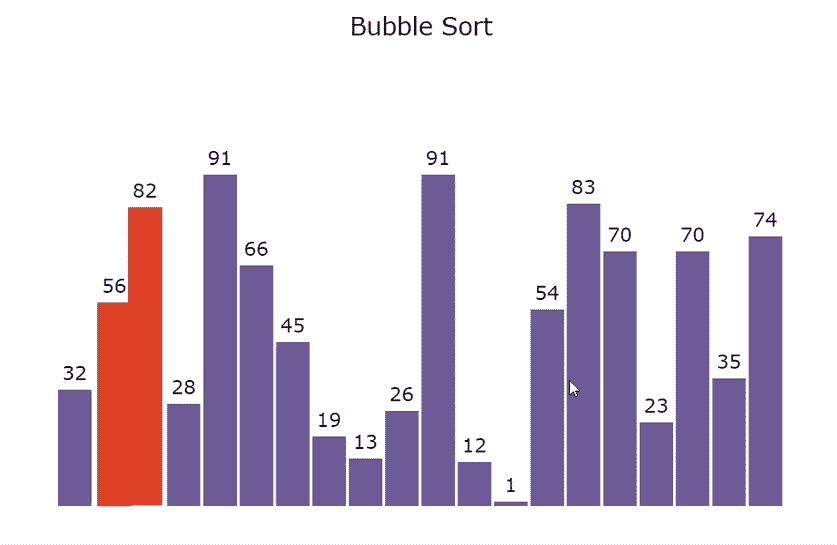
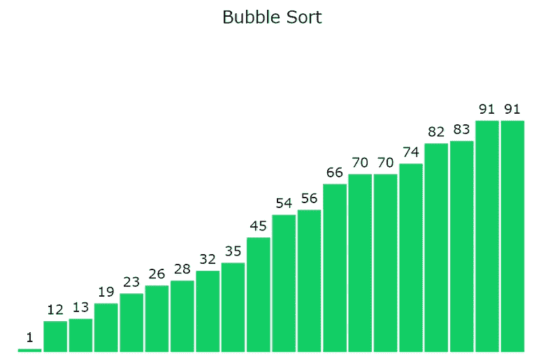

# 使用 JavaScript 的冒泡排序可视化

> 原文:[https://www . geesforgeks . org/bubble-sort-visualization-use-JavaScript/](https://www.geeksforgeeks.org/bubble-sort-visualization-using-javascript/)

**图形用户界面**比程序更容易理解。在本文中，我们将使用 JavaScript 可视化冒泡排序。我们将看到元素如何在冒泡排序中交换，以及我们如何获得最终的排序数组。我们还将可视化冒泡排序的时间复杂性。

**参考:**

*   [起泡启动](https://www.geeksforgeeks.org/bubble-sort/)
*   [JavaScript 中的异步函数](https://www.geeksforgeeks.org/how-to-create-an-asynchronous-function-in-javascript/)

**进场:**

*   首先，我们将使用 [**Math.random()**](https://www.geeksforgeeks.org/javascript-math-random-method/) 函数生成一个随机数组。
*   不同的颜色用于指示哪些元素正在被**比较、排序、**和**未排序。**
*   由于算法的运算速度非常快， [**setTimeout()**](https://www.geeksforgeeks.org/java-script-settimeout-setinterval-method/) 功能被用来减缓进程。
*   按**“Ctrl+R”**键可生成新数组。
*   使用**交换()**功能，使用**起泡器 rt()** 功能执行排序

**示例:**





下面是可视化[冒泡排序算法](https://www.geeksforgeeks.org/bubble-sort/)的程序。

**index.html**

## 超文本标记语言

```html
<!DOCTYPE html>
<html lang="en">

<head>
    <meta charset="UTF-8" />
    <meta name="viewport" content=
        "width=device-width, initial-scale=1.0" />
    <link rel="stylesheet" href="style.css" />
</head>

<body>
    <br />
    <p class="header">Bubble Sort</p>

    <div id="array"></div>
    <script src="script.js"></script>
</body>

</html>
```

**style.css:** 以下是上述文件中使用的“style.css”的内容。

```html
* {
    margin: 0px;
    padding: 0px;
    box-sizing: border-box;
}

.header {
    font-size: 20px;
    text-align: center;
}

#array {
    background-color: white;
    height: 413px;
    width: 598px;
    margin: auto;
    position: relative;
    margin-top: 64px;
}

.block {
    width: 28px;
    background-color: #6b5b95;
    position: absolute;
    bottom: 0px;
    transition: 0.2s all ease;
}

.block_id {
    position: absolute;
    color: black;
    margin-top: -20px;
    width: 100%;
    text-align: center;
}
```

**script.js:** 以下是上述 HTML 代码中使用的“script.js”文件的内容。

```html
var container = document.getElementById("array");

// Function to generate the array of blocks
function generatearray() {
    for (var i = 0; i < 20; i++) {

        // Return a value from 1 to 100 (both inclusive)
        var value = Math.ceil(Math.random() * 100);

        // Creating element div
        var array_ele = document.createElement("div");

        // Adding class 'block' to div
        array_ele.classList.add("block");

        // Adding style to div
        array_ele.style.height = `${value * 3}px`;
        array_ele.style.transform = `translate(${i * 30}px)`;

        // Creating label element for displaying 
        // size of particular block
        var array_ele_label = document.createElement("label");
        array_ele_label.classList.add("block_id");
        array_ele_label.innerText = value;

        // Appending created elements to index.html 
        array_ele.appendChild(array_ele_label);
        container.appendChild(array_ele);
    }
}

// Promise to swap two blocks
function swap(el1, el2) {
    return new Promise((resolve) => {

        // For exchanging styles of two blocks
        var temp = el1.style.transform;
        el1.style.transform = el2.style.transform;
        el2.style.transform = temp;

        window.requestAnimationFrame(function() {

            // For waiting for .25 sec
            setTimeout(() => {
                container.insertBefore(el2, el1);
                resolve();
            }, 250);
        });
    });
}

// Asynchronous BubbleSort function
async function BubbleSort(delay = 100) {
    var blocks = document.querySelectorAll(".block");

    // BubbleSort Algorithm
    for (var i = 0; i < blocks.length; i += 1) {
        for (var j = 0; j < blocks.length - i - 1; j += 1) {

            // To change background-color of the
            // blocks to be compared
            blocks[j].style.backgroundColor = "#FF4949";
            blocks[j + 1].style.backgroundColor = "#FF4949";

            // To wait for .1 sec
            await new Promise((resolve) =>
                setTimeout(() => {
                    resolve();
                }, delay)
            );

            console.log("run");
            var value1 = Number(blocks[j].childNodes[0].innerHTML);
            var value2 = Number(blocks[j + 1]
                        .childNodes[0].innerHTML);

            // To compare value of two blocks
            if (value1 > value2) {
                await swap(blocks[j], blocks[j + 1]);
                blocks = document.querySelectorAll(".block");
            }

            // Changing the color to the previous one
            blocks[j].style.backgroundColor = "#6b5b95";
            blocks[j + 1].style.backgroundColor = "#6b5b95";
        }

        //changing the color of greatest element 
        //found in the above traversal
        blocks[blocks.length - i - 1]
                .style.backgroundColor = "#13CE66";
    }
}

// Calling generatearray function
generatearray();

// Calling BubbleSort function
BubbleSort();
```

**输出:**

<video class="wp-video-shortcode" id="video-553509-1" width="640" height="360" preload="metadata" controls=""><source type="video/mp4" src="https://media.geeksforgeeks.org/wp-content/uploads/20210127152046/Bubble-Sort-Visualizer.mp4?_=1">[https://media.geeksforgeeks.org/wp-content/uploads/20210127152046/Bubble-Sort-Visualizer.mp4](https://media.geeksforgeeks.org/wp-content/uploads/20210127152046/Bubble-Sort-Visualizer.mp4)</video>