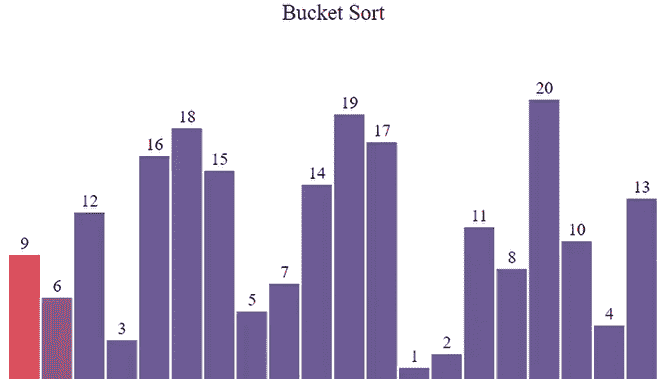
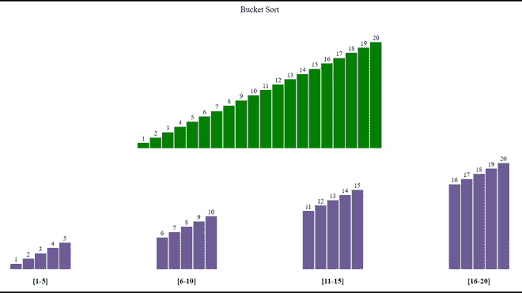
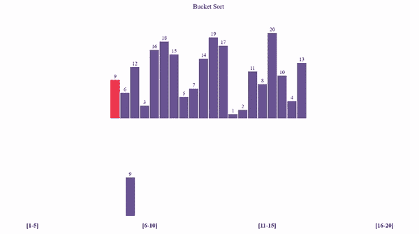

# 使用 Javascript 的桶排序可视化

> 原文:[https://www . geesforgeks . org/bucket-sort-visualization-use-JavaScript/](https://www.geeksforgeeks.org/bucket-sort-visualization-using-javascript/)

**图形用户界面**比程序更容易理解。在本文中，我们将使用 JavaScript 可视化桶排序。我们将看到元素是如何存储到桶中的，以及如何遍历桶来获得最终的排序数组。我们还将可视化桶排序的时间复杂性。

**参考:**

*   [桶排序](https://www.geeksforgeeks.org/bucket-sort-2/)
*   [JavaScript 中的异步函数](https://www.geeksforgeeks.org/how-to-create-an-asynchronous-function-in-javascript/)

**进场:**

*   首先，我们将使用**[**math . random()**](https://www.geeksforgeeks.org/javascript-math-random-method/)函数生成一个随机数组。**
*   **不同的颜色用于指示哪个元素正在被**遍历**。**
*   **每个被穿越的元素被扔进**合适的铲斗**中。**
*   **使用**插入排序**对这些桶进行排序。**
*   **此外，这些**桶被遍历**以获得最终的排序数组。**
*   **由于算法的运算速度非常快， [**setTimeout()**](https://www.geeksforgeeks.org/java-script-settimeout-setinterval-method/) 功能被用来减缓进程。**
*   **按**“Ctrl+R”**键可生成新数组。**
*   **使用桶的**桶 rt()** 功能执行排序。**

****示例:****

**

排序前** **

排序后** 

**下面是可视化[桶排序](https://www.geeksforgeeks.org/bucket-sort-2/)算法的程序。**

## **index.html**

```html
<!DOCTYPE html>
<html lang="en">

<head>
    <link rel="stylesheet" href="style.css" />
</head>

<body>
    <br />
    <p class="header">Bucket Sort</p>

    <div id="array"></div>
    <br />
    <br />

    <div style="display: flex; justify-content: space-evenly">
        <div class="bucket">
            <div id="one" class="bucket2"></div>
            <br />
            <h3 style="text-align: center">[1-5]</h3>
        </div>

        <div class="bucket">
            <div id="two" class="bucket2"></div>
            <br />
            <h3 style="text-align: center">[6-10]</h3>
        </div>

        <div class="bucket">
            <div id="three" class="bucket2"></div>
            <br />
            <h3 style="text-align: center">[11-15]</h3>
        </div>

        <div class="bucket">
            <div id="four" class="bucket2"></div>
            <br />
            <h3 style="text-align: center">[16-20]</h3>
        </div>
    </div>

    <script src="script.js"></script>
</body>

</html>
```

****style.css:** 以下是上述文件中使用的“style.css”的内容。**

## **style.css**

```html
* {
  margin: 0px;
  padding: 0px;
  box-sizing: border-box;
}
.header {
  font-size: 20px;
  text-align: center;
}
#array {
  background-color: white;
  height: 265px;
  width: 598px;
  margin: auto;
  position: relative;
  margin-top: 64px;
}
.block {
  width: 28px;
  background-color: #6b5b95;
  position: absolute;
  bottom: 0px;
  transition: 0.2s all ease;
}
.block_id {
  position: absolute;
  color: black;
  margin-top: -20px;
  width: 100%;
  text-align: center;
}
.block_id2 {
  position: absolute;
  color: black;
  margin-top: 22px;
  width: 100%;
  text-align: center;
}
.block_id3 {
  position: absolute;
  color: black;
  margin-top: 1px;
  width: 100%;
  text-align: center;
}
.bucket {
  width: 256px;
  height: 260px;
  position: relative;
}
.bucket2 {
  margin: auto;
  width: 148px;
  height: 260px;
}
.firstbucket {
  width: 28px;
  background-color: #6b5b95;
  position: absolute;
  bottom: 0px;
  transition: 0.2s all ease;
}
.secondbucket {
  width: 28px;
  background-color: #6b5b95;
  position: absolute;
  bottom: 0px;
  transition: 0.2s all ease;
}
.thirdbucket {
  width: 28px;
  background-color: #6b5b95;
  position: absolute;
  bottom: 0px;
  transition: 0.2s all ease;
}
.fourthbucket {
  width: 28px;
  background-color: #6b5b95;
  position: absolute;
  bottom: 0px;
  transition: 0.2s all ease;
}
```

****script.js:** 以下是上述 HTML 代码中使用的“script.js”文件的内容。**

## **script.js**

```html
var container = document.getElementById("array");

// Function to randomly shuffle the array
function shuffle(arr) {
  for (var i = arr.length - 1; i > 0; i--) {

    // Generate random number
    var j = Math.floor(Math.random() * (i + 1));
    var temp = arr[i];
    arr[i] = arr[j];
    arr[j] = temp;
  }
}

function generatearray() {

  // Creating an array
  var arr = [];

  // Filling array with values from 1 to 20
  for (var i = 0; i < 20; i++) {
    arr.push(i + 1);
  }

  // Shuffling the array
  shuffle(arr);
  for (var i = 0; i < 20; i++) {
    var value = arr[i];

    // Creating element div
    var array_ele = document.createElement("div");

    // Adding class 'block' to div
    array_ele.classList.add("block");

    // Adding style to div
    array_ele.style.height = `${value * 13}px`;
    array_ele.style.transform = `translate(${i * 30}px)`;

    // Creating label element for displaying
    // size of particular block
    var array_ele_label = document.createElement("label");
    array_ele_label.classList.add("block_id");
    array_ele_label.innerText = value;

    // Appending created elements to index.html
    array_ele.appendChild(array_ele_label);
    container.appendChild(array_ele);
  }
}

async function InsertionSort(clsnam, delay = 600) {
  let blocks = document.getElementsByClassName(clsnam);
  blocks[0].style.backgroundColor = "rgb(49, 226, 13)";

  for (var i = 1; i < blocks.length; i += 1) {
    var j = i - 1;

    // To store the integer value of ith block to key
    var key = parseInt(blocks[i].childNodes[0].innerHTML);

    // To store the ith block height to height
    var height = blocks[i].style.height;

    // Provide darkblue color to the ith block
    blocks[i].style.backgroundColor = "darkblue";

    // To pause the execution of code for 600 milliseconds
    await new Promise((resolve) =>
      setTimeout(() => {
        resolve();
      }, 600)
    );

    // For placing selected element at its correct position
    while (j >= 0 && parseInt(blocks[j].childNodes[0].innerHTML) > key) {

      // Provide darkblue color to the jth block
      blocks[j].style.backgroundColor = "darkblue";

      // For placing jth element over (j+1)th element
      blocks[j + 1].style.height = blocks[j].style.height;
      blocks[j + 1].childNodes[0].innerText = 
      blocks[j].childNodes[0].innerText;
      j = j - 1;

      // To pause the execution of code for 600 milliseconds
      await new Promise((resolve) =>
        setTimeout(() => {
          resolve();
        }, delay)
      );

      // Provide lightgreen color to the sorted part
      for (var k = i; k >= 0; k--) {
        blocks[k].style.backgroundColor = " rgb(49, 226, 13)";
      }
    }

    // Placing the selected element to its correct position
    blocks[j + 1].style.height = height;
    blocks[j + 1].childNodes[0].innerHTML = key;

    // To pause the execution of code for 600 milliseconds
    await new Promise((resolve) =>
      setTimeout(() => {
        resolve();
      }, delay)
    );

    // Provide light green color to the ith block
    blocks[i].style.backgroundColor = " rgb(49, 226, 13)";
  }
}

// Asynchronous CountingSort function
async function CountingSort(delay = 250) {
  var blocks = document.querySelectorAll(".block");

  var block1 = 0,
    block2 = 0,
    block3 = 0,
    block4 = 0;

  // CountingSort Algorithm
  for (var i = 0; i < blocks.length; i += 1) {
    blocks[i].style.backgroundColor = "#FF4949";
    var value = 
    Number(blocks[i].childNodes[0].innerHTML);

    // Creating element div
    var array_ele = document.createElement("div");

    // Adding style to div
    array_ele.style.height = `${value * 13}px`;

    // Creating label element for displaying
    // size of particular block
    var array_ele_label = document.createElement("label");
    array_ele_label.classList.add("block_id");
    array_ele_label.innerText = value;

    array_ele.appendChild(array_ele_label);

    // Addding block to first bucket
    if (value >= 1 && value <= 5) {
      array_ele.classList.add("firstbucket");
      var container = document.getElementById("one");
      array_ele.style.transform = 
      `translate(${block1 * 30}px)`;
      container.appendChild(array_ele);
      block1++;
    }

    // Addding block to second bucket
    if (value >= 6 && value <= 10) {
      array_ele.classList.add("secondbucket");
      var container = document.getElementById("two");
      array_ele.style.transform = 
      `translate(${block2 * 30}px)`;
      container.appendChild(array_ele);
      block2++;
    }

    // Addding block to third bucket
    if (value >= 11 && value <= 15) {
      array_ele.classList.add("thirdbucket");
      var container = document.getElementById("three");
      array_ele.style.transform = `translate(${block3 * 30}px)`;
      container.appendChild(array_ele);
      block3++;
    }

    // Addding block to fourth bucket
    if (value >= 16 && value <= 20) {
      array_ele.classList.add("fourthbucket");
      var container = document.getElementById("four");
      array_ele.style.transform = 
      `translate(${block4 * 30}px)`;
      container.appendChild(array_ele);
      block4++;
    }

    // To wait for 250 milliseconds
    await new Promise((resolve) =>
      setTimeout(() => {
        resolve();
      }, delay)
    );

    blocks[i].style.backgroundColor = "#6b5b95";
  }

  // Performing insertion sort on every bucket
  await InsertionSort("firstbucket");
  await InsertionSort("secondbucket");
  await InsertionSort("thirdbucket");
  await InsertionSort("fourthbucket");

  // Copying elements from buckets to main array
  for (var i = 0; i < 4; i++) {
    var bucket_idx = 0;
    var block_idx;
    if (i == 0) block_idx =
    document.getElementsByClassName("firstbucket");
    if (i == 1) block_idx = 
    document.getElementsByClassName("secondbucket");
    if (i == 2) block_idx =
    document.getElementsByClassName("thirdbucket");
    if (i == 3) block_idx = 
    document.getElementsByClassName("fourthbucket");
    for (var j = i * 5; j < 5 * (i + 1); j++, bucket_idx++) {
      block_idx[bucket_idx].style.backgroundColor = "red";

      // To wait for 300 milliseconds
      await new Promise((resolve) =>
        setTimeout(() => {
          resolve();
        }, 300)
      );

      blocks[j].style.height = 
      block_idx[bucket_idx].style.height;
      blocks[j].childNodes[0].innerText =
        block_idx[bucket_idx].childNodes[0].innerText;
      blocks[j].style.backgroundColor = "green";

      // To wait for 300 milliseconds
      await new Promise((resolve) =>
        setTimeout(() => {
          resolve();
        }, 300)
      );

      block_idx[bucket_idx]
      .style.backgroundColor = "#6b5b95";
    }
  }
}

// Calling generatearray function
generatearray();

// Calling CountingSort function
CountingSort();
```

****输出:****

****