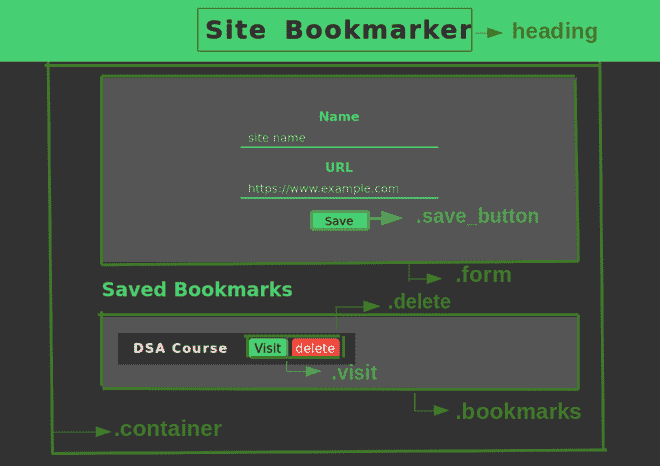

# 使用 JavaScript 本地存储构建网站书签应用

> 原文:[https://www . geesforgeks . org/build-a-site-bookmark-app-with-JavaScript-by-use-local-storage/](https://www.geeksforgeeks.org/build-a-site-bookmark-app-with-javascript-by-using-local-storage/)

在本文中，我们将使用 HTML、CSS 和 JavaScript 创建一个站点书签应用程序。这将帮助我们存储到我们最喜欢的网站的链接，而无需使用任何数据库，并且只使用浏览器的本地存储。

[**【本地存储】**](https://www.geeksforgeeks.org/localstorage-and-sessionstorage-web-storage-apis/) 被称为网络存储 API，允许我们在客户端存储数据。本地存储中的数据以字符串的形式存储，并且即使在会话关闭后也保持不变。只有当用户手动删除数据时，才能删除数据。所有的数据都保存在客户端，因此对于值的长度有一个定义的限制，我们目前可以根据我们使用的浏览器存储从 **2 MB 到 10 MB** 大小的数据。

**方法:**我们正在设计的书签应用可以做到以下几点:

*   使用用户键入的名称和网站链接添加新书签。
*   包含访问网站的选项
*   删除书签
*   然后将书签永久保存在本地存储器中

**项目一瞥:**



**文件结构:**

*   **index.html**
*   **style.css**
*   **main.js**

我们将使用 HTML 来设计网页结构或布局。这包括:

*   **标题部分:**这包括我们网页的标题。这里的标题是“网站书签”。
*   **容器部分:**包含表单和书签部分。
*   **表单部分:**包括两个输入字段，分别是站点名称和链接。它还包含一个用于提交表单的“保存”按钮。
*   **书签部分:**这个部分会包含我们保存的所有书签，并且会根据输入动态变化。

## 超文本标记语言

```html
<!DOCTYPE html>
<html lang="en">
<head>
    <title>Site Bookmarker</title>

    <!-- link the CSS file here -->
    <link rel="stylesheet" type="text/css" href="style.css">  
</head>
<body>

  <h1>Site Bookmarker</h1>

  <div class="container">
    <!-- form to enter details of site -->
    <form class="form" action="#">
      <div class="input-field">
        <label for="site_name">Name</label>
        <input name="site_name" type="text" 
               placeholder="site name">
      </div>

      <div class="input-field">
        <label for="url">URL</label>
        <input name="url" type="text" 
               placeholder="https://www.example.com">
      </div>

      <button class="save_button">Save</button>
    </form>

    <!-- section where bookmarks will be displayed   -->
    <h2>Saved Bookmarks</h2>

    <div class="bookmarks"></div>
  </div>

  <!-- link the JavaScript file here -->
  <script src="./main.js"></script>
</body>
</html>
```

**CSS 样式化:** CSS 用于对不同部分进行样式化，使其更具视觉吸引力。

*   表单和书签部分使用 flex 布局显示。
*   每个元素都有足够的填充和边距。
*   每个元素的文本大小、颜色以及背景颜色使得用户很容易阅读。
*   需要时，将动态添加或删除单个书签。

## 半铸钢ˌ钢性铸铁(Cast Semi-Steel)

```html
*{
    box-sizing: border-box;
    font-family: sans-serif;
  }
  body{
    margin: 0;
    padding: 0;
    background-color:  #333333;
  }
  a{
    text-decoration: none;
    color: #fff;
  }

  /*Styling title*/
  h1{
    width: 100%;
    height: 80px;
    text-align: center;
    line-height: 80px;
    margin: 0;
    padding: 0;
    background-color: #47CF73;
    letter-spacing: 2px;
    word-spacing: 8px;
    color: #000;
  }
  h2{
    color: #47CF73;
  }
  .container{
    width: 600px;
    min-height: 150px;
    background-color:  #333333;
    margin: 0 auto;
  }

  /*Styling form section*/
  .form{
    width: 100%;
    height: auto;
    background-color: #555555;
    padding: 40px 50px;
    margin: 20px 0;

  }
  .input-field{
    display: flex;
    flex-direction: column;
    align-items: center;
    margin-bottom: 15px; 
  }
  .input-field input[type="text"]{
    width: 250px;
    height: 25px;
    outline: none;
    border: none;
    background-color: transparent;
    border-bottom: 2px solid #47CF73;
    padding-left: 10px;
    color: #fff;
  }
  .input-field label{
    color: #47CF73;
    font-weight: bold;
    margin-bottom: 5px;
  }
  .save_button{
    display: block;
    margin: 0 auto;
    border: none;
    width: 70px;
    height: 25px;
    background-color: #47CF73;
    color: #000;
    cursor: pointer;
    outline: none;
  }

  /*Styling Bookmarks section*/
  .bookmarks{
    width: 100%;
    background-color: #555555;
    padding: 20px;
  }
  .bookmark{
    display: flex;
    align-items: center;
    width: 300px;
    height: 40px;
    padding: 5px 20px;
    background-color: #FAFAFA;
    margin-bottom: 10px;
    background-color:  #333333;
  }
  .bookmark span{
    flex: 1;
    font-weight: bold;
    letter-spacing: 1.5px;
    color: #fff;
  }
  .bookmark .visit{
    width: 50px;
    height: 25px;
    line-height: 25px;
    text-align: center;
    background-color: #47CF73;
    color: #000;
    border-radius: 5px;
    margin: 0 5px;
  }
  .bookmark .delete{
    width: 60px;
    height: 25px;
    line-height: 25px;
    text-align: center;
    background-color: #F44336;
    border-radius: 5px;
  }
```

**逻辑:**我们 app 的主要逻辑是用 JavaScript 实现的。该应用程序有几个功能协同工作。

**步骤 1(选择所有元素并定义变量):**

*   我们需要做的第一件事是从 DOM 中获取我们需要的所有内容的引用。HTML 布局中所需的元素是使用 querySelector()方法选择的。
*   这个会抢”。书签“，”。save_button”，以及来自 DOM 的“site_name”和“url”等输入字段，并将它们存储在相应的变量中。
*   它们被分配了变量名，以便于访问和修改。
*   此外，为我们的本地存储定义书签对象来保存所有书签。

## java 描述语言

```html
// Select the save button
var button = document.querySelector(".save_button");

// Select the input box
var siteName = document.querySelector("[name='site_name']");
var url = document.querySelector("[name='url']");

// Select the <div> with class="bookmarks"
var bookmarksSection = document.querySelector(".bookmarks");

// Hold bookmarks in local storage
if(typeof(localStorage.bookmark) == "undefined"){
  localStorage.bookmark = "";
}
```