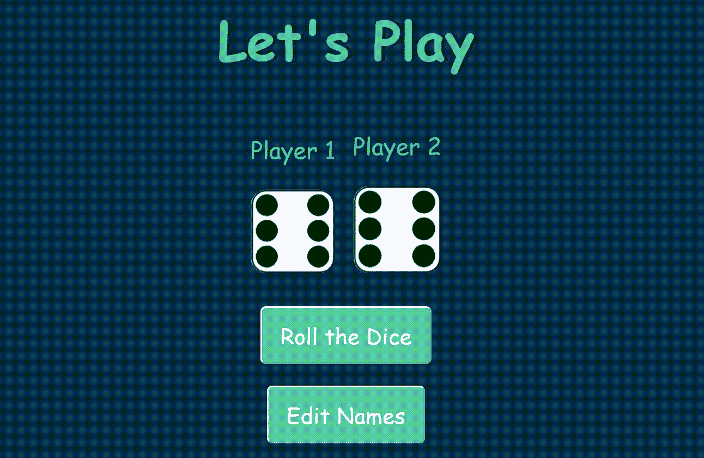

# 用 JavaScript 构建骰子游戏

> 原文:[https://www . geesforgeks . org/building-a-dice-game-use-JavaScript/](https://www.geeksforgeeks.org/building-a-dice-game-using-javascript/)

我们将使用 HTML、CSS 和 JavaScript 构建一个骰子游戏项目。骰子游戏是基于两个人的游戏。两个玩家都掷骰子，获得最高相位值的玩家将赢得游戏。

**骰子相位图像:**骰子相位图像列表如下。将所有图像保存在保存 HTML、CSS 和 JavaScript 文件的文件夹中。您可以单独保存所有的 HTML、CSS 和 JavaScript 文件，并将 CSS 和 JavaScript 文件链接到 HTML 文件，或者将所有代码(HTML、CSS 和 JavaScript)组合在一个文件中并执行它。

*   说 1
*   [说 2](https://media.geeksforgeeks.org/wp-content/uploads/20200508141001/dice2.png)
*   [说 3](https://media.geeksforgeeks.org/wp-content/uploads/20200508141003/dice3.png)
*   [说 4](https://media.geeksforgeeks.org/wp-content/uploads/20200508141004/dice4.png)
*   [说 5](https://media.geeksforgeeks.org/wp-content/uploads/20200508141005/dice5.png)
*   [说 6](https://media.geeksforgeeks.org/wp-content/uploads/20200508141006/dice6.png)

**HTML 代码:** HTML 代码用于设计项目的基本结构。HTML 代码包含保存玩家姓名和初始骰子阶段的容器类。另一个底部 div 包含两个按钮(一个按钮用于掷骰子，另一个按钮用于重命名玩家名称)。

```
<!DOCTYPE html>
<html lang="en">

<head>
    <meta charset="UTF-8">
    <meta name="viewport" content=
        "width=device-width, initial-scale=1.0">
    <title>Dice Game</title>
</head>

<body>
    <div class="container">
        <h1>Let's Play</h1>

        <div class="dice">
            <p class="Player1">Player 1</p>
            
        </div>

        <div class="dice">
            <p class="Player2">Player 2</p>
            
        </div>
    </div>

    <div class="container bottom">
        <button type="button" class="butn"
            onClick="rollTheDice()">
            Roll the Dice
        </button>
    </div>
    <div class="container bottom">
        <button type="button" class="butn" 
            onClick="editNames()">
            Edit Names
        </button>
    </div>
</body>

</html>
```

**CSS 代码:**在本节中，我们将使用一些 CSS 属性来设置骰子游戏的样式。

```
<style>
    .container {
        width: 70%;
        margin: auto;
        text-align: center;
    }

    .dice {
        text-align: center;
        display: inline-block;
        margin: 10px;
    }

    body {
        background-color: #042f4b;
        margin: 0;
    }

    h1 {
        margin: 30px;
        font-family: "Lobster", cursive;
        text-shadow: 5px 0 #232931;
        font-size: 4.5rem;
        color: #4ecca3;
        text-align: center;
    }

    p {
        font-size: 2rem;
        color: #4ecca3;
        font-family: "Indie Flower", cursive;
    }

    img {
        width: 100%;
    }

    .bottom {
        padding-top: 30px;
    }

    .butn {
        background: #4ecca3;
        font-family: "Indie Flower", cursive;
        border-radius: 7px;
        color: #ffff;
        font-size: 30px;
        padding: 16px 25px 16px 25px;
        text-decoration: none;
    }

    .butn:hover {
        background: #232931;
        text-decoration: none;
    }
</style>
```

**JavaScript 代码:**JavaScript 代码包含骰子游戏的功能。第一个功能是在点击按钮后重命名玩家名称。另一个功能是点击按钮后掷骰子。双方掷骰子后，任何获得最高相位值的玩家都将获胜。如果两个玩家获得相同的相位值，那么游戏将会平局。

```
<script>

    // Player name
    var player1 = "Player 1";
    var player2 = "Player 2";

    // Function to change the player name
    function editNames() {
        player1 = prompt("Change Player1 name");
        player2 = prompt("Change player2 name");

        document.querySelector("p.Player1").innerHTML = player1;
        document.querySelector("p.Player2").innerHTML = player2;
    }

    // Function to roll the dice
    function rollTheDice() {
        setTimeout(function () {
            var randomNumber1 = Math.floor(Math.random() * 6) + 1;
            var randomNumber2 = Math.floor(Math.random() * 6) + 1;

            document.querySelector(".img1").setAttribute("src",
                "dice" + randomNumber1 + ".png");

            document.querySelector(".img2").setAttribute("src",
                "dice" + randomNumber2 + ".png");

            if (randomNumber1 === randomNumber2) {
                document.querySelector("h1").innerHTML = "Draw!";
            }

            else if (randomNumber1 < randomNumber2) {
                document.querySelector("h1").innerHTML
                                = (player2 + " WINS!");
            }

            else {
                document.querySelector("h1").innerHTML
                                = (player1 + " WINS!");
            }
        }, 2500);
    }
</script>
```

**完整代码:**将以上三个部分(HTML、CSS、JavaScript)代码合并后，我们将得到完整的骰子游戏。

```
<!DOCTYPE html>
<html lang="en">

<head>
    <meta charset="UTF-8">
    <meta name="viewport" content
        ="width=device-width, initial-scale=1.0">
    <title>Dice Game</title>

    <style>
        .container {
            width: 70%;
            margin: auto;
            text-align: center;
        }

        .dice {
            text-align: center;
            display: inline-block;
            margin: 10px;
        }

        body {
            background-color: #042f4b;
            margin: 0;
        }

        h1 {
            margin: 30px;
            font-family: "Lobster", cursive;
            text-shadow: 5px 0 #232931;
            font-size: 4.5rem;
            color: #4ecca3;
            text-align: center;
        }

        p {
            font-size: 2rem;
            color: #4ecca3;
            font-family: "Indie Flower", cursive;
        }

        img {
            width: 100%;
        }

        .bottom {
            padding-top: 30px;
        }

        .butn {
            background: #4ecca3;
            font-family: "Indie Flower", cursive;
            border-radius: 7px;
            color: #ffff;
            font-size: 30px;
            padding: 16px 25px 16px 25px;
            text-decoration: none;
        }

        .butn:hover {
            background: #232931;
            text-decoration: none;
        }
    </style>
</head>

<body>
    <div class="container">
        <h1>Let's Play</h1>

        <div class="dice">
            <p class="Player1">Player 1</p>
            
        </div>

        <div class="dice">
            <p class="Player2">Player 2</p>
            
        </div>
    </div>

    <div class="container bottom">
        <button type="button" class="butn"
            onClick="rollTheDice()">
            Roll the Dice
        </button>
    </div>
    <div class="container bottom">
        <button type="button" class="butn"
            onClick="editNames()">
            Edit Names
        </button>
    </div>

    <script>

        // Player name
        var player1 = "Player 1";
        var player2 = "Player 2";

        // Function to change the player name
        function editNames() {
            player1 = prompt("Change Player1 name");
            player2 = prompt("Change player2 name");

            document.querySelector("p.Player1")
                            .innerHTML = player1;

            document.querySelector("p.Player2")
                            .innerHTML = player2;
        }

        // Function to roll the dice
        function rollTheDice() {
            setTimeout(function () {
                var randomNumber1 = Math.floor(Math.random() * 6) + 1;
                var randomNumber2 = Math.floor(Math.random() * 6) + 1;

                document.querySelector(".img1").setAttribute("src",
                    "dice" + randomNumber1 + ".png");

                document.querySelector(".img2").setAttribute("src",
                    "dice" + randomNumber2 + ".png");

                if (randomNumber1 === randomNumber2) {
                    document.querySelector("h1").innerHTML = "Draw!";
                }

                else if (randomNumber1 < randomNumber2) {
                    document.querySelector("h1").innerHTML
                        = (player2 + " WINS!");
                }

                else {
                    document.querySelector("h1").innerHTML
                        = (player1 + " WINS!");
                }
            }, 2500);
        }
    </script>
</body>

</html>
```

**输出:**
