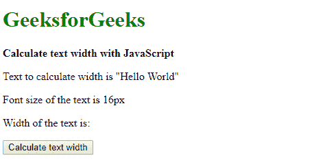
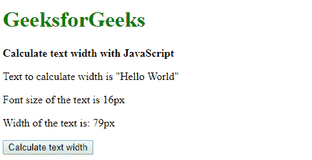
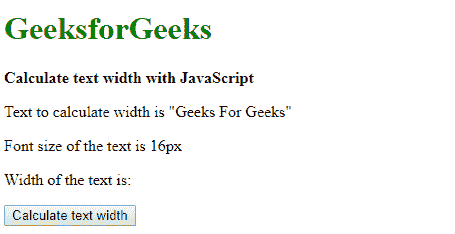

# 计算 JavaScript 中文本的宽度

> 原文:[https://www . geesforgeks . org/计算 javascript 文本宽度/](https://www.geeksforgeeks.org/calculate-the-width-of-the-text-in-javascript/)

**方法 1:创建一个新的 DOM 元素并测量其宽度:**使用 createElement()方法创建一个新的“span”元素。然后使用 appendChild()方法将其添加到元素的主体中。这个元素的 style 属性用于设置字体、字号、高度、宽度、空白和位置等属性。
字体设置为所需字体的字符串。字体大小是一个以像素为单位的字符串。高度和宽度属性设置为“自动”。位置属性设置为“绝对”，空白属性设置为“不换行”。要测量的文本是使用 innerHTML 属性指定的。clientWidth 属性用于获取其元素的宽度。该值将以像素为单位表示文本的宽度。然后使用 removeChild()方法移除该元素。

**示例:**

```
<!DOCTYPE html>
<html>

<head>
    <title>
        Calculate the text width
        with JavaScript 
    </title>
</head>

<body>
    <h1 style="color: green">
        GeeksforGeeks
    </h1>

    <b>
        Calculate text width 
        with JavaScript
    </b> 

    <p>
        Text to calculate width is
        "Hello World"
    </p>
    <p>Font size of the text is 16px</p>

    <p>
        Width of the text is:
        <span class="output"></span>
    </p>

    <button onclick="getTextWidth()">
        Calculate text width
    </button>

    <script type="text/javascript">
        function getTextWidth() {

            text = document.createElement("span");
            document.body.appendChild(text);

            text.style.font = "times new roman";
            text.style.fontSize = 16 + "px";
            text.style.height = 'auto';
            text.style.width = 'auto';
            text.style.position = 'absolute';
            text.style.whiteSpace = 'no-wrap';
            text.innerHTML = 'Hello World';

            width = Math.ceil(text.clientWidth);
            formattedWidth = width + "px";

            document.querySelector('.output').textContent
                    = formattedWidth;
            document.body.removeChild(text);
        }
    </script>
</body>

</html>    
```

**输出:**

*   **点击按钮前:**
    
*   **点击按钮后:**
    

**方法 2:使用 canvas measureText()方法:**使用 createElement()方法创建一个新的“canvas”元素。使用 getContext()方法访问绘制图形所需的 2d 上下文，并将值“2d”作为参数传递。该上下文将用于操作画布中的文本。字体是使用 font 属性指定的。字体字符串使用与 CSS 字体说明符相同的语法。
使用 measureText()方法计算文本的尺寸。要测量的文本被传递给此方法。它返回一个 TextMetrics 对象，该对象包含有关测量文本的信息。该文本度量对象的宽度属性用于获取文本的宽度。宽度可能是一个浮点值，因此使用 Math.ceil()函数来查找浮点的上限并返回一个整数。该值是以像素为单位测量的文本宽度。

**示例:**

```
<!DOCTYPE html>
<html>

<head>
    <title>
        Calculate the text width with JavaScript
    </title>
</head>

<body>
    <h1 style="color: green">
        GeeksforGeeks
    </h1>

    <b>Calculate text width with JavaScript</b> 

    <p>
        Text to calculate width is 
        "Geeks For Geeks"
    </p>

    <p>Font size of the text is 16px</p>

    <p>
        Width of the text is: 
        <span class="output"></span>
    </p>

    <button onclick="getTextWidth()">
        Calculate text width
    </button>

    <script type="text/javascript">
        function getTextWidth() {

            inputText = "Geeks For Geeks";
            font = "16px times new roman";

            canvas = document.createElement("canvas");
            context = canvas.getContext("2d");
            context.font = font;
            width = context.measureText(inputText).width;
            formattedWidth = Math.ceil(width) + "px";

            document.querySelector('.output').textContent
                        = formattedWidth;
        }
    </script>
</body>

</html>    
```

**输出:**

*   **点击按钮前:**
    
*   **点击按钮后:**
    