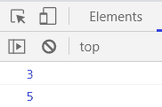
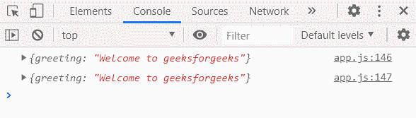

# 在 JavaScript 中按值调用与按引用调用

> 原文:[https://www . geesforgeks . org/按值调用 vs 按引用调用 javascript/](https://www.geeksforgeeks.org/call-by-value-vs-call-by-reference-in-javascript/)

**按值调用:**假设有一个名为**“a”**的变量。现在，我们在变量**“a”**中存储一个原始值(布尔值、整数、浮点数等)。

让我们在**“a”**中存储一个整数值，让 a=5。现在，变量**“a”**存储 5，并有一个地址位置，该原始值位于内存中。

现在，假设我们通过赋值( **a=b** )来复制**【b】**中**a**的值。现在，**“b”**指向内存中的新位置，包含与变量**“a”**相同的数据。

因此，a=b=5，但两者都指向内存中的不同位置。

这种方法被称为**按值调用**，其中两个变量通过复制值而变得相同，但位于内存中的两个独立位置。

**按值调用的特征:**

*   函数参数总是按值传递的。
*   它将函数中传递的变量值复制到局部变量中。
*   这两个变量在内存中占据不同的位置。因此，如果一个特定变量发生了变化，它不会影响另一个变量。

**示例:**

## Java Script 语言

```
<script type="text/javascript">
    // By value (primitives)
    var a = 5;
    var b;
    b = a;
    a = 3;
    console.log(a);
    console.log(b);
</script>
```

**输出:“b”**只是**“a”**的翻版。它在内存中有自己的空间。当我们改变**a**时，对**b**的数值没有任何影响。



传值

**引用调用:**假设我们有一个对象存储在变量**“a”**中。变量存储对象所在的位置或地址。现在我们设定 **b=a** 。现在新变量**“b”**不再指向内存中的新位置，而是指向**“a”**指向的相同位置。不会创建新对象，也不会创建副本。两个变量都指向同一个对象。这就像有两个名字。

这是**通过引用调用**。它的表现与价值截然不同。所有对象都通过引用进行交互。

**引用特征:**

*   在 JavaScript 中，所有对象都通过引用进行交互。
*   如果一个对象存储在一个变量中，并且该变量等于另一个变量，那么这两个变量在内存中占据相同的位置。
*   一个对象变量的更改会影响另一个对象变量。

**示例:**在这里，当我们设置 **d=c** 时，**d”**指向内存中与**【c】**相同的位置。首先，我们有一个名值对存储在**“c”**中。现在，当我们使用**“c”**更改属性时，它也会更改**“d”**中的属性，因为两者都指向同一个对象。它影响的一个方面的变化。

## java 描述语言

```
<script>

    // By reference (all objects (including functions))
    var c = { greeting : 'Welcome' };
    var d;
    d = c;

    // Mutating the value of c
    c.greeting = 'Welcome to geeksforgeeks';
    console.log(c);
    console.log(d);
</script>
```

**输出:**



传地址

**按值调用与按引用调用的区别:**

<figure class="table">

| **按值调用** | **按引用调用** |
| The original variable is not modified according to the changes of other variables. | The original variable changes with other variables. |
| The actual and copied variables are created in different memory locations. | The actual variable and the copied variable are created in the same memory location. |
| When a variable in a function is passed, any changes made to the passed variable will not affect the original variable. | When a variable is passed in a function, any change to the passed parameter will also update the reference of the original variable. |

</figure>