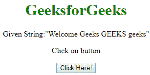
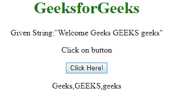
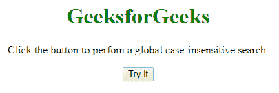

# JavaScript 中不区分大小写的搜索

> 原文:[https://www . geesforgeks . org/不区分大小写-在 javascript 中搜索/](https://www.geeksforgeeks.org/case-insensitive-search-in-javascript/)

**不区分大小写:**表示对字母大写不敏感的文本或键入的输入，如“**极客**”和“**极客**”在不区分大小写的搜索中必须同等对待。在 Javascript 中，我们使用 **string.match()** 函数搜索字符串中的正则表达式，match()函数返回匹配项，作为 Array 对象。

**语法:**

```
string.match(regexp)
```

**参数:**该方法接受单参数**正则表达式**，这是必需的。它用于将要搜索的值作为正则表达式传递。

**正则表达式(regexp):** 是一种特殊的语法*/模式/修饰符；*修改器设置类型。例如/geeksforgeks/I，其中“I”设置为不区分大小写。

**注意:**这里 g 和 I 分别用于全局和不区分大小写的搜索。

**示例 1:** 该示例描述了正则表达式的搜索。

## 超文本标记语言

```
<!DOCTYPE html>
<html>

<head>
    <title>
        Case insensitive search
        in JavaScript
    </title>
</head>

<body style = "text-align:center;">

    <h1 style = "color:green;" >    
        GeeksforGeeks
    </h1>

<p>
        Click on button
    </p>

    <button onclick="myGeeks()">
        Click Here!
    </button>

    <p id="GFG"></p>

    <script>
        function myGeeks() {
            var str = "Welcome Geeks GEEKS geeks";
            var res = str.match(/geeks/gi);

            document.getElementById("GFG").innerHTML
                    = res;
        }
    </script>
</body>

</html>                   
```

**输出:**

*   **点击按钮前:**



*   **点击按钮后:**



**示例 2:** 该示例描述了正则表达式的搜索。

## 超文本标记语言

```
<!DOCTYPE html>
<html>

<head>
    <style>
        h1 {
            padding-top: 35px;
            color: green;
        }
    </style>
</head>

<body style="text-align:center;">

    <h1>GeeksforGeeks</h1>

<p>Click the button to perform a global
                     case-insensitive search.</p>

    <button onclick="myFunction()">Try it</button>

    <p id="demo"></p>

    <script>
        function myFunction() {
            var str = "Brazil and Austraila won the WorldCup 5 times";
            var res = str.match(/5/gi);
            document.getElementById("demo").innerHTML = res;
        }
    </script>

</body>

</html>
```

**输出:-**

*   **点击按钮前**



*   **点击按钮后:**

