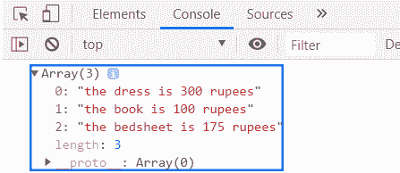

# JavaScript 中数组方法的链接

> 原文:[https://www . geesforgeks . org/链式数组方法 in-javascript/](https://www.geeksforgeeks.org/chaining-of-array-methods-in-javascript/)

JavaScript 中有一些方法可以在数组中循环。我们已经了解了这些数组方法。

1.  过滤方法([过滤()](https://www.geeksforgeeks.org/javascript-array-filter-function/))
2.  地图法([地图()](https://www.geeksforgeeks.org/javascript-array-map-method/))
3.  还原法( [reduce()](https://www.geeksforgeeks.org/javascript-array-reduce-method/) )
4.  查找方法( [find()](https://www.geeksforgeeks.org/javascript-array-prototype-find-function/) )
5.  排序方法( [sort()](https://www.geeksforgeeks.org/javascript-sort-method/) )

我们将学习如何将所有的数组方法链接在一起。

**示例:**

```
const products = [

    // Here we create an object and each
    // object has a name and a price
    { name: 'dress', price: 600 },
    { name: 'cream', price: 60 },
    { name: 'book', price: 200 },
    { name: 'bottle', price: 50 },
    { name: 'bedsheet', price: 350 }
];
```

我们想做两件事。

1.  使用 **filter()** 方法过滤那些价格大于 100 的元素。
2.  将这些元素映射到一个新的销售价格(五折)的新数组。

**示例:**

```
<script>
    const products = [

        // Here we create an object and each
        // object has a name and a price
        { name: 'dress', price: 600 },
        { name: 'cream', price: 60 },
        { name: 'book', price: 200 },
        { name: 'bottle', price: 50 },
        { name: 'bedsheet', price: 350 }
    ];

    // Filters the elements with 
    // price above 100
    const filtered = products.filter(
        product => product.price > 100);

    const sale = filtered.map(product => {
        return `the ${product.name} is 
        ${product.price / 2} rupees`;
    });

    // log the sale price to console
    console.log(sale);
</script>
```

**输出:**


更快的方法是使用数组方法**链接**。所有数组方法都作用于数组并返回数组。所以我们可以很容易地把这些方法联系起来。

**示例:**

```
<script>
    const products = [
        { name: 'dress', price: 600 },
        { name: 'cream', price: 60 },
        { name: 'book', price: 200 },
        { name: 'bottle', price: 50 },
        { name: 'bedsheet', price: 350 }
    ];

    // Writing the different array methods
    // on different lines increases the
    // readability
    const sale = products
        .filter(product => product.price > 100)
        .map(product => `the ${product.name} 
            is ${product.price / 2} rupees`);

    document.write(sale);
</script>
```

**输出:**


**结论:**

1.  两种情况下的输出保持不变。第二种方法叫做数组方法的链接，这使得代码更加简洁。
2.  由于 filter 方法返回一个数组，我们可以将其链接到 map 方法，map 方法在数组上工作，反之亦然。
3.  这个过程可以应用于所有的数组方法，这使得代码简洁。
4.  这个方法不仅适用于数组，而且我们也可以在字符串上使用它们，只要方法返回并在字符串上工作。同样的原则也将适用。