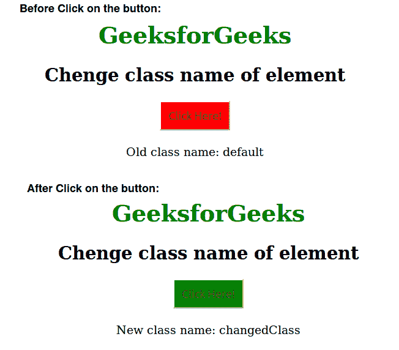
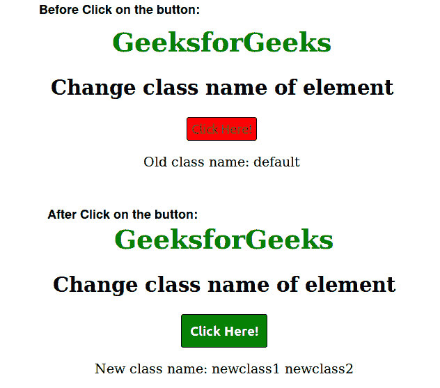

# JavaScript 更改元素类

> 原文:[https://www . geesforgeks . org/change-an-element-class-JavaScript/](https://www.geeksforgeeks.org/change-an-element-class-javascript/)

类名在 HTML 中用作选择器，有助于给元素属性赋予一些价值。document.getElementById()方法用于返回文档中具有“Id”属性的元素，“className”属性可用于更改/追加元素的类。
**语法:**

```html
document.getElementById('myElement').className = "myclass";
```

**示例 1:** 在此代码中，使用 onclick 事件将按钮的类别从“默认”更改为“更改类别”，这又将按钮的背景颜色从红色更改为绿色。

## 超文本标记语言

```html
<!DOCTYPE html>
<html>
    <head>
        <title>Change an element class with javascript</title>
        <style type="text/css">
            .default{
                background-color: red;
            }
            .changedClass{
                background-color: green;
            }
            #myPara{
                margin-top: 20px;
            }
            #myButton{
                padding: 10px;
            }
            body {
                text-align:center;
            }
            h1 {
                color:green;
            }
        </style>
        <script type="text/javascript">
            function changeClass() {
                document.getElementById('myButton').className = "changedClass";
                var button_class = document.getElementById('myButton').className;
                document.getElementById('myPara').innerHTML = "New class name: "
                + button_class;
            }
        </script>
    </head>
    <body>
        <h1>GeeksforGeeks</h1>
        <h2>Change class name of element</h2>
        <button class="default" onclick="changeClass()"
                    id="myButton">Click Here!</button><br>
        <p id="myPara">Old class name: default</p>

    </body>
</html>                   
```

**输出:**



**示例 2 :** 在这段代码中，使用 onclick 事件将按钮的类别从“默认”更改为“newclass1”和“newclass2”。

## 超文本标记语言

```html
<!DOCTYPE html>
<html>
    <head>
        <title>Change an element class with javascript</title>
        <style type="text/css">
            .default{
                background-color: red;
                padding:5px;
                border:1px solid black;
                border-radius:3px;
            }
            .newclass1 {
                color:white;
                font-size:16px;
                font-weight:bold;
                border:1px solid black;
            }
            .newclass2 {
                padding: 10px;
                background-color:green;
                border-radius:3px;
            }
                h1 {
                color:green;
            }
            body {
                text-align:center;
            }
        </style>
        <script type="text/javascript">
            function changeClass() {
                document.getElementById('myButton').className = "newclass1";
                document.getElementById('myButton').classList.add("newclass2");
                var button_class = document.getElementById('myButton').className;
                document.getElementById('myPara').innerHTML = "New class name: "
                + button_class;
            }
        </script>
    </head>
    <body>
        <h1>GeeksforGeeks</h1>
        <h2>Change class name of element</h2>
        <button class="default" onclick="changeClass()"
            id="myButton">Click Here!</button>
        <p id="myPara">Old class name: default</p>

    </body>
</html>                       
```

**输出:**

