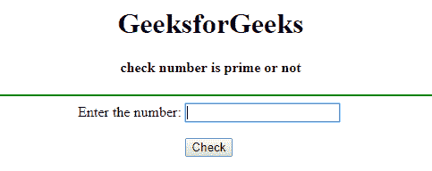
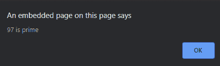
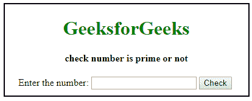
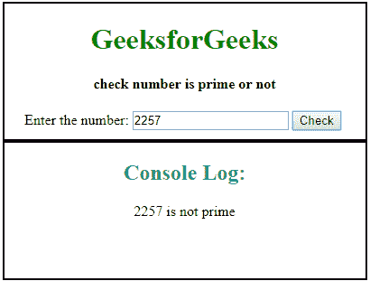

# 用 JavaScript 检查一个数字是否是质数

> 原文:[https://www . geesforgeks . org/check-a-number-is-prime-or-not-use-JavaScript/](https://www.geeksforgeeks.org/check-a-number-is-prime-or-not-using-javascript/)

质数是一个只能被 1 整除的数。前几个质数是:2、3、5、7、11、13、17、…
一个 JavaScript 使用 DOM 模型检查输入的数字是否为质数，并在屏幕上显示其对应的提醒消息。

**示例:**

```
Input : 4
Output : Not Prime

Input : 5
Output : Prime

```

**例 1:** 本例使用报警功能显示结果。

```
<!DOCTYPE html>
<html>

<head>
    <title>
        Check a number is Prime or
        not using JavaScript
    </title>

    <script type="text/javascript">

        // Function to check prime number
        function p() {

            var n, i, flag = true;

            // Getting the value form text
            // field using DOM
            n = document.myform.n.value;
            n = parseInt(n)
            for(i = 2; i <= n - 1; i++)
                if (n % i == 0) {
                    flag = false;
                    break;
                }

                // Check and display alert message
            if (flag == true)
                alert(n + " is prime");
            else
                alert(n + " is not prime");
        }
    </script>
</head>

<body>
    <center>
        <h1>GeeksforGeeks</h1>

        <h4>check number is prime or not</h4>

        <hr color="Green">

        <form name="myform">
            Enter the number:
            <input type="text" name=n value="">

            <br><br>

            <input type="button" value="Check" onClick="p()">
            <br>
        </form>
    </center>
</body>

</html>
```

**输出:**

*   **核对号码前:**
    
*   **核对号码后:**
    

**示例 2:** 本示例检查给定数字是否为质数，并在控制台上显示结果。

```
<!DOCTYPE html>
<html>

<head>
    <title>
        Check a number is Prime or
        not using JavaScript
    </title>

    <style>
        body {
            border:2px solid black;
            width:400px;
            height:150px;
            text-align:center;
        }
        h1 {
            color:green;
        }
    </style>

    <script type="text/javascript">

        // Function to check for prime number
        function checkPrime() {

            var n, i, flag = true;

            // Getting the value form the
            // text field using DOM
            n = document.myform.n.value;
            n = parseInt(n)
            for (i = 2; i <= n - 1; i++)
                if (n % i == 0) {
                    flag = false;
                    break;
                }

            // Check and display output
            if (flag == true)
                console.log(n + " is prime");
            else
                console.log(n + " is not prime");
        }
    </script>
</head>

<body>
        <h1>GeeksforGeeks</h1>
        <h4>check number is prime or not</h4>

        <form name="myform">
            Enter the number:
            <input type="text" name=n value="">
            <input type="button" value="Check" onClick="checkPrime()">
            <br>
        </form>
    </center>
</body>

</html>                                
```

**输出:**

*   **核对号码前:**
    
*   **核对号码后:**
    