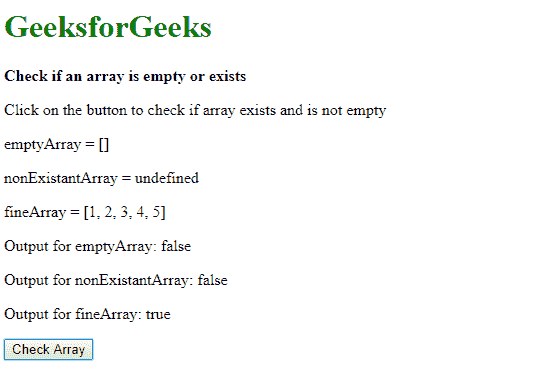
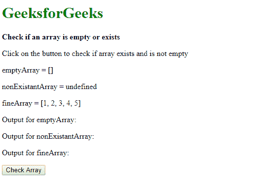
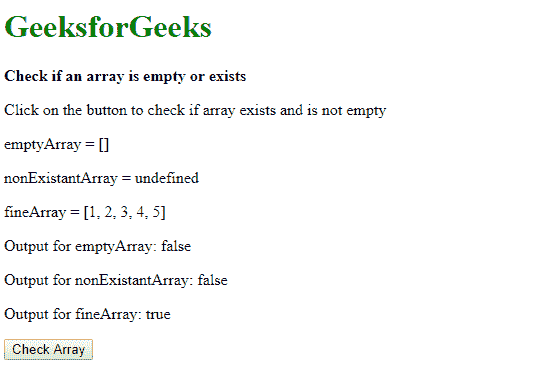

# 在 JavaScript 中检查数组是否为空

> 原文:[https://www . geeksforgeeks . org/check-如果数组为空或不在 javascript 中/](https://www.geeksforgeeks.org/check-if-an-array-is-empty-or-not-in-javascript/)

**方法 1:使用 Array.isArray()方法和 array.length 属性:**可以通过 Array.isArray()方法检查数组是否真的是数组并且存在。如果作为参数传递的对象是数组，则此方法返回 true。它还检查数组是否未定义或为空。

可以使用 array.length 属性检查数组是否为空。此属性返回数组中的元素数量。如果该数字大于 0，则计算结果为真。
该方法和属性都可以与 AND( & &)运算符一起使用，以确定数组是否存在且不为空。

**语法:**

```
Array.isArray(emptyArray) && emptyArray.length
```

**示例:**

```
<!DOCTYPE html>
<html>

<head>
    <title>
        Check if an array is empty or exists
    </title>
</head>

<body>
    <h1 style="color: green">
        GeeksforGeeks
    </h1>

    <b>
        Check if an array is empty or exists
    </b>

    <p>
        Click on the button to check if 
        array exists and is not empty
    </p>

    <p>emptyArray = []</p>
    <p>nonExistantArray = undefined</p>
    <p>fineArray = [1, 2, 3, 4, 5]</p>

    <p>
        Output for emptyArray: 
        <span class="output-empty"></span>
    </p>

    <p>
        Output for nonExistantArray: 
        <span class="output-non"></span>
    </p>

    <p>
        Output for fineArray: 
        <span class="output-ok"></span>
    </p>

    <button onclick="checkArray()">
        Check Array
    </button>

    <script type="text/javascript">

        function checkArray() {
            let emptyArray = [];
            let nonExistantArray = undefined;
            let fineArray = [1, 2, 3, 4, 5];

            if (Array.isArray(emptyArray) && emptyArray.length)
                output = true;
            else
                output = false;

            document.querySelector('.output-empty').textContent = output;

            if (Array.isArray(nonExistantArray) && nonExistantArray.length)
                output = true;
            else
                output = false;

            document.querySelector('.output-non').textContent = output;

            if (Array.isArray(fineArray) && fineArray.length)
                output = true;
            else
                output = false;

            document.querySelector('.output-ok').textContent = output;
        }
    </script>
</body>

</html>                    
```

**输出:**

*   **点击按钮前:**
    
*   **点击按钮后:**
    

**方法二:检查数组的类型和长度:**通过用 type of 运算符检查数组的类型是否为‘undefined’，可以检查数组是否存在。还会检查数组是否为“null”。这两件事验证了数组的存在。

可以使用 array.length 属性检查数组是否为空。通过检查属性是否存在，可以确保它是一个数组，通过检查返回的长度是否大于 0，可以确保数组不为空。

然后，这些属性可以与 AND(&&)运算符一起使用，以确定数组是否存在以及是否为空。

**语法:**

```
typeof emptyArray != "undefined" && emptyArray != null && emptyArray.length != null
&& emptyArray.length > 0
```

**示例:**

```
<!DOCTYPE html>
<html>

<head>
    <title>
        Check if an array is
        empty or exists
    </title>
</head>

<body>
    <h1 style="color: green">
        GeeksforGeeks
    </h1>

    <b>
        Check if an array is
        empty or exists
    </b>

    <p>
        Click on the button to check if 
        array exists and is not empty
    </p>

    <p>emptyArray = []</p>
    <p>nonExistantArray = undefined</p>
    <p>fineArray = [1, 2, 3, 4, 5]</p>

    <p>Output for emptyArray: 
    <span class="output-empty"></span>
    </p>

    <p>
        Output for nonExistantArray: 
        <span class="output-non"></span>
    </p>

    <p>
        Output for fineArray: 
        <span class="output-ok"></span>
    </p>

    <button onclick="checkArray()">
        Check Array
    </button>

    <script type="text/javascript">

        function checkArray() {
            let emptyArray = [];
            let nonExistantArray = undefined;
            let fineArray = [1, 2, 3, 4, 5];

            if (typeof emptyArray != "undefined" 
                        && emptyArray != null 
                        && emptyArray.length != null 
                        && emptyArray.length > 0)
                output = true;
            else
                output = false;

            document.querySelector('.output-empty').textContent
                    = output;

            if (typeof nonExistantArray != "undefined" 
                        && nonExistantArray != null 
                        && nonExistantArray.length != null 
                        && nonExistantArray.length > 0)
                output = true;
            else
                output = false;

            document.querySelector('.output-non').textContent
                    = output;

            if (typeof fineArray != "undefined" 
                        && fineArray != null 
                        && fineArray.length != null 
                        && fineArray.length > 0)
                output = true;
            else
                output = false;

            document.querySelector('.output-ok').textContent
                    = output;
        }
    </script>
</body>

</html>                    
```

**输出:**

*   **点击按钮前:**
    
*   **点击按钮后:**
    

JavaScript 最出名的是网页开发，但它也用于各种非浏览器环境。您可以通过以下 [JavaScript 教程](https://www.geeksforgeeks.org/javascript-tutorial/)和 [JavaScript 示例](https://www.geeksforgeeks.org/javascript-examples/)从头开始学习 JavaScript。