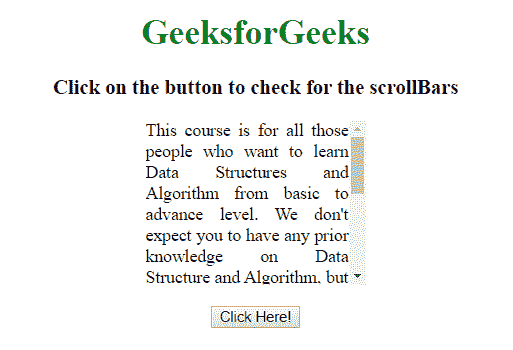
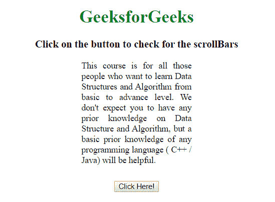

# 用 JavaScript 检查 HTML 元素是否有滚动条

> 原文:[https://www . geesforgeks . org/check-what-html-element-has-scroll bar-using-JavaScript/](https://www.geeksforgeeks.org/check-whether-html-element-has-scrollbars-using-javascript/)

给定一个 HTML 文档，任务是识别特定元素是否有滚动条。有两种方法可以解决这个问题，讨论如下:

**方法 1:**

*   选择特定元素。
*   获取**元素，滚动宽度**和**。水平滚动条的 clientWidth** 属性。
*   计算**滚动宽度>客户端宽度**。
*   如果该值为真，则水平滚动条存在，否则不存在。
*   做同样的过程来检查垂直滚动条。

**示例 1:** 该示例实现了上述方法。

```
<!DOCTYPE HTML>  
<html>  

<head> 
    <title> 
         Check whether HTML element has
         scrollbars using JavaScript
    </title>    

    <style>
        #div {
            width:200px;
            height:150px;
            overflow:auto; 
            text-align:justify;
        }
        #GFG {
            font-size: 24px;
            font-weight: bold;
            color: green;
        }
    </style>
</head>    

<body>
    <center>
        <h1 style = "color:green;" >  
            GeeksforGeeks  
        </h1>

        <h3>
            Click on the button to check
            for the scrollBars
        </h3>

        <div id="div">
            This course is for all those people who want to
            learn Data Structures and Algorithm from basic
            to advance level. We don't expect you to have
            any prior knowledge on Data Structure and 
            Algorithm, but a basic prior knowledge of any
            programming language ( C++ / Java) will be
            helpful. This course gives you the flexibility
            of learning, under this program you can study 
            your course whenever you feel like, you need
            not hurry or puzzle yourself.
        </div>
        <br>

        <button onclick = "GFG_Fun()">
            Click Here!
        </button>

        <div id = "GFG"></div>

        <script>
            function GFG_Fun() {
                var div = document.getElementById('div');
                var hs = div.scrollWidth > div.clientWidth;
                var vs = div.scrollHeight > div.clientHeight;

                document.getElementById('GFG').innerHTML 
                        = "Horizontal Scrollbar - " + hs
                        +"<br>Vertical Scrollbar - " + vs;
            }
        </script> 
    </center>
</body>  

</html>
```

**输出:**

*   **点击按钮前:**
    
*   **点击按钮后:**
    

**方法 2:**

*   选择特定元素。
*   使用**滚动顶部**和**滚动顶部**属性。
*   如果这些值大于 0，则滚动条存在。
*   如果这些是 0，那么首先将它们设置为 1，然后再次测试以了解是否得到 1 的结果。
*   最后，将它们设置回 0。

**示例 2:** 该示例使用上述方法。

```
<!DOCTYPE HTML>  
<html>  

<head> 
    <title> 
         Check whether HTML element has
         scrollbars using JavaScript
    </title>    

    <style>
        #div {
            width:200px;
            height:200px;
            overflow:none; 
            text-align:justify;
        }
        #GFG {
            font-size: 24px;
            font-weight: bold;
            color: green;
        }
    </style>
</head>    

<body>
    <center>
        <h1 style = "color:green;" >  
            GeeksforGeeks  
        </h1>

        <h3>
            Click on the button to check
            for the scrollBars
        </h3>

        <div id="div">
            This course is for all those people who want to
            learn Data Structures and Algorithm from basic
            to advance level. We don't expect you to have
            any prior knowledge on Data Structure and 
            Algorithm, but a basic prior knowledge of any
            programming language ( C++ / Java) will be
            helpful. 
        </div>
        <br>

        <button onclick = "GFG_Fun()">
            Click Here!
        </button>

        <div id = "GFG"></div>

        <script>
            function checkScrollBar(element, dir) {
                dir = (dir === 'vertical') ?
                            'scrollTop' : 'scrollLeft';

                var res = !! element[dir];

                if (!res) {
                    element[dir] = 1;
                    res = !!element[dir];
                    element[dir] = 0;
                }
                return res;
            }

            function GFG_Fun() {
                var div = document.getElementById('div');
                var hs = checkScrollBar(div, 'horizontal');
                var vs = checkScrollBar(div, 'vertical');

                document.getElementById('GFG').innerHTML 
                        = "Horizontal Scrollbar - " + hs
                        +"<br>Vertical Scrollbar - " + vs;
            }
        </script> 
    </center>
</body>  

</html>
```

**输出:**

*   **点击按钮前:**
    
*   **点击按钮后:**
    