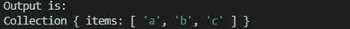

# Collect.js dd()方法

> 原文:[https://www.geeksforgeeks.org/collect-js-dd-method/](https://www.geeksforgeeks.org/collect-js-dd-method/)

collect.js 中的 **dd()方法**用于记录函数的输出并停止进一步执行，从而退出当前进程。

**安装:**

*   使用 NPM:

    ```
    npm install collect.js
    ```

*   使用 collect.js 的 CDN

    ```
    <script src="https://cdnjs.com/libraries/collect.js"></script>
    ```

**语法:**

```
collect.dd()
```

**参数:**不接受任何参数。

**返回值:**不返回任何东西。

**例 1:**

## java 描述语言

```
// Importing the collect.js module.
const collect = require('collect.js'); 
let array = [1, 2, 3, 4, 5, 6];

// Making the collection
let collection = collect(array);

// Using dd() function
collection.dd();
```

**输出:**


**例 2:**DD()函数后的代码将不执行。

## java 描述语言

```
// Importing the collect.js module.
const collect = require('collect.js'); 
let array = ["a", "b", "c"];

// Making the collection
let collection = collect(array);
console.log("Output is: ");

// Using dd() function
collection.dd();

// This will not be printed on the console
console.log("geeks for geeks");
```

**输出:**



**参考:**T2】https://collect.js.org/api/dd.html