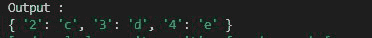
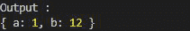

# Collect.js diffAssoc()功能

> 原文:[https://www . geesforgeks . org/collect-js-diffassoc-function/](https://www.geeksforgeeks.org/collect-js-diffassoc-function/)

**diffAssoc()** 函数用于比较两个给定集合，并返回给定集合中不存在的值及其索引。如果在集合中给定了键值对，它将根据指定的键进行比较并返回。

**语法:**

```
diffAssoc( collection );
```

**参数:**

*   **集合:**是给定的集合，其值将与原始数组进行比较。

**返回值:**返回给定集合中不存在的值及其索引。

**示例 1:** 当数组作为集合给出时

## java 描述语言

```
// Importing the collect.js module.
const collect = require('collect.js');
let array = ["a", "b", "c", "d", "e"];
let arr = ["a", "b", "q"];

// Making the collec1
let collec1 = collect(array);
let collec2 = collect(arr);

// Using diffAssoc() Function
let aa = collec1.diffAssoc(collec2)

// The output is so because c, d, e
// are not present in collec2 
// But are present in collec1
console.log("Output : ")
console.log(aa.all())
```

**输出:**



**例 2:** 给定键值对的对象时。

## java 描述语言

```
// Importing the collect.js module.
const collect = require('collect.js');
let obj1 = { "a": 1, "b": 12, "c": 3 };
let obj2 = { "a": 12, "d": 2, "c": 3 };

// Making the collec1
let collec1 = collect(obj1);
let collec2 = collect(obj2);

// Using diffAssoc() Function
let aa = collec1.diffAssoc(collec2)

// The output is so because a whose 
// value is 1 and b whose value is 12 
// because are not present in collec2 
// But are present in collec1
console.log("Output : ")
console.log(aa.all())
```

**输出:**

