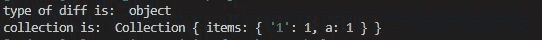

# Collect.js diffKeys()功能

> 原文:[https://www.geeksforgeeks.org/collect-js-diffkeys-function/](https://www.geeksforgeeks.org/collect-js-diffkeys-function/)

**Collect.js** 是 Javascript 中的一个库，它充当数组和对象的包装器。这个库用于将数组和对象转换成集合，然后对它们执行不同的操作。

collect.js 的 **diffKeys** 方法将数组转换为集合，然后根据其键将该集合与另一个集合进行比较，并返回原始集合中不存在于另一个集合中的元素。

**安装:**

*   在 NodeJs 中:

    ```
    npm install collect.js
    ```

*   collect.js 的 CDN

    ```
    <script src="https://cdnjs.com/libraries/collect.js"></script>
    ```

**语法:**

```
collection.diffkeys(object);
```

**参数:**它只取一个对象作为参数。

**返回:**返回一个对象。

下面给出了这个函数的几个例子

**例 1:**

当另一个集合为空对象时。

```
let collect=require("collect.js");
const someCollection = collect({
  "a":1,
  "b":2
});
// Applying diffkeys function
const diff = someCollection.diffKeys({
});
console.log("type of diff is: ", typeof(diff))
console.log("collection is: ", diff)
```

**输出:**


**例 2:**

当另一个集合不是空对象时。

```
let collect=require("collect.js");
const someCollection = collect({
  "a":1,
  "b":2,
  "1":1,
  "2":2
});
// Applying diffkeys function
const diff = someCollection.diffKeys({
  "b":2,
  "2":2
});
console.log("type of diff is: ", typeof(diff))
console.log("collection is: ", diff)
```

**输出:**

