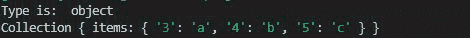
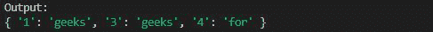

# Collect.js 副本()方法

> 原文:[https://www.geeksforgeeks.org/collect-js-duplicates-method/](https://www.geeksforgeeks.org/collect-js-duplicates-method/)

collect.js 中的 **duplicates()** 函数用于从给定数组中提取副本。它返回一个对象，该对象包含作为副本索引的键和作为副本本身的值。

**安装:**

*   使用 NPM:

    ```
    npm install collect.js
    ```

*   使用 collect.js 的 CDN

    ```
    <script src="https://cdnjs.com/libraries/collect.js"></script>

    ```

**语法:**

```
collect.duplicates()
```

**参数:**此方法不接受任何参数。

**返回值:**返回包含重复值及其索引的对象。

**例 1:**

## java 描述语言

```
// Importing the collect.js module.
const collect = require('collect.js'); 

const collection = collect(['b', 'c', 'a', 'a', 'b', "c"]);

const duplicatesObject = collection.duplicates();

// Logging the return type
console.log("Type is: ", typeof(duplicatesObject))

// Logging the duplicates object
console.log(duplicatesObject)
```

**输出:**



**示例 2:** 使用 duplicate.all 进行日志记录，并从字符串数组中提取副本。

## java 描述语言

```
// Importing the collect.js module.
const collect = require('collect.js'); 

const collection = collect(["geeks", 
    "geeks", "for", "geeks", "for"]);

const duplicatesObject = collection.duplicates();

// Logging the return type
// logging the duplicates object using
// duplicate.all
console.log("Output: ")
console.log(duplicatesObject.all())
```

**输出:**

