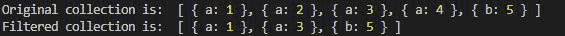
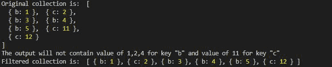

# Collect.js whereNotIn()方法

> 原文:[https://www.geeksforgeeks.org/collect-js-wherenotin-method/](https://www.geeksforgeeks.org/collect-js-wherenotin-method/)

collect.js 中的 **whereNotIn()** 方法用于根据键和值过滤给定集合中的元素。如果找到一组特定的键值，那么它就会被过滤掉。

**安装:**

*   **在 NodeJs 中:**

    ```
    npm install collect.js
    ```

*   **CDN 为**T0

**语法:**

```
whereNotIn(key, array_value);
```

**参数:**

*   **键:**要删除其值的键。
*   **array_value:** 要删除的键值数组。

**返回值:**返回对象。

**例 1:**

## java 描述语言

```
// Importing the collect.js module.
const collect = require('collect.js');
let obj1 = [
    { "a": 1 },
    { "a": 2 },
    { "a": 3 },
    { "a": 4 },
    { "b": 5 }
]

// Making a collection
let collection = collect(obj1);

// Using whereNotIn() method to return
// a collection not having value 2, 4
// For key "a"
let collectionFilter = collection
            .whereNotIn("a", [2, 4]);

console.log("Original collection is: ",
            collection.all())

console.log("Filtered collection is: ", 
            collectionFilter.all());
```

**输出:**



**例 2:**

## java 描述语言

```
// Importing the collect.js module.
const collect = require('collect.js');

let obj1 = [
    { "b": 1 },
    { "c": 2 },
    { "b": 3 },
    { "b": 4 },
    { "b": 5 },
    { "c": 11 },
    { "c": 12 },
]

// Making a collection
let collection = collect(obj1);

// Using whereNotIn() method to return 
// a collection not having value 1, 2, 4
// For key "b"
let collectionFilter = 
    collection.whereNotIn("b", [1, 2, 4]);

collectionFilter = 
    collection.whereNotIn("c", [11]);

console.log("Original collection is: ", 
    collection.all());

console.log("The output will not contain "
        + "value of 1, 2, 4 for key \"b\""
        + " and value of 11 for key \"c\"");

console.log("Filtered collection is: ", 
        collectionFilter.all());
```

**输出:**



**参考:**T2】https://collect.js.org/api/whereNotIn.html