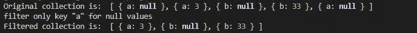

# Collect.js whereNotNull 方法

> 原文:[https://www . geesforgeks . org/collect-js-where not null-method/](https://www.geeksforgeeks.org/collect-js-wherenotnull-method/)

**whereNotNull()** 方法用于返回不包含任何 Null 值的集合。简单地说，它过滤不为空的值。

**安装:**

*   **在 NodeJs 中:**

    ```
    npm install collect.js
    ```

*   **CDN 为**T0

**语法:**

```
whereNotNull(key if any)
```

**参数:**取对象中元素的键。

**返回值:**返回对象。

**例 1:**

## java 描述语言

```
// Importing the collect.js module.
const collect = require('collect.js');

let obj1 = [{ "a": null }, { "a": 3 }, 
    { "b": null }, { "b": 33 }, { "a": null }];

// Making a collection
let collection = collect(obj1);

// Filtering the null values;
let collectionFilter = collection.whereNotNull("a");

// Printing the original collection
console.log("Original collection is: ", collection.all())
console.log("filter only key \"a\" for null values")
console.log("Filtered collection is: ", 
        collectionFilter.all());
```

**输出:**



**例 2:**

## java 描述语言

```
// Importing the collect.js module.
const collect = require('collect.js');
let obj1 = [1, 2, null, null, 5];

// Making a collection
let collection = collect(obj1);

// Filtering the null values;
let collectionFilter = collection.whereNotNull();
console.log("Original collection is: ",
            collection.all())

console.log("Filtered collection is: ", 
            collectionFilter.all());
```

**输出:**


**参考:**T2】https://collect.js.org/api/whereNotNull.html