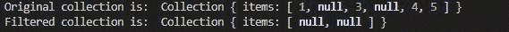
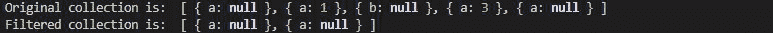

# Collect.js whereNull()方法

> 原文:[https://www.geeksforgeeks.org/collect-js-wherenull-method/](https://www.geeksforgeeks.org/collect-js-wherenull-method/)

collect.js 中的 **whereNull()** 方法用于过滤集合中为空的值。

**安装:**

*   **在 NodeJs 中:**

    ```
    npm install collect.js
    ```

*   **CDN 为**T0

**语法:**

```
whereNull(key if any);
```

**参数:**接受对象的键。

**返回:**返回集合对象。

**例 1:**

## java 描述语言

```
// Importing the collect.js module.
const collect = require('collect.js');
let obj1 = [1, null, 3, null, 4, 5];

// Making a collection
let collection = collect(obj1);

// Filtering the null values;
let collectionFilter = collection.whereNull();
console.log("Original collection is: ", collection)
console.log("Filtered collection is: ", collectionFilter);
```

**输出:**



**示例 2:** 使用具有空值的对象。

## java 描述语言

```
// Importing the collect.js module.
const collect = require('collect.js');
let obj1 = [{ "a": null }, { "a": 1 }, 
    { "b": null }, { "a": 3 }, { "a": null }];

// Making a collection
let collection = collect(obj1);

// Filtering the null values;
let collectionFilter = collection.whereNull("a");

// Printing the original collection
console.log("Original collection is: ", 
        collection.all())
console.log("Filtered collection is: ", 
        collectionFilter.all());
```

**输出:**



**参考:**T2】https://collect.js.org/api/whereNull.html