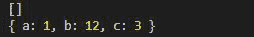
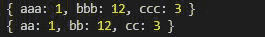

# Collect.js wrap()方法

> 原文:[https://www.geeksforgeeks.org/collect-js-wrap-method/](https://www.geeksforgeeks.org/collect-js-wrap-method/)

collect.js 中的 **wrap()** 方法用于包装集合中的一组特定值。

**安装:**

*   **在 NodeJs 中:**

    ```
    npm install collect.js
    ```

*   **CDN 为**T0

**语法:**

```
wrap( object );
```

**参数:**此方法接受数组或对象。

**返回值:**返回对象。

**例 1:**

## java 描述语言

```
// Importing the collect.js module.
const collect = require('collect.js');
let obj1 = { "a": 1, "b": 12, "c": 3 };

// This will make a empty collection
let collection = collect();

// It will not wrap
collection.wrap(obj1);

console.log(collection.all());

// Using wrap function to wrap values
// to a collection
collection = collect().wrap(obj1);
console.log(collection.all());
```

**输出:**



**例 2:**

## java 描述语言

```
// Importing the collect.js module.
const collect = require('collect.js');
let obj1 = { "a": 1, "b": 12, "c": 3 };
let obj2 = { "aa": 1, "bb": 12, "cc": 3 };
let obj3 = { "aaa": 1, "bbb": 12, "ccc": 3 };

// Using wrap() method to wrap values
// to a collection
collection = collect().wrap(obj1)
    .wrap(obj2)
    .wrap(obj3);

// Note: only the obj3 is wrapped and
// obj1 and obj2 are replaced

console.log(collection.all());
collection = collect().wrap(obj1)
    .wrap(obj2)

// Note: only the obj2 is wrapped 
// and obj1 is replaced.
console.log(collection.all());
```

**输出:**



**参考:**T2】https://collect.js.org/api/wrap.html