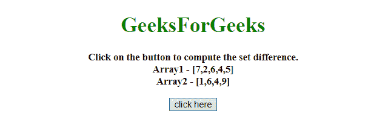
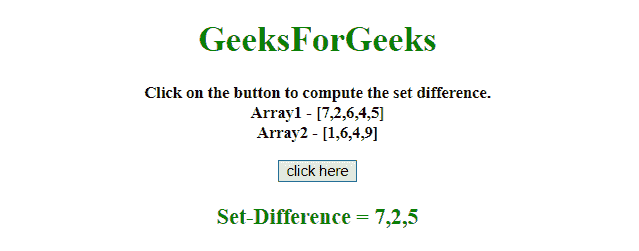
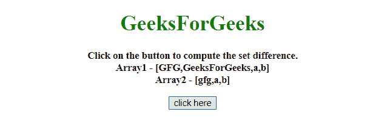
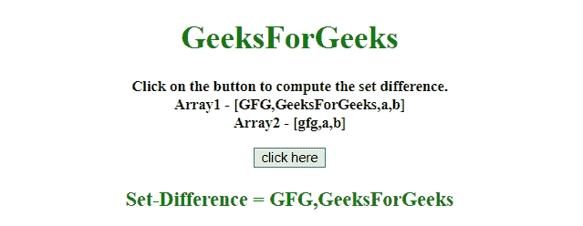

# 使用 JavaScript 数组计算集差

> 原文:[https://www . geesforgeks . org/compute-the-set-difference-use-JavaScript-arrays/](https://www.geeksforgeeks.org/compute-the-set-difference-using-javascript-arrays/)

给定一个两个数组，任务是使用 JavaScript 计算两个数组之间的集合差。

**进场:**

*   将两个数组值存储到两个变量中。
*   对 array_1 的每个值使用 filter()方法，如果 array_2 中有一个值，则不包括它。否则包括 array_1 的值。

**示例 1:** 在本示例中，使用**滤波器()方法**计算设定差。

```
<!DOCTYPE HTML> 
<html> 

<head> 
    <title> 
        Compute the set difference using
        Javascript arrays
    </title>
</head>

<body style = "text-align:center;"> 

    <h1 style = "color:green;" id = "h1"> 
        GeeksForGeeks 
    </h1>

    <p id = "GFG_UP" style = 
        "font-size: 15px; font-weight: bold;">
    </p>

    <button onclick = "GFG_Fun()">
        click here
    </button>

    <p id = "GFG_DOWN" style = 
        "color:green; font-size: 20px; font-weight: bold;">
    </p>

    <script> 
        var up = document.getElementById('GFG_UP');
        var down = document.getElementById('GFG_DOWN');
        var A = [7, 2, 6, 4, 5];
        var B = [1, 6, 4, 9];
        up.innerHTML = "Click on the button to compute "
                + "the set difference.<br>" + "Array1 - ["
                + A + "]<br>Array2 - [" + B + "]";

        function GFG_Fun() {
            diff = A.filter(x => !B.includes(x) )
            down.innerHTML = "Set-Difference = " + diff;
        }
    </script> 
</body> 

</html>    
```

**输出:**

*   **点击按钮前:**
    
*   **点击按钮后:**
    

**示例 2:** 在此示例中，使用**滤波器()方法**计算集差，但方法稍有不同。

```
<!DOCTYPE HTML> 
<html> 

<head> 
    <title> 
        Compute the set difference
        using Javascript arrays
    </title>
</head>

<body style = "text-align:center;"> 

    <h1 style = "color:green;" id = "h1"> 
        GeeksForGeeks 
    </h1>

    <p id = "GFG_UP" style = 
        "font-size: 15px; font-weight: bold;">
    </p>

    <button onclick = "GFG_Fun()">
        click here
    </button>

    <p id = "GFG_DOWN" style =
        "color:green; font-size: 20px; font-weight: bold;">
    </p>

    <script> 
        var up = document.getElementById('GFG_UP');
        var down = document.getElementById('GFG_DOWN');
        var A = ["GFG", "GeeksForGeeks", "a", "b"];
        var B = ["gfg", "a", "b"];

        up.innerHTML = "Click on the button to compute"
                + " the set difference.<br>" + "Array1 - ["
                + A + "]<br>Array2 - [" + B + "]";

        function GFG_Fun() {
            diff = A.filter(function(x) {
                return B.indexOf(x) < 0 
            })

            down.innerHTML = "Set-Difference = " + diff;
        }
    </script> 
</body> 

</html>                    
```

**输出:**

*   **点击按钮前:**
    
*   **点击按钮后:**
    