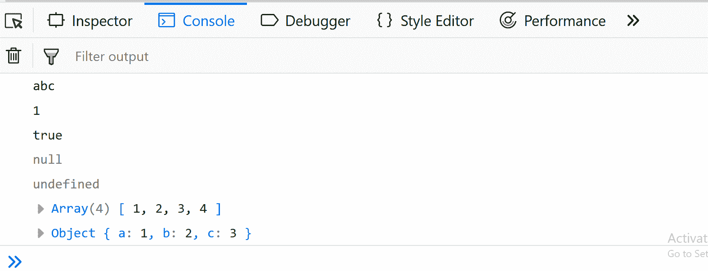
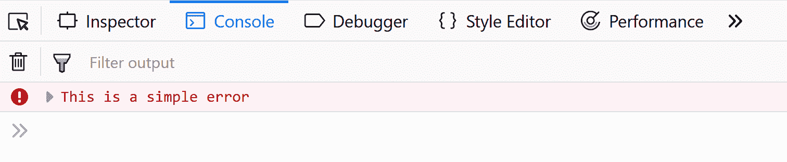
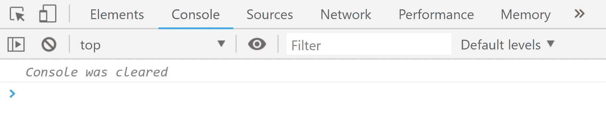

# JavaScript 中的控制台

> 原文:[https://www.geeksforgeeks.org/console-in-javascript/](https://www.geeksforgeeks.org/console-in-javascript/)

**网络控制台**

网络控制台是一种工具，主要用于记录与网页相关的信息，如:*网络请求、javascript、安全错误、警告、CSS 等。*通过在网页内容中执行 javascript 表达式，使我们能够与网页进行交互。

**控制台对象**

在 javascript 中，控制台是一个提供对浏览器调试控制台的访问的对象。我们可以在网络浏览器中打开一个控制台，窗口使用: *Ctrl + Shift + K* ，Mac 使用*命令+选项+ K* 。控制台对象为我们提供了几种不同的方法，比如:

*   日志()
*   错误()
*   警告()
*   清除()
*   时间()和时间结束()
*   表()
*   计数()
*   group()和 groupEnd()
*   自定义控制台日志

让我们逐一看看所有这些方法。

**console.log()**

主要用于将输出记录(打印)到控制台。我们可以在 log()中放入任何类型，可以是字符串、数组、对象、布尔值等。

## java 描述语言

```
// console.log() method
console.log('abc');
console.log(1);
console.log(true);
console.log(null);
console.log(undefined);
console.log([1, 2, 3, 4]); // array inside log
console.log({a:1, b:2, c:3}); // object inside log
```

**输出:**



**console.error()**

用于将错误消息记录到控制台。在代码测试中很有用。默认情况下，错误消息将以红色突出显示。

## java 描述语言

```
// console.error() method
console.error('This is a simple error');
```

**输出:**



**console.warn()**

用于将警告消息记录到控制台。默认情况下，警告消息将以黄色突出显示。

## java 描述语言

```
// console.warn() method
console.warn('This is a warning.');
```

**输出:**


**console.clear()**

用于清除控制台。控制台将被清除，在 Chrome 的情况下，一个简单的重叠文本将被打印出来，如:“控制台被清除”，而在 firefox 中没有消息被返回。

## java 描述语言

```
// console.clear() method
console.clear();
```

**输出:**



**console.time()和 console.timeEnd()**

每当我们想知道一个块或一个函数花费的时间量时，我们可以利用 javascript console 对象提供的 time()和 timeEnd()方法。它们有一个标签，标签必须是相同的，里面的代码可以是任何东西(函数、对象、简单控制台)。

## java 描述语言

```
// console.time() and console.timeEnd() method
console.time('abc');
 let fun =  function(){
     console.log('fun is running');
 }
 let fun2 = function(){
     console.log('fun2 is running..');
 }
 fun(); // calling fun();
 fun2(); // calling fun2();
console.timeEnd('abc');
```