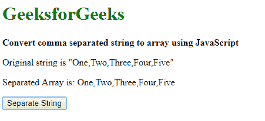
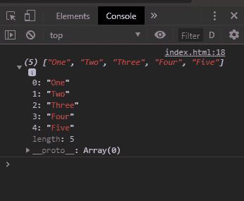
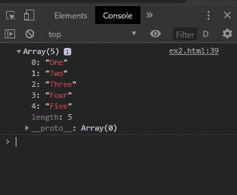

# 使用 JavaScript 将逗号分隔的字符串转换为数组

> 原文:[https://www . geesforgeks . org/convert-逗号分隔字符串到数组-使用-javascript/](https://www.geeksforgeeks.org/convert-comma-separated-string-to-array-using-javascript/)

逗号分隔的字符串可以通过两种方法转换为数组:

**方法 1:使用 split()方法**
split()方法用于在分隔符的基础上拆分字符串。该分隔符可以定义为逗号，以便在遇到逗号时分隔字符串。这个方法会传回分隔的字串阵列。

**语法:**

```
string.split(', ')
```

**示例:**

```
<!DOCTYPE html>
<html>

<head>
    <title>
      Convert comma separated 
      string to array using JavaScript
  </title>
</head>

<body>
    <h1 style="color: green">
      GeeksforGeeks
  </h1>
    <b>Convert comma separated string 
      to array using JavaScript</b>
    <p>Original string is
      "One, Two, Three, Four, Five"</p>
    <p>
      Separated Array is: <span class="output"></span>
  </p>

    <button onclick="separateString()">
      Remove Text
  </button>
    <script type="text/javascript">
        function separateString() {
            originalString = "One, Two, Three, Four, Five";
            separatedArray = originalString.split(', ');

            console.log(separatedArray);
            document.querySelector('.output').textContent = 
              separatedArray;
        }
    </script>
</body>

</html>
```

**输出:**

*   **点击按钮后:**
    
*   **控制台输出:**
    

**方法 2:遍历数组，跟踪遇到的任何逗号，并用分隔的字符串创建一个新数组。**
这种方法包括遍历字符串中的每个字符，并检查逗号。定义了一个变量 previousIndex，用于跟踪下一个字符串的第一个字符。然后使用 slice 方法移除字符串中位于前一个索引和当前找到的逗号位置之间的部分。这个字符串然后被推送到一个新的数组。然后对整个字符串重复这个过程。最后的数组包含所有分离的字符串。

**语法:**

```
originalString = "One, Two, Three, Four, Five";
separatedArray = [];

// index of end of the last string 
let previousIndex = 0;

for(i = 0; i < originalString.length; i++) {

    // check the character for a comma
    if (originalString[i] == ', ') {

        // split the string from the last index
        // to the comma
        separated = originalString.slice(previousIndex, i);
        separatedArray.push(separated);

        // update the index of the last string
        previousIndex = i + 1;
    }
}

// push the last string into the array
separatedArray.push(originalString.slice(previousIndex, i));
```

**示例:**

```
<!DOCTYPE html>
<html>

<head>
    <title>
      Convert comma separated string
      to array using JavaScript
  </title>
</head>

<body>
    <h1 style="color: green">
      GeeksforGeeks
  </h1>
    <b>Convert comma separated 
      string to array using JavaScript</b>
    <p>Original string is
      "One, Two, Three, Four, Five"</p>
    <p>
      Separated Array is: <span class="output"></span>
  </p>

    <button onclick="separateString()">
      Remove Text
  </button>
    <script type="text/javascript">

        function separateString() {

            originalString =
              "One, Two, Three, Four, Five";
            separatedArray = [];

            // index of end of the last string 
            let previousIndex = 0;

            for (i = 0; i < originalString.length; i++) {

                // check the character for a comma
                if (originalString[i] == ', ') {

                    // split the string from the last index
                    // to the comma
                    separated = 
                      originalString.slice(previousIndex, i);
                    separatedArray.push(separated);

                    // update the index of the last string
                    previousIndex = i + 1;
                }
            }

            // push the last string into the array
            separatedArray.push(
              originalString.slice(previousIndex, i));

            console.log(separatedArray);
            document.querySelector(
              '.output').textContent = separatedArray;
        }
    </script>
</body>

</html>
```

**输出:**

*   **点击按钮后:**
    
*   **控制台输出:**
    