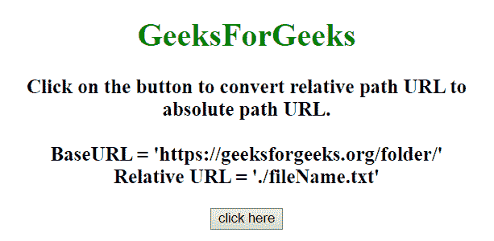
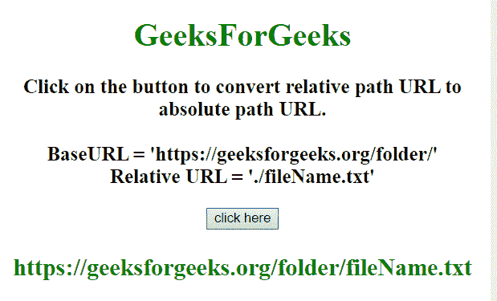
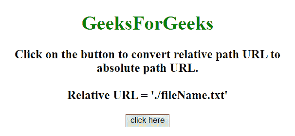
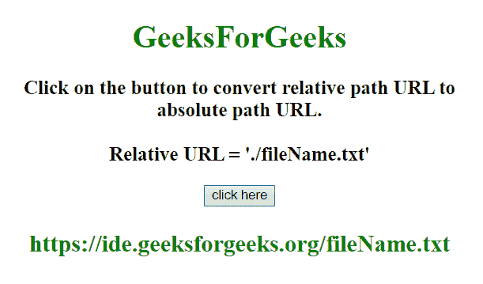

# 使用 JavaScript 将相对路径 URL 转换为绝对路径 URL

> 原文:[https://www . geesforgeks . org/convert-relative-path-URL-to-absolute-path-URL-using-JavaScript/](https://www.geeksforgeeks.org/convert-relative-path-url-to-absolute-path-url-using-javascript/)

给定相对网址，任务是将相对网址转换为绝对网址。这里也给出了基本网址。这里讨论了 2 种方法，第一个例子有用户提供的 baseURL，第二个例子从页面的 URL 中获取。

**方法 1:**

*   从用户处获取 relURL 和 baseURL。
*   使用**。split()方法**对“/”上的基和相对 URL 进行拆分，分别得到数组、st 和 arr 中的各个部分。
*   在 arr 长度上运行一个循环，对于每一圈，如果 arr[I]= = = ' .. '然后从 st 数组弹出元素，否则使用**在 st 数组中推送 arr[i]。push()和。pop()方法**。
*   使用**加入 st 数组。join()方法**在“/”上获取绝对 URL。

**示例 1:** 该示例实现了上述方法。

```
<!DOCTYPE HTML>
<html>

<head>
    <title>
        Convert relative path URL to
      absolute path URL using JavaScript.
    </title>
    <script src=
"https://ajax.googleapis.com/ajax/libs/jquery/3.4.1/jquery.min.js">
    </script>
</head>

<body style="text-align:center;">
    <h1 style="color:green;">  
            GeeksForGeeks  
        </h1>
    <p id="GFG_UP">
    </p>
    <button onclick="GFG_Fun()">
        click here
    </button>
    <p id="GFG_DOWN" style="color: green;">
    </p>
    <script>
        var up = document.getElementById('GFG_UP');
        var element = document.getElementById("body");
        var base = "https://geeksforgeeks.org/folder/";
        var relURL = "./fileName.txt";
        up.innerHTML = 
            "Click on the button to convert relative path"+
          " URL to absolute path URL.<br><br>BaseURL = '"
        + base + "'<br>Relative URL = '" + relURL + "'";

        function absolute(base, rel) {
            var st = base.split("/");
            var arr = rel.split("/");
            st.pop(); // ignore the current file name (or no string)
           // (ignore if "base" is the current folder without having slash in trail)
            for (var i = 0; i < arr.length; i++) {
                if (arr[i] == ".")
                    continue;
                if (arr[i] == "..")
                    st.pop();
                else
                    st.push(arr[i]);
            }
            return st.join("/");
        }

        function GFG_Fun() {
            $('#GFG_DOWN').html(absolute(base, relURL));
        }
    </script>
</body>

</html>
```

**输出:**

*   **点击按钮前:**
    
*   **点击按钮后:**
    

**方法 2:**

*   从用户处获取 relURL。
*   使用**document . create element(“a”)**创建一个锚点元素，并将 **href 属性**设置为等于 relURL。
*   使用 **link.protocol、link.host 和 link.pathname** 分别获取页面的协议、主机名和路径名(relURL)。

**示例 2:** 该示例实现了上述方法。

```
<!DOCTYPE HTML>
<html>

<head>
    <title>
        Convert relative path URL to
      absolute path URL using JavaScript.
    </title>
    <script src=
"https://ajax.googleapis.com/ajax/libs/jquery/3.4.1/jquery.min.js">
    </script>
</head>

<body style="text-align:center;">
    <h1 style="color:green;">  
            GeeksForGeeks  
        </h1>
    <p id="GFG_UP">
    </p>
    <button onclick="GFG_Fun()">
        click here
    </button>
    <p id="GFG_DOWN" style="color: green;">
    </p>
    <script>
        var up = document.getElementById('GFG_UP');
        var element = document.getElementById("body");
        var relURL = "./fileName.txt";
        up.innerHTML = 
          "Click on the button to convert relative path URL to"+
          " absolute path URL.<br><br>Relative URL = '"
        + relURL + "'";
        var absolute = function(rel) {
            var link = document.createElement("a");
            link.href = rel;
            return (link.protocol + "//" + link.host + link.pathname);
        }

        function GFG_Fun() {
            $('#GFG_DOWN').html(absolute(relURL));
        }
    </script>
</body>

</html>
```

**输出:**

*   **点击按钮前:**
    
*   **点击按钮后:**
    