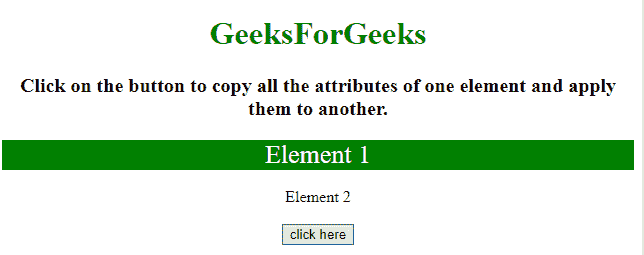
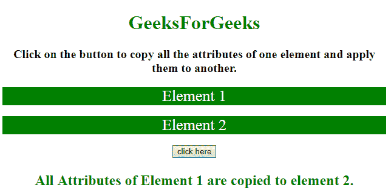

# 用 JavaScript 复制一个元素的所有属性并应用到另一个元素上

> 原文:[https://www . geeksforgeeks . org/用 javascript 复制一个元素的所有属性并将其应用于另一个元素/](https://www.geeksforgeeks.org/copy-all-the-attributes-of-one-element-and-apply-them-to-another-with-javascript/)

任务是复制一个元素的所有属性，并在 javaScript 的帮助下将其应用于另一个元素。这里讨论两种方法。

**方法 1:**

*   选择两个元素(目标和源元素)。
*   使用 **el.prop('属性')方法**获取源元素的属性。
*   使用**。每个()方法对每个对象属性执行**，并使用**将该属性设置为目标元素。attr()方法**。

**示例 1:** 该示例实现了上述方法。

## 超文本标记语言

```
<!DOCTYPE HTML>
<html>

<head>
    <title>
        Copy all the attributes of one element
      and apply them to another with JavaScript.
    </title>
    <script src=
"https://ajax.googleapis.com/ajax/libs/jquery/3.4.1/jquery.min.js">
    </script>
</head>

<body style="text-align:center;">
    <h1 style="color:green;"> 
            GeeksForGeeks 
        </h1>
    <p id="GFG_UP">
    </p>

    <div id="el1" style="background: green;">
        Element 1
    </div>
    <br>
    <div id="el2">
        Element 2
    </div>
    <br>
    <button onclick="GFG_Fun()">
        click here
    </button>
    <p id="GFG_DOWN" style="color: green;">
    </p>

    <script>
        var up = document.getElementById('GFG_UP');
        var down = document.getElementById('GFG_DOWN');
        up.innerHTML =
"Click on the button to copy all the attributes of one "+
          "element and apply them to another.";

        function GFG_Fun() {
            var $el1 = $("#el1");
            var $el2 = $("#el2");
            var attrbts = $el1.prop("attributes");
            // loop through element1 attributes and apply them on element2.
            $.each(attrbts, function() {
                $el2.attr(this.name, this.value);
            });
            down.innerHTML =
              "All Attributes of Element 1 are copied to element 2.";
        }
    </script>
</body>

</html>
```

**输出:**

*   **点击按钮前:**



*   **点击按钮后:**



**方法 2:**

*   选择两个元素(目标和源元素)。
*   使用 **el.attributes 属性**获取源元素的属性。
*   使用**。对每个属性使用 forEach()方法**，并使用**将该属性设置为目标元素。setAttribute()方法**。

**示例 2:** 该示例实现了上述方法。

## 超文本标记语言

```
<!DOCTYPE HTML>
<html>

<head>
    <title>
        Copy all the attributes of one element
      and apply them to another with JavaScript.
    </title>
    <script src=
"https://ajax.googleapis.com/ajax/libs/jquery/3.4.1/jquery.min.js">
    </script>
</head>

<body style="text-align:center;">
    <h1 style="color:green;"> 
            GeeksForGeeks 
        </h1>
    <p id="GFG_UP">
    </p>

    <div id="el1" style="background: green;
                color: white; font-size: 26px;">
        Element 1
    </div>
    <br>
    <div id="el2">
        Element 2
    </div>
    <br>
    <button onclick="GFG_Fun()">
        click here
    </button>
    <p id="GFG_DOWN" style="color: green;">
    </p>

    <script>
        var up = document.getElementById('GFG_UP');
        var down = document.getElementById('GFG_DOWN');
        up.innerHTML =
"Click on the button to copy all the attributes of one element"+
        " and apply them to another.";

        function copyAttrs(target, source) {
            [...source.attributes].forEach(attr => {
                target.setAttribute(attr.nodeName, attr.nodeValue)
            })
        }

        function GFG_Fun() {
            var el1 = document.getElementById("el1");
            var el2 = document.getElementById("el2");
            copyAttrs(el2, el1);
            down.innerHTML =
              "All Attributes of Element 1 are copied to element 2.";
        }
    </script>
</body>

</html>
```

**输出:**

*   **点击按钮前:**


*   **点击按钮后:**

