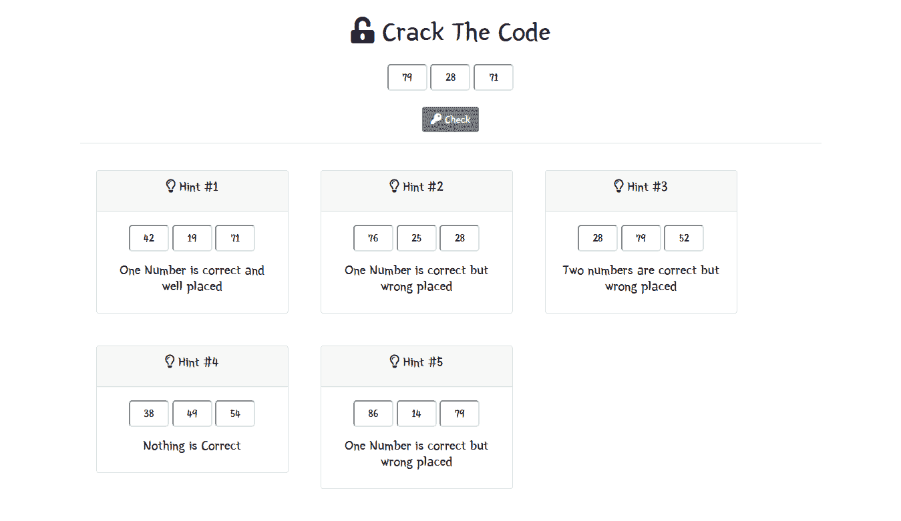
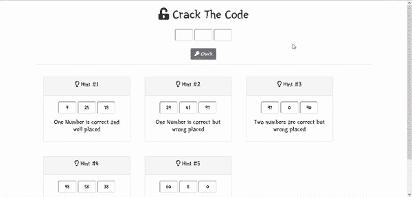
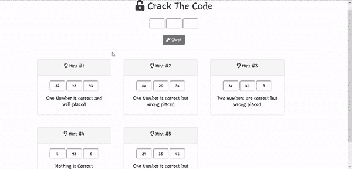
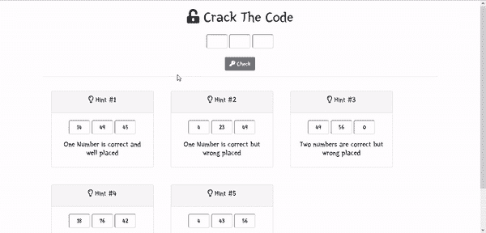

# JavaScript 破解代码游戏

> 原文:[https://www . geesforgeks . org/破解代码-游戏-使用-javascript/](https://www.geeksforgeeks.org/crack-the-code-game-using-javascript/)

**如何用 JavaScript 实现破解游戏？**

用一些简单的数学很容易发展。玩家必须使用 5 个简单的提示来猜测这 3 个数字才能赢得这场游戏。这将是一个非常有趣的游戏。这个游戏是用简单的数学在 JavaScript 中构建的。

**先决条件:【HTML、CSS、JavaScript、Bootstrap 4 等一些前端技术的基础知识。**



破解密码观

**文件名:index.html**

## 超文本标记语言

```html
<!doctype html>
<html lang="en">

<head>
    <meta charset="utf-8">
    <meta name="viewport" content="width=device-width,
        initial-scale=1, shrink-to-fit=no">

    <title>Crack-The-Code Game</title>

    <!-- Bootstrap CDN starts-->
    <link rel="stylesheet" href=
"https://maxcdn.bootstrapcdn.com/bootstrap/4.0.0/css/bootstrap.min.css"
        crossorigin="anonymous">

    <script src="https://code.jquery.com/jquery-3.2.1.slim.min.js" 
        crossorigin="anonymous">
    </script>

    <script src=
"https://cdnjs.cloudflare.com/ajax/libs/popper.js/1.12.9/umd/popper.min.js"
        crossorigin="anonymous">
    </script>

    <script src=
"https://maxcdn.bootstrapcdn.com/bootstrap/4.0.0/js/bootstrap.min.js" 
        crossorigin="anonymous">
    </script>
    <!-- Bootstrap CDN ends -->

    <!-- Font Awesome kit --- for icons -->
    <script src="https://kit.fontawesome.com/788fc8cac3.js" 
        crossorigin="anonymous">
    </script>

    <!-- Google font CDN for Yeon Sung font -->
    <link rel="preconnect" href="https://fonts.gstatic.com">
    <link href=
"https://fonts.googleapis.com/css2?family=Yeon+Sung&display=swap"
        rel="stylesheet">
    <!-- Google font CDN ends -->

    <!-- Internal CSS -->
    <style>
        * {
            font-family: 'Yeon Sung', cursive;
        }

        input {
            width: 60px;
            height: 40px;
            border-radius: 5px;
            text-align: center;
        }
    </style>
</head>

<body>

    <!--Popup Modal -->
    <div class="modal fade" id="popup" tabindex="-1" 
        role="dialog" aria-labelledby="popupLabel" 
        aria-hidden="true">

        <div class="modal-dialog" role="document">
            <div class="modal-content">
                <div class="modal-header">
                    <h5 class="modal-title text-danger 
                        font-weight-bold" id="popupLabel">
                        Pop Up
                    </h5>

                    <button type="button" class="close" 
                        data-dismiss="modal" aria-label="Close">
                        <span aria-hidden="true">×</span>
                    </button>
                </div>
                <div class="modal-body">
                    <h3 id="result" class="text-center"></h3>
                </div>
                <div class="modal-footer">
                    <button type="button" class="btn 
                        btn-secondary" data-dismiss="modal">
                        Close
                    </button>
                </div>
            </div>
        </div>
    </div>
    <!-- Popup Modal -->

    <div class="container my-4">
        <h1 class="text-center my-4"><i class="fas 
                fa-unlock-alt"></i> Crack The Code</h1>

        <!-- 3 input fields -->
        <div class="text-center">
            <input type="text" id="b1">
            <input type="text" id="b2">
            <input type="text" id="b3">
            <br />
            <!-- Button to check result -->
            <button class="btn btn-secondary mt-4" 
                onclick="myfunc();">
                <i class="fas fa-key"></i> Check
            </button>
        </div>
        <hr>

        <!-- Hints starts -->
        <div id="hints" class="row m-auto">
            <div id="hintOne">
                <div class="card m-4" style="width: 18rem;">
                    <div class="card-header card-title">
                        <h5 class="card-title text-center">
                            <i class="far fa-lightbulb"></i>
                            Hint #1
                        </h5>
                    </div>
                    <div class="card-body">
                        <p id="h1" class="text-center"></p>

                        <h5 class="text-center">
                            One Number is correct and 
                            well placed
                        </h5>
                    </div>
                </div>

            </div>
            <div id="hintTwo">
                <div class="card m-4" style="width: 18rem;">
                    <div class="card-header card-title">
                        <h5 class="card-title text-center">
                            <i class="far fa-lightbulb"></i> 
                            Hint #2
                        </h5>
                    </div>
                    <div class="card-body">
                        <p id="h2" class="text-center"></p>

                        <h5 class="text-center">
                            One Number is correct but wrong placed
                        </h5>
                    </div>
                </div>
            </div>
            <div id="hintThree">
                <div class="card m-4" style="width: 18rem;">
                    <div class="card-header card-title">
                        <h5 class="card-title text-center">
                            <i class="far fa-lightbulb"></i> 
                            Hint #3
                        </h5>
                    </div>
                    <div class="card-body">
                        <p id="h3" class="text-center"></p>

                        <h5 class="text-center">
                            Two numbers are correct but 
                            wrong placed
                        </h5>
                    </div>
                </div>
            </div>
            <div id="hintFour">
                <div class="card m-4" style="width: 18rem;">
                    <div class="card-header card-title">
                        <h5 class="card-title text-center">
                            <i class="far fa-lightbulb"></i> 
                            Hint #4
                        </h5>
                    </div>
                    <div class="card-body">
                        <p id="h4" class="text-center"></p>

                        <h5 class="text-center">
                            Nothing is Correct
                        </h5>
                    </div>
                </div>
            </div>
            <div id="hintFive">
                <div class="card m-4" style="width: 18rem;">
                    <div class="card-header card-title">
                        <h5 class="card-title text-center">
                            <i class="far fa-lightbulb"></i> 
                            Hint #5
                        </h5>
                    </div>
                    <div class="card-body">
                        <p id="h5" class="text-center"></p>

                        <h5 class="text-center">
                            One Number is correct but 
                            wrong placed
                        </h5>
                    </div>
                </div>
            </div>
        </div>
        <!-- Hints ends -->

    </div>
</body>
<!-- JavaScript file included -->
<script src="script.js"></script>

</html>
```

**文件名:script.js**

## java 描述语言

```html
// Number to decide the game digit i.e. 
// game work on 2 digit, 3 digit or n
// digit of number.
const digit = 100;

// Set random numbers. The task of user 
// is to find these numbers.
let num1 = Math.floor(Math.random() * digit);
let num2 = Math.floor(Math.random() * digit);
let num3 = Math.floor(Math.random() * digit);

// Hints are generated here onwards.
// Hint 1
let h1_a = Math.floor(Math.random() * digit);
let h1_b = Math.floor(Math.random() * digit);
let h1_c = num3;

// Hint 2
let h2_a = Math.floor(Math.random() * digit);
let h2_b = Math.floor(Math.random() * digit);
let h2_c = num2;

//Hint 3
let h3_a = num2;
let h3_b = num1;
let h3_c = Math.floor(Math.random() * digit);

// Hint 4
let h4_a = Math.floor(Math.random() * digit);
let h4_b = Math.floor(Math.random() * digit);
let h4_c = Math.floor(Math.random() * digit);

// Hint 5
let h5_a = Math.floor(Math.random() * digit);
let h5_b = Math.floor(Math.random() * digit);
let h5_c = num1;

// Hint generation ends

// Putting hints to index.html page
document.getElementById('h1').innerHTML = 
    `<input type="text" id="b1" value="${h1_a}
    " readonly> <input type="text" id="b1" value="
    ${h1_b}" readonly> <input type="text" id="b1" 
    value="${h1_c}" readonly>  `;

document.getElementById('h2').innerHTML = 
    `<input type="text" id="b1" value="${h2_a}
    " readonly> <input type="text" id="b1" 
    value="${h2_b}" readonly> <input type="text" 
    id="b1" value="${h2_c}" readonly>  `;

document.getElementById('h3').innerHTML = 
    `<input type="text" id="b1" value="${h3_a}
    " readonly> <input type="text" id="b1" 
    value="${h3_b}" readonly> <input type="text" 
    id="b1" value="${h3_c}" readonly>  `;

document.getElementById('h4').innerHTML = 
    `<input type="text" id="b1" value="${h4_a}
    " readonly> <input type="text" id="b1" 
    value="${h4_b}" readonly> <input type="text" 
    id="b1" value="${h4_c}" readonly>  `;

document.getElementById('h5').innerHTML = 
    `<input type="text" id="b1" value="${h5_a}
    " readonly> <input type="text" id="b1" 
    value="${h5_b}" readonly> <input type="text" 
    id="b1" value="${h5_c}" readonly>  `;

// Function to check whether game is solved or not
function myfunc() {

    // Getting value of user though input fields.
    let a = document.getElementById('b1').value;
    let b = document.getElementById('b2').value;
    let c = document.getElementById('b3').value;

    // Checking whether input fields is blank or not
    if (a != '' && b != '' && c != '') {
        if (a == num1 && b == num2 && c == num3) {

            // Outputting this message to index.html
            // page with id result.
            $('#result').html('You Crack it.????');

            // Opening popup modal
            $('#popup').modal('toggle');
        } else {

            // Outputting this message to index.html
            // page with id result.
            $('#result').html('Try once again.????');

            // Opening popup modal
            $('#popup').modal('toggle')
        }
    }
    else {

        // Outputting this message to index.html
        // page with id result.
        $('#result').html('Fill all fields.????');

        // Opening popup modal
        $('#popup').modal('toggle');
    }
}
```

**运行程序的步骤:**

```html
Run the index.html file by opening it in any browser.
```

**输出:**

**当玩家将输入栏留空时。**



输入字段为空

**回答错误时**



回答错误！

**当你破解它的时候**



你破解它！