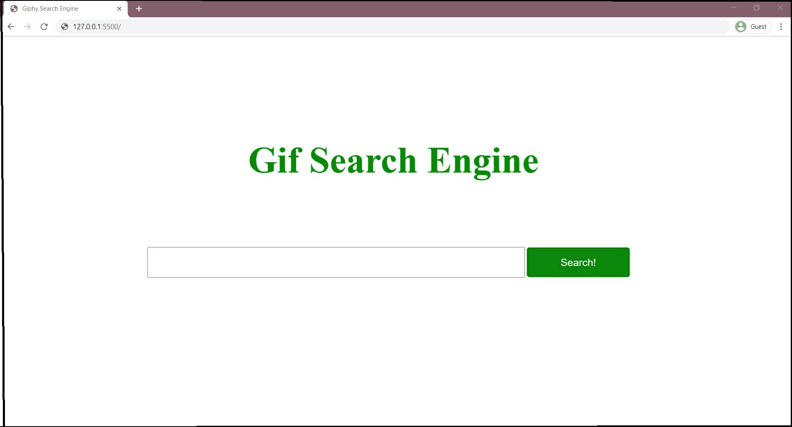
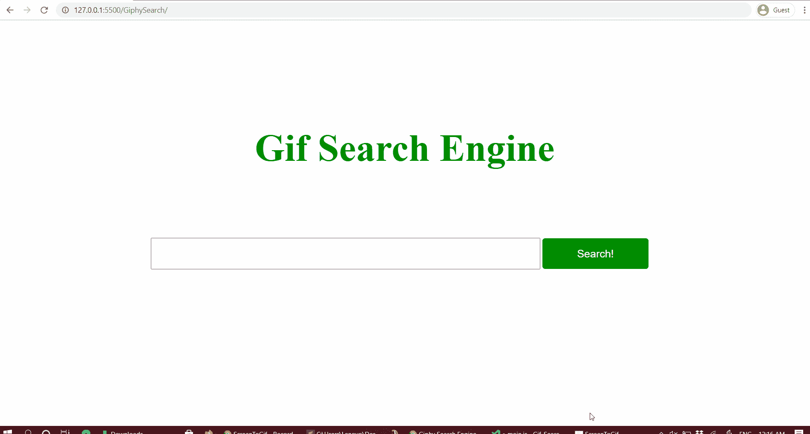

# 使用 JavaScript 创建一个 GIF 搜索引擎

> 原文:[https://www . geesforgeks . org/create-a-gif-search-engine-use-JavaScript/](https://www.geeksforgeeks.org/create-a-gif-search-engine-using-javascript/)

在本文中，我们将使用 JavaScript 创建一个 Gif 搜索引擎。Gif 搜索引擎的基本应用是从给定的用户输入关键词中搜索图像，图像的输出将以 Giphy 提供的不同纵横比和大小加载到同一页面上。为了获得图像的输出，我们将使用 Giphy EndPoint 搜索应用编程接口。

通过应用编程接口中的端点，我们实际上是使用我们的网址中的端点来访问 Giphy 图像交付服务。

首先，我们将创建一个 HTML 布局和样式元素使用 CSS。页面包含图像搜索关键字的输入字段和一些 CSS 样式。

基本的 HTML 布局呈现了页面的结构，它包括以下内容-

*   **输入字段:**基本输入字段，接受用户输入的字母数字关键字。
*   **Search Button:** The Input keyword will be triggered to call the API method using this button.

    ## 超文本标记语言

    ```html
    <!DOCTYPE html>
    <html>
      <head>
        <title>Giphy Search Engine</title>
        <link rel="stylesheet" href="css/main.css" />
      </head>
      <body>
        <div class="header">
          <h1>Gif Search Engine</h1>
        </div>
        <div class="container container-padding50">
          <input type="text" class="js-userinput 
            container-textinput" />
          <button class="js-go container-button">
            Search!
          </button>
        </div>
        <div class="container 
          container-padding50 js-container">
        </div>

        <!-- Link to JavaScript File here-->

        <script src="javascript/main.js"></script>
      </body>
    </html>
    ```

    在给定的 HTML 布局中，我们以下列方式构造了上面的代码

    ## 超文本标记语言

    ```html
    <style>

    body {
      width: 80%;
      max-width: 1024px;
      margin: 0 auto;
    }

    .header {
      padding: 100px 50px 50px 40px;
      position: relative;
      top: 50px;
    }

    h1 {
      font-weight: bold;
      font-style: normal;
      font-family: "Times New Roman";
      font-size: 72px;
      color: #090;
      text-align: center;
    }

    .container-padding50 {
      padding: 80px 0px 0px 30px;
    }

    .container-textinput {
      width: 70%;
      display: inline-block;
      padding: 16px;
      font-size: 20px;
      font-family: Helvetica, sans-serif;
    }

    .container-button {
      width: 20%;
      display: inline-block;
      padding: 16px;
      background-color: green;
      color: white;
      font-size: 20px;
      font-family: Helvetica, sans-serif;

      border: 1px solid green;
      border-radius: 5px;
    }

    .container-image {
      width: 30%;
      display: block;
      float: left;
      margin-right: 3%;
    }

    </style>
    ```

*   一个一级标题标签，用于显示标题名称，并通过使用 CSS 将类定义为标题来设置样式。
*   基本属性，如字体系列、字体样式、字体粗细、颜色和给类的对齐方式，以显示标题。
*   在下一个 div 容器中，显示了一个输入字段和一个按钮，其类的样式具有足够的填充，宽度使其与屏幕对齐。
*   为了在同一个页面中加载图像的输出，给了一个容器一组样式属性，如宽度和边距，以缩放所有图像。
*   这些类和 id 可以在以后需要时修改。

**CSS 样式:**上面的 HTML 和 CSS 的创建布局如下图所示，



**搜索引擎的主要逻辑:**首先，为了启用用户输入关键字来搜索 Gif 图像并将其显示为输出，将它们写入一个 JavaScript 文件中。有一堆函数和逻辑来运行搜索查询。

有几个步骤可以帮助理解逻辑。

**步骤 1:从用户处获取输入:**最初，输入字段具有用户输入的某个关键字或值，这确保了将对给定关键字执行逻辑。这里，关键字由查询选择器方法选择，然后返回输入关键字或值。

## java 描述语言

```html
function getUserInput() {
  var inputValue = document
    .querySelector(".js-userinput").value;
  return inputValue;
}
```

**步骤 2:获取输入并处理请求:**此外，当点击搜索按钮时，执行一组操作。函数“getUserInput”返回的值现在也被其他函数使用。然后，该值由 click 事件的处理程序处理。这可以通过添加 EventListener 方法来实现。现在，只要点击搜索按钮，就会对该关键字执行一系列操作。

## java 描述语言

```html
document.querySelector(".js-go").addEventListener("click", function () {
  var inputValue = document
    .querySelector(".js-userinput").value;
  var userInput = getUserInput();
  searchGiphy(userInput);
});
```

**注意:**addEventListener 方法中还有其他事件，通过这些事件我们可以扩展监听事件的方式。这里“按键”事件用于允许用户按回车键并搜索图像的关键字。相比之下，它实际上监听用户按下了哪个键。这里需要一个对象来检查按下的键是否与[键码](https://keycode.info/)值匹配。

## java 描述语言

```html
document.querySelector(".js-userinput")
  .addEventListener("keyup", function (e) {

  // If the Key Enter is Pressed 
  if (e.which === 13) { 
    var userInput = getUserInput();
    searchGiphy(userInput);
  }
});
```

**步骤-3:** 一旦输入数据被事件监听器捕获，它现在就被 searchGiphy 函数使用，该函数将用户数据作为参数并执行一组操作。

**search giphy(search query):**函数处理以下事情-

*   此功能每次对给定的用户数据执行搜索操作，并通过请求 Giphy 服务器使用 [Giphy 端点搜索应用编程接口](https://github.com/Giphy/GiphyAPI)网址返回对象来启用它。
*   Giphy 端点搜索 API URL 请求 Giphy 服务器响应请求，并以 JSON 对象的形式返回输出。

**加载图像而不刷新页面**

*   Giphy 应用编程接口网址返回的数据可以在不刷新页面的情况下检索。我们可以通过 AJAX 请求加载数据而不刷新页面来实现这一点。
*   我们可以创建一个 XMLHttpRequest(XHR)的构造函数，它使用。open()方法，并使用发送请求。。send()方法。
*   然后，响应由负责在屏幕上加载数据的事件侦听器处理程序处理。

## java 描述语言

```html
function searchGiphy(searchQuery) {
  var url =
"https://api.giphy.com/v1/gifs/search?api_key=dc6zaTOxFJmzC&q="
  + searchQuery;

  // AJAX Request

  var GiphyAJAXCall = new XMLHttpRequest();
  GiphyAJAXCall.open("GET", url);
  GiphyAJAXCall.send();

  GiphyAJAXCall.addEventListener("load", function (data) {
    var actualData = data.target.response;
    pushToDOM(actualData);
    console.log(actualData);

  });
}
```

**步骤 4:** 定义了一个函数 pushToDOM，它将负责处理响应和加载图像。
**pushToDOM(响应):**处理来自 API 的响应有一些标准步骤。这个函数处理以下事情-

*   **访问数据**Search Giphy 函数接收用户数据作为参数，并请求 Giphy EndPoint Search API 访问查询并返回响应。

*   **将响应转换为 JSON 对象**响应基本上是数组，数组中有 Image 标签、类型、源 url、高度、宽度等信息，通过转换为 JSON 对象可以检索到这些信息。通过使用 JSON.parse(响应)，我们可以将对象转换为 JSON 对象。

*   **保持响应**通过。我们选择一个容器来保存响应。如果任何先前的响应已经同步并出现在容器中，那么就清空容器。

*   **图像再现**输出图像有一些属性可以被其对象访问。通过再现手段，我们实际上想要的图像的网址，可以很容易地通过。url 方法。

*   **显示图像**需要一个容器来显示图像，但是图像有一个 url，容器可以使用元素属性 innerHTML 访问该 URL。

因此，我们可以通过循环图像来处理响应中的所有图像，这些图像将每个图像提取到一个包含其源 url 的容器中。

## java 描述语言

```html
function pushToDOM(response) {

  // Turn response into real JavaScript object
  response = JSON.parse(response);

  // Drill down to the data array
  var images = response.data;

  // Find the container to hold the response in DOM
  var container = document.querySelector(".js-container");

  // Clear the old content since this function 
  // will be used on every search that we want
  // to reset the div
  container.innerHTML = "";

  // Loop through data array and add IMG html
  images.forEach(function (image) {

    // Find image src
    var src = image.images.fixed_height.url;

    // Concatenate a new IMG tag
    container.innerHTML += "";
  });
}
```

**最终输出:**



**源代码:**[https://github.com/codewithdev/Gif-Search-Engine](https://github.com/codewithdev/Gif-Search-Engine)