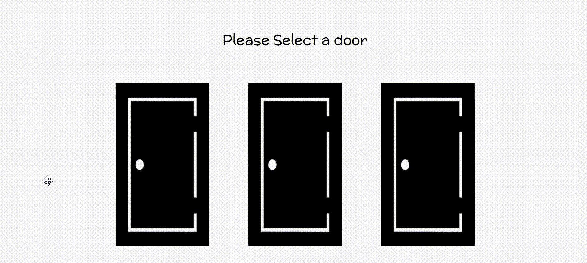

# 使用原始 JavaScript 创建一个蒙提霍尔游戏

> 原文:[https://www . geesforgeks . org/create-a-monty-hall-game-in-vanilla-JavaScript/](https://www.geeksforgeeks.org/create-a-monty-hall-game-in-vanilla-javascript/)

蒙提霍尔问题是一个流行的概率难题，基于一个电视游戏节目，并以其主持人蒙提霍尔的名字命名。

在这场蒙提霍尔的比赛中，

*   会有三扇紧闭的门，你可以选择其中一扇。一扇门后有一辆汽车，另一扇门后是山羊。主人知道汽车和山羊的位置。
*   在你选择一扇门后，主人打开另外两扇门中的一扇门，里面有一只山羊。
*   现在，你可以坚持你最初选择的门，也可以切换。

这是游戏的一瞥。



让我们用 HTML、CSS 和普通的 JavaScript 创建一个这个游戏的交互版本。

**HTML:** 我们在游戏中需要的主要部分有:

1.  主持人与玩家互动的对话空间。
2.  三扇门
3.  结果页面

我们包括所有可能的场景和对话，稍后使用 JavaScript，我们可以在必要时使用它们。

在这里，在指令类中，我们包含了宿主的所有对话，我们可以用 JavaScript 进行交互。在说明课之后，有包含 3 个门的主要部分。最后，我们根据玩家的选择有不同的场景。

## 超文本标记语言

```html
<!DOCTYPE html>
<head>
    <title>MontyHall</title>
    <link rel="stylesheet" href="style.css">
</head>
<body>
    <div id="body">
        <header>
            <h1>welcome to Montyhall game</h1>
        </header>
        <div id="instructions" class="instructions">
            <div id="row1" class="row1">
              Please Select a door
            </div>
            <div id="d1">You selected door1</div>
            <div id="d2">You selected door2</div>
            <div id="d3">You selected door3</div>
            <div id="row2" class="row2">

<p>Ok, I'm opening a door</p>

<p>Do you want to switch?</p>

                <div class="buttons">
                    <button id="btn-1">Yes</button>
                    <button id="btn-2">No</button>
                </div>
            </div>
        </div>

        <main class="door-row">
            
            
            

        </main>
    </div>
    <div id="switchAndWin" class="result">

<p>Congratulations!!!!!</p>

<p>You made the right choice by switching</p>

<p>By switching, you increased your
           probability of winning to 0.67</p>

        <div class="links">
            <button><a href=
"https://en.wikipedia.org/wiki/Monty_Hall_problem"
                       target="_blank">
              Know more</a>
            </button>
            <button><a href="index.html">
                      Play again
                    </a></button>
        </div>
    </div>
    <div id="switchAndLose" class="result">

<p>You Lost!!!</p>

<p>The chances of you winning was 67% since you
            switched,yet you still lost </p>

<p>Play again to redefine your luck</p>

        <div class="links">
            <button><a href=
"https://en.wikipedia.org/wiki/Monty_Hall_problem"
                       target="_blank">
              Know more</a>
            </button>
            <button><a href="index.html">Play again</a></button>
        </div>
    </div>
    <div id="NoSwitchAndWin" class="result">

<p>Congratulations!!!!!</p>

<p>You are a very lucky person</p>

<p>The probability of you winning was only 0.33 because
           you didn't switch,yet you still won</p>

        <div class="links">
            <button><a href=
"https://en.wikipedia.org/wiki/Monty_Hall_problem"
                       target="_blank">
              Know more</a>
            </button>
            <button><a href="index.html">
              Play again</a>
            </button>
        </div>
    </div>
    <div id="NoSwitchAndLose" class="result">

<p>You Lost!!!!</p>

<p>Since you didn't switch, your chances
            of winning was only 33%</p>

<p>Play again to redefine your luck</p>

        <div class="links">
            <button><a href=
"https://en.wikipedia.org/wiki/Monty_Hall_problem"
                       target="_blank">
              Know more</a>
            </button>
            <button><a href="index.html">Play again</a></button>
        </div>
    </div>
    <script src="script1.js" async defer></script>
</body>
</html>
```

**CSS:** 我们给游戏加点造型吧。它是高度可定制的，可以随意添加自己的风格。

## 半铸钢ˌ钢性铸铁(Cast Semi-Steel)

```html
/*Basic Styling */
* {
    margin: 0;
    padding: 0%;
    box-sizing: border-box;
}

body {
    background-color: #ffffff;
    min-height: 100vh;
    display: flex;
    align-items: center;
    justify-content: center;
    flex-direction: column;
}

header {
    height: 20vh;
    font-family: 'Bangers', cursive;
    display: flex;
    justify-content: center;
    align-items: center;
    font-size: 30px;
    text-align: center;
}

.instructions {
    height: 15vh;
    display: flex;
    justify-content: center;
    align-items: center;
    font-size: 30px;
    font-family: 'McLaren', cursive;
    margin: 30px 0;
}

.door-row {
    text-align: center;
    margin-top: 40px;
}

.door {
    width: 200px;
    height: 350px;
    margin: 10px 40px;
    margin-bottom: 40px;
    cursor: pointer;
    border: 10px solid #000;
}

.buttons {
    width: 300px;
    height: 50px;
    display: flex;
    justify-content: center;
    align-items: center;
}

button {
    padding: 10px 40px;
    background-color: #000;
    border: none;
    border-radius: 50px;
    color: #f5f5f5;
    cursor: pointer;
    margin: 0 20px;
    font-size: 18px;
    outline:none;
    box-shadow: 0px 10px 13px -7px #000000,
                7px 5px 15px 5px rgba(0, 0, 0, 0);
}

button:active {
    transform: scale(0.9);
}

.result p {
    font-size: 22px;
    line-height: 40px;
    text-align: center;
}

.result p:first-child {
    font-family: 'Bangers', cursive;
    letter-spacing: 2px;
    text-transform: uppercase;
    font-size: 40px;
    margin-bottom: 30px;
}

.links {
    width: 100vw;
    height: 10vw;
    text-align: center;
    margin: 40px 0;
}

.result a {
    color: gray;
    background-color: #000;
    text-decoration: none;
}
.result a:hover {
    color:#f5f5f5;
}

@media screen and (max-width:700px) {
    header {
        margin-top: 20px;
        font-size: 20px;
        text-align: center;
    }
}
```