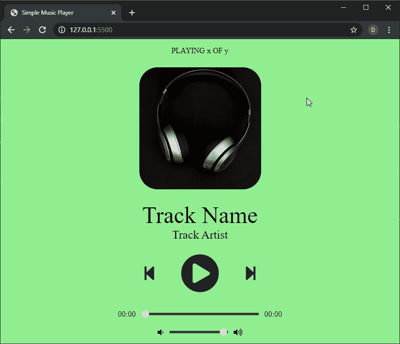

# 使用 JavaScript 创建音乐播放器

> 原文:[https://www . geesforgeks . org/create-a-music-player-use-JavaScript/](https://www.geeksforgeeks.org/create-a-music-player-using-javascript/)

随着流媒体越来越多地被用户采用，在线媒体播放器已经成为在互联网上消费媒体的必备工具。音乐播放器允许人们在任何浏览器中欣赏音乐，并支持离线音乐播放器的许多功能。
我们将创建一个具有干净用户界面的音乐播放器，可用于在浏览器中播放音乐。我们还将实现搜索和音量控制等功能。HTML 在 HTMLMediaElement 接口中有几种方法，可以用来播放音频文件并控制其播放，而无需使用任何其他库。
我们将从创建 HTML 布局开始，首先定义播放器的结构，通过使用 CSS 的样式使其看起来很好，然后在 JavaScript 中为所有功能编写播放器逻辑。
**HTML 布局**
HTML 布局定义了将在页面上显示的元素结构。玩家可以分为以下几个部分:

*   **细节部分:**此部分显示正在播放的当前曲目的细节。它包括曲目编号、曲目专辑、曲目名称和曲目艺术家。
*   **按钮部分:**该部分显示了用于控制轨道回放的按钮。它包括播放/暂停按钮、上一首和下一首曲目按钮。他们会有一个 onclick()方法，调用在 JavaScript 文件中定义的特定函数。
*   **滑块部分:**该部分包含寻道滑块和音量滑块，可用于控制播放和音量。

我们将使用 FontAwesome 图标来获取页面上使用的所有按钮的图标。我们稍后将编写的自定义 CSS 和 JavaScript 也链接在文件中。
**HTML 代码如下:**

## 超文本标记语言

```html
<!DOCTYPE html>
<html lang="en">
<head>
  <title>Simple Music Player</title>
  <!-- Load FontAwesome icons -->
  <link rel="stylesheet" 
        href=
"https://cdnjs.cloudflare.com/ajax/libs/font-awesome/5.13.0/css/all.min.css">

  <!-- Load the custom CSS style file -->
  <link rel="stylesheet" type="text/css" href="style.css">
</head>
<body>
  <div class="player">

    <!-- Define the section for displaying details -->
    <div class="details">
      <div class="now-playing">PLAYING x OF y</div>
      <div class="track-art"></div>
      <div class="track-name">Track Name</div>
      <div class="track-artist">Track Artist</div>
    </div>

    <!-- Define the section for displaying track buttons -->
    <div class="buttons">
      <div class="prev-track" onclick="prevTrack()">
        <i class="fa fa-step-backward fa-2x"></i>
      </div>
      <div class="playpause-track" onclick="playpauseTrack()">
        <i class="fa fa-play-circle fa-5x"></i>
      </div>
      <div class="next-track" onclick="nextTrack()">
        <i class="fa fa-step-forward fa-2x"></i>
      </div>
    </div>

    <!-- Define the section for displaying the seek slider-->
    <div class="slider_container">
      <div class="current-time">00:00</div>
      <input type="range" min="1" max="100"
        value="0" class="seek_slider" onchange="seekTo()">
      <div class="total-duration">00:00</div>
    </div>

    <!-- Define the section for displaying the volume slider-->
    <div class="slider_container">
      <i class="fa fa-volume-down"></i>
      <input type="range" min="1" max="100"
        value="99" class="volume_slider" onchange="setVolume()">
      <i class="fa fa-volume-up"></i>
    </div>
  </div>

  <!-- Load the main script for the player -->
  <script src="main.js"></script>
</body>
</html>
```

**CSS 样式**
使用 CSS，我们可以设置不同部分的样式，使其更具视觉吸引力:

*   flex 布局用于排列播放器的各种元素，并将它们与页面中间对齐。
*   轨道艺术图像被赋予一个固定的尺寸，并使用边框半径属性进行舍入。
*   通过使用外观属性，这两个滑块已经从默认外观进行了修改。高度和背景被改变以适应配色方案。它们还被赋予轻微的透明度，使用过渡属性平滑地过渡到完全不透明度。
*   所有的回放控件都设置了光标属性，这样每当鼠标悬停在它上面时，它就会变成一个指针。

## 钢性铸铁

```html
body {
  background-color: lightgreen;

  /* Smoothly transition the background color */
  transition: background-color .5s;
}

/* Using flex with the column direction to
   align items in a vertical direction */
.player {
  height: 95vh;
  display: flex;
  align-items: center;
  flex-direction: column;
  justify-content: center;
}

.details {
  display: flex;
  align-items: center;
  flex-direction: column;
  justify-content: center;
  margin-top: 25px;
}

.track-art {
  margin: 25px;
  height: 250px;
  width: 250px;
  background-image: URL(
     "https://source.unsplash.com/Qrspubmx6kE/640x360");
  background-size: cover;
  background-position: center;
  border-radius: 15%;
}

/* Changing the font sizes to suitable ones */
.now-playing {
  font-size: 1rem;
}

.track-name {
  font-size: 3rem;
}

.track-artist {
  font-size: 1.5rem;
}

/* Using flex with the row direction to
   align items in a horizontal direction */
.buttons {
  display: flex;
  flex-direction: row;
  align-items: center;
}

.playpause-track,
.prev-track,
.next-track {
  padding: 25px;
  opacity: 0.8;

  /* Smoothly transition the opacity */
  transition: opacity .2s;
}

/* Change the opacity when mouse is hovered */
.playpause-track:hover,
.prev-track:hover,
.next-track:hover {
  opacity: 1.0;
}

/* Define the slider width so that it scales properly */
.slider_container {
  width: 75%;
  max-width: 400px;
  display: flex;
  justify-content: center;
  align-items: center;
}

/* Modify the appearance of the slider */
.seek_slider, .volume_slider {
  -webkit-appearance: none;
  -moz-appearance: none;
  appearance: none;
  height: 5px;
  background: black;
  opacity: 0.7;
  -webkit-transition: .2s;
  transition: opacity .2s;
}

/* Modify the appearance of the slider thumb */
.seek_slider::-webkit-slider-thumb,
.volume_slider::-webkit-slider-thumb {
  -webkit-appearance: none;
  -moz-appearance: none;
  appearance: none;
  width: 15px;
  height: 15px;
  background: white;
  cursor: pointer;
  border-radius: 50%;
}

/* Change the opacity when mouse is hovered */
.seek_slider:hover,
.volume_slider:hover {
  opacity: 1.0;
}

.seek_slider {
  width: 60%;
}

.volume_slider {
  width: 30%;
}

.current-time,
.total-duration {
  padding: 10px;
}

i.fa-volume-down,
i.fa-volume-up {
  padding: 10px;
}

/* Change the mouse cursor to a pointer
   when hovered over */
i.fa-play-circle,
i.fa-pause-circle,
i.fa-step-forward,
i.fa-step-backward {
  cursor: pointer;
}
```

HTML 布局和 CSS 样式的结果将给出以下外观:



**玩家的 JavaScript 逻辑:**
玩家的逻辑在 JavaScript 文件中定义。有几个功能协同工作来处理播放器的所有功能。
**步骤 1:** 定义所有变量并访问 HTML 元素
首先使用 querySelector()方法选择 HTML 布局中需要动态更改的元素。然后给它们分配变量名，以便它们可以被访问和修改。还定义了在整个程序中可以访问的其他变量。

## java 描述语言

```html
// Select all the elements in the HTML page
// and assign them to a variable
let now_playing = document.querySelector(".now-playing");
let track_art = document.querySelector(".track-art");
let track_name = document.querySelector(".track-name");
let track_artist = document.querySelector(".track-artist");

let playpause_btn = document.querySelector(".playpause-track");
let next_btn = document.querySelector(".next-track");
let prev_btn = document.querySelector(".prev-track");

let seek_slider = document.querySelector(".seek_slider");
let volume_slider = document.querySelector(".volume_slider");
let curr_time = document.querySelector(".current-time");
let total_duration = document.querySelector(".total-duration");

// Specify globally used values
let track_index = 0;
let isPlaying = false;
let updateTimer;

// Create the audio element for the player
let curr_track = document.createElement('audio');

// Define the list of tracks that have to be played
let track_list = [
  {
    name: "Night Owl",
    artist: "Broke For Free",
    image: "Image URL",
    path: "Night_Owl.mp3"
  },
  {
    name: "Enthusiast",
    artist: "Tours",
    image: "Image URL",
    path: "Enthusiast.mp3"
  },
  {
    name: "Shipping Lanes",
    artist: "Chad Crouch",
    image: "Image URL",
    path: "Shipping_Lanes.mp3",
  },
];
```

**第二步:**从曲目列表
加载新曲目所有需要播放的曲目都在曲目列表中定义为对象。这些对象包含名称、艺术家、图像和轨道路径等属性。然后可以使用其轨道索引来访问每个轨道。
为了加载轨迹，定义了一个函数 loadTrack()，它处理以下事情:

*   **重置前一个轨道的所有值**
    创建了一个重置值()函数，用于在新轨道开始之前将持续时间值和滑块重置为初始值。这可以防止新磁道加载时寻道滑块的跳跃。
*   **加载轨道**
    使用音频元素的 src 属性为其分配一个新的源。它可以是文件系统中的任何路径或网址。然后在音频元素上使用 load()方法来准备轨道。
*   **更新要显示的轨道艺术**
    轨道艺术从数组中获取，并在 backgroundImage 属性的帮助下分配。
*   **更新要显示的轨迹细节**
    轨迹细节是从数组中获取的，并在 textContent 属性的帮助下进行分配。
*   **向轨道添加事件监听器**
    媒体元素中添加了两个事件监听器，第一个用于更新当前寻道位置，第二个用于在当前轨道结束时加载下一个轨道。
*   **设置随机的彩色背景**
    通过随机使用红色、绿色和蓝色值并将其设置为一种颜色来生成彩色背景。通过在背景色上使用过渡属性，可以使效果具有动画效果。

## java 描述语言

```html
function loadTrack(track_index) {
  // Clear the previous seek timer
  clearInterval(updateTimer);
  resetValues();

  // Load a new track
  curr_track.src = track_list[track_index].path;
  curr_track.load();

  // Update details of the track
  track_art.style.backgroundImage = 
     "url(" + track_list[track_index].image + ")";
  track_name.textContent = track_list[track_index].name;
  track_artist.textContent = track_list[track_index].artist;
  now_playing.textContent = 
     "PLAYING " + (track_index + 1) + " OF " + track_list.length;

  // Set an interval of 1000 milliseconds
  // for updating the seek slider
  updateTimer = setInterval(seekUpdate, 1000);

  // Move to the next track if the current finishes playing
  // using the 'ended' event
  curr_track.addEventListener("ended", nextTrack);

  // Apply a random background color
  random_bg_color();
}

function random_bg_color() {
  // Get a random number between 64 to 256
  // (for getting lighter colors)
  let red = Math.floor(Math.random() * 256) + 64;
  let green = Math.floor(Math.random() * 256) + 64;
  let blue = Math.floor(Math.random() * 256) + 64;

  // Construct a color withe the given values
  let bgColor = "rgb(" + red + ", " + green + ", " + blue + ")";

  // Set the background to the new color
  document.body.style.background = bgColor;
}

// Function to reset all values to their default
function resetValues() {
  curr_time.textContent = "00:00";
  total_duration.textContent = "00:00";
  seek_slider.value = 0;
}
```

**第三步:**配置播放器按钮
一个功能 playTrack()处理当前加载曲目的播放。HTMLMediaElement API 的 play()方法用于此函数。按钮的图标也会变为暂停图标。这是通过使用 FontAwesome 库中的一个图标，并使用 innerHTML 将其插入来完成的。
一个函数 pauseTrack()处理当前加载曲目的播放。HTMLMediaElement API 的 pause()方法用于此函数。按钮的图标也会变回播放图标。这是通过使用 FontAwesome 库中的一个图标，并使用 innerHTML 将其插入来完成的。
根据曲目当前是否播放，调用这两个功能。playpause()功能处理轨道的实际播放/暂停控制。
一个函数 prevTrack()处理前一个轨迹的加载和向后移动索引。当索引到达第一个轨道时，索引被重置为最后一个轨道。上面定义的 loadTrack()方法用于加载新轨道。
类似地，函数 nextTrack()处理下一个轨道的加载和向前移动索引。当索引到达最后一个轨道时，索引被重置为第一个轨道。上面定义的 loadTrack()方法用于加载新轨道。

## java 描述语言

```html
function playpauseTrack() {
  // Switch between playing and pausing
  // depending on the current state
  if (!isPlaying) playTrack();
  else pauseTrack();
}

function playTrack() {
  // Play the loaded track
  curr_track.play();
  isPlaying = true;

  // Replace icon with the pause icon
  playpause_btn.innerHTML = '<i class="fa fa-pause-circle fa-5x"></i>';
}

function pauseTrack() {
  // Pause the loaded track
  curr_track.pause();
  isPlaying = false;

  // Replace icon with the play icon
  playpause_btn.innerHTML = '<i class="fa fa-play-circle fa-5x"></i>';
}

function nextTrack() {
  // Go back to the first track if the
  // current one is the last in the track list
  if (track_index < track_list.length - 1)
    track_index += 1;
  else track_index = 0;

  // Load and play the new track
  loadTrack(track_index);
  playTrack();
}

function prevTrack() {
  // Go back to the last track if the
  // current one is the first in the track list
  if (track_index > 0)
    track_index -= 1;
  else track_index = track_list.length - 1;

  // Load and play the new track
  loadTrack(track_index);
  playTrack();
}
```

**步骤 4:** 配置滑块部分
我们将设置两个滑块，分别控制寻道滑块和音量滑块。

*   **寻道滑块**
    寻道滑块通过用轨道的当前时间更新滑块来显示滑块上的当前回放位置。创建了一个新的函数 seekUpdate()，用于处理相对于轨道当前时间的寻道滑块更新。使用 value 属性计算和设置寻道滑块位置。
    现在，每次赛道进一步前进都要调用这个函数。这可以通过安排它每秒更新一次来实现。这可以使用间隔为 1000 毫秒的 setInterval()方法来完成。每次加载新曲目时，该定时器都会清零。
    该功能还处理轨迹的经过时间和总持续时间的变化，每次该功能触发时都会更新。分钟和秒钟是分开计算的，并经过适当的格式化才能显示。

*   **音量滑块**
    音量滑块用于显示一个设置轨道的当前音量。创建了一个新的函数 setVolume()，每当用户更改音量滑块时，它都会处理音量滑块的设置。

## java 描述语言

```html
function seekTo() {
  // Calculate the seek position by the
  // percentage of the seek slider 
  // and get the relative duration to the track
  seekto = curr_track.duration * (seek_slider.value / 100);

  // Set the current track position to the calculated seek position
  curr_track.currentTime = seekto;
}

function setVolume() {
  // Set the volume according to the
  // percentage of the volume slider set
  curr_track.volume = volume_slider.value / 100;
}

function seekUpdate() {
  let seekPosition = 0;

  // Check if the current track duration is a legible number
  if (!isNaN(curr_track.duration)) {
    seekPosition = curr_track.currentTime * (100 / curr_track.duration);
    seek_slider.value = seekPosition;

    // Calculate the time left and the total duration
    let currentMinutes = Math.floor(curr_track.currentTime / 60);
    let currentSeconds = Math.floor(curr_track.currentTime - currentMinutes * 60);
    let durationMinutes = Math.floor(curr_track.duration / 60);
    let durationSeconds = Math.floor(curr_track.duration - durationMinutes * 60);

    // Add a zero to the single digit time values
    if (currentSeconds < 10) { currentSeconds = "0" + currentSeconds; }
    if (durationSeconds < 10) { durationSeconds = "0" + durationSeconds; }
    if (currentMinutes < 10) { currentMinutes = "0" + currentMinutes; }
    if (durationMinutes < 10) { durationMinutes = "0" + durationMinutes; }

    // Display the updated duration
    curr_time.textContent = currentMinutes + ":" + currentSeconds;
    total_duration.textContent = durationMinutes + ":" + durationSeconds;
  }
}
```

**第五步:**启动播放器
通过调用 loadTrack()函数加载第一首曲目。这将从曲目列表中加载第一首曲目，并更新该曲目的所有详细信息。然后，用户可以使用播放按钮开始播放曲目。“上一首”和“下一首”按钮将分别加载上一首和下一首曲目，并开始播放它们。
当一首曲目播放完毕后，自动加载下一首曲目。用户可以使用搜索滑块搜索到轨道中的某个位置。也可以使用音量滑块调节音量。

## java 描述语言

```html
// Load the first track in the tracklist
loadTrack(track_index);
```

**最终演示**
玩家现在可以在任何浏览器中使用了。新曲目可以添加到曲目列表中，以播放您选择的音乐。

<video class="wp-video-shortcode" id="video-398786-1" width="640" height="360" preload="metadata" controls=""><source type="video/mp4" src="https://media.geeksforgeeks.org/wp-content/uploads/20200417135652/example-music-player1.mp4?_=1">[https://media.geeksforgeeks.org/wp-content/uploads/20200417135652/example-music-player1.mp4](https://media.geeksforgeeks.org/wp-content/uploads/20200417135652/example-music-player1.mp4)</video>

**上网试试:t1】[https://ide . geeksforgeeks . org/try it . PHP/T3 gdwun 4ax](https://ide.geeksforgeeks.org/tryit.php/T3gdWUn4aX)**源代码:**[https://github . com/sayannm19/js-music player](https://github.com/sayantanm19/js-music-player)**

HTML 是网页的基础，通过构建网站和网络应用程序用于网页开发。您可以通过以下 [HTML 教程](https://www.geeksforgeeks.org/html-tutorials/)和 [HTML 示例](https://www.geeksforgeeks.org/html-examples/)从头开始学习 HTML。

CSS 是网页的基础，通过设计网站和网络应用程序用于网页开发。你可以通过以下 [CSS 教程](https://www.geeksforgeeks.org/css-tutorials/)和 [CSS 示例](https://www.geeksforgeeks.org/css-examples/)从头开始学习 CSS。