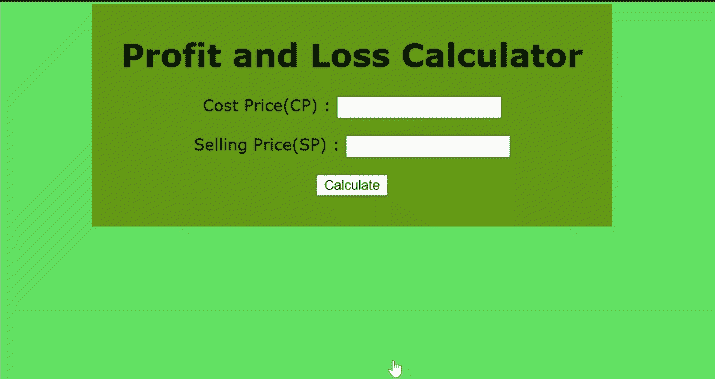

# 使用 JavaScript 创建损益计算器

> 原文:[https://www . geesforgeks . org/create-a-盈亏计算器-使用-javascript/](https://www.geeksforgeeks.org/create-a-profit-and-loss-calculator-using-javascript/)

在本文中，我们将使用 HTML、CSS 和 Javascript 创建一个损益计算器，用于在添加设计和布局的同时添加基本功能。盈亏计算器基本上是用来计算卖出特定价格或商品后收到的金额或百分比。如果卖出后收到的金额(卖价)大于实际金额(成本价)，则认为*盈利*否则*亏损。*我们将成本价表示为 CP &售价表示为 SP。

**使用的配方:**

*   **利润:**(SP)–(CP)
*   **利润百分比:**利润/CP×100
*   **损失:**(SP)–(CP)
*   **损失**T2】百分比:损失/CP×100

**进场:**

*   在正文标签中，使用基本的 HTML 创建计算器的设计和布局。
*   将 CSS 属性用于样式，如对齐、大小、背景等。
*   要计算盈亏，使用 JavaScript 调用一个函数。

**示例:**我们将使用上述方法创建一个计算器。

## 超文本标记语言

```html
<div class="plcalculate">
    <h1>Profit and Loss Calculator</h1>
    <p>
        Cost Price(CP) :
        <input class="cost__price" type="number" />
    </p>

    <p>
        Selling Price(SP) :
        <input class="selling__price" type="number" />
    </p>

    <button onclick="Calculate()">Calculate</button>

    <h2 class="profit__loss"></h2>
    <h2 class="profit__loss__percentage"></h2>
    <h2 class="nothing"></h2>

</div>
```

**CSS 代码:**

## 半铸钢ˌ钢性铸铁(Cast Semi-Steel)

```html
body {
  background-color: rgb(99, 226, 99);
  font-family: Verdana;
}
.plcalculate {
  text-align: center;
  background-color: rgb(102, 155, 22);
  width: 500px;
  margin-left: auto;
  margin-right: auto;
  padding: 10px;
}
h2 {
  color: white;
}
```

**Javascript:**

## java 描述语言

```html
function Calculate() {
  const CP = document.querySelector(".cost__price").value;
  const SP = document.querySelector(".selling__price").value;

  const profit__loss = document.querySelector(".profit__loss");
  const percentage = document.querySelector(".profit__loss__percentage");
  const nothing = document.querySelector(".nothing");

  profit__loss.innerHTML = "";
  percentage.innerHTML = "";
  nothing.innerHTML = "";

  if (SP > CP) {
    const profit = SP - CP;
    const profit_percent = ((profit / CP) * 100).toFixed(2);

    profit__loss.innerHTML = "Profit : " + profit;
    percentage.innerHTML = "Profit Percentage : " + profit_percent;
  }
  if (SP < CP) {
    const loss = CP - SP;
    const loss_percent = ((loss / CP) * 100).toFixed(2);

    profit__loss.innerHTML = "Loss : " + loss;
    percentage.innerHTML = "Loss Percentage : " + loss_percent;
  }
  if (SP == CP) {
    nothing.innerHTML = "No Profit No Loss";
  }
};
```

**说明:**当用户在输入中输入 CP 和 SP 金额，并使用[点击](https://www.geeksforgeeks.org/html-onclick-event-attribute/)事件属性点击*计算*按钮时，将调用计算()功能。在这个函数中，我们使用了 DOM [querySelector()](https://www.geeksforgeeks.org/html-dom-queryselector-method/) 方法，使用类名将输入中输入的值选择到一个变量中。如果 SP 金额大于 CP 金额，则计算()函数将计算利润和利润百分比，否则使用上述公式计算亏损和亏损百分比，并使用 [innerHTML](https://www.geeksforgeeks.org/html-dom-innerhtml-property/) 属性显示文本。

**完整代码:**

## 超文本标记语言

```html
<!DOCTYPE html>
<html lang="en">
<head>
    <title>Profit and Loss Calculator</title>
    <style>
        body{
            background-color: rgb(99, 226, 99);
            font-family: Verdana;
        }
        .plcalculate{
            text-align: center;
            background-color: rgb(102, 155, 22);
            width: 500px;
            margin-left: auto;
            margin-right: auto;
            padding: 10px;
        }
        h2{
            color: white;
        }
    </style>
</head>
<body>
    <div class="plcalculate">
        <h1>Profit and Loss Calculator</h1>

        <p>Cost Price(CP)   :
            <input class="cost__price" type="number"  />
        </p>

        <p>Selling Price(SP)   :
            <input class="selling__price" type="number" />
        </p>

        <button onclick="Calculate()">Calculate</button>

        <p>
              <h2 class="profit__loss"></h2>
            <h2 class="profit__loss__percentage"></h2>
            <h2 class="nothing"></h2>
        </p>
    </div>

    <script>
        function Calculate(){
        const CP= document.querySelector(".cost__price").value;
        const SP= document.querySelector(".selling__price").value;

        const profit__loss=document.querySelector(".profit__loss");
        const percentage=document.querySelector(".profit__loss__percentage");
        const nothing=document.querySelector(".nothing");

        profit__loss.innerHTML="";
        percentage.innerHTML="";
        nothing.innerHTML="";

        if(SP>CP){
            const profit=SP - CP;
            const profit_percent= ((profit/CP)*100).toFixed(2);

            profit__loss.innerHTML="Profit : "+ profit;
            percentage.innerHTML="Profit Percentage : "+ profit_percent;
        }
        if(SP<CP){
            const loss=CP - SP;
            const loss_percent= ((loss/CP)*100).toFixed(2);

            profit__loss.innerHTML="Loss : "+ loss;
            percentage.innerHTML="Loss Percentage : "+ loss_percent;
        }
        if(SP==CP){
            nothing.innerHTML="No Profit No Loss";
        }
    }
    </script>
</body>
</html>
```

**输出:**

