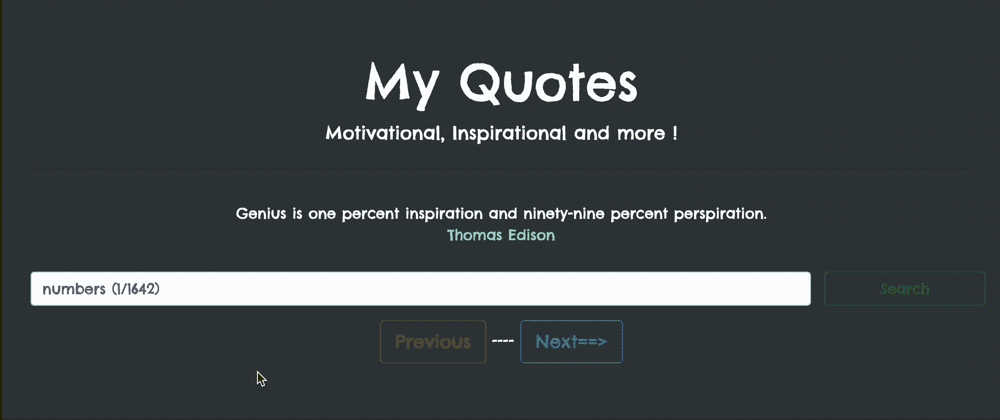

# 使用应用编程接口

使用纯 JavaScript 创建报价生成器网络应用程序

> 原文:[https://www . geesforgeks . org/create-a-quote-generator-web-app-with-pure-JavaScript-using-an-API/](https://www.geeksforgeeks.org/create-a-quote-generator-web-app-with-pure-javascript-using-an-api/)

在本教程中，我们将创建一个网络应用程序，使用应用编程接口获取激励和鼓舞人心的报价。

**应用要求:**

1.  自举 4 CDN
2.  API:https://type . fit/API/quote
3.  Java Script 语言
4.  超文本标记语言

**步骤:**按照以下步骤创建报价生成器。

*   **第一步提取:**我们使用 JavaScript 的内置提取函数从应用编程接口中提取数据。这个函数返回一个承诺。我们将使用 JavaScript 的**内置 HTML** 功能在网页上填充来自 API 的数据

    ## script.js

    ```
    fetch(url).then(function (response) {
           return response.json();
    }).then(function (data) {  
        return response.json();
    }
    ```

*   **下一步和上一步的第 2 步按钮:**我们正在增加和减少我们在变量中设置的值，以从一个报价切换到另一个报价。

    ## script.js

    ```
    let nextthought = document.getElementById("nextthought");
       nextthought.addEventListener("click", function () {
         let countnum = document.getElementById("countnum");

         countnum.value = ++a;

         displaythought(countnum.value, data);
       });

       let previousthought = document.getElementById("previousthought");
       previousthought.addEventListener("click", function () {
         let countnum = document.getElementById("countnum");

         if (countnum.value < 0) {
           let thought = document.getElementById("thought");
           thought.innerHTML = `<b><i>You are at first quote</i></b>`;
         } else {
           a = --countnum.value;

           displaythought(a, data);
         }
       });
    ```

*   **第 3 步搜索按钮:**对于搜索按钮，我们从用户处获取一个值输入，以在我们的数据集中搜索由 API 提供的特定数字，然后将其显示在我们的网页上。

    ## script.js

    ```
    let searchbtn=document.getElementById('searchbtn');
    searchbtn.addEventListener('click',function(){
           let countnum=document.getElementById('countnum');
           let inputsearch=document.getElementById('inputsearch');
           a=inputsearch.value;
           countnum.value=inputsearch.value;
           displaythought(a,data);
    })
    ```

现在，我们将创建 HTML 结构，并结合所有上述 js 部分来执行 API 数据的获取和操作。

## index.html

```
<!DOCTYPE html>
<html lang="en">
  <head>
    <!-- Required meta tags -->
    <meta charset="utf-8" />
    <meta
      name="viewport"
      content="width=device-width, 
               initial-scale=1, 
            shrink-to-fit=no"/>

    <!-- Bootstrap CSS -->
    <link
      rel="stylesheet"
      href=
"https://cdn.jsdelivr.net/npm/bootstrap@4.5.3/dist/css/bootstrap.min.css"
      integrity=
"sha384-TX8t27EcRE3e/ihU7zmQxVncDAy5uIKz4rEkgIXeMed4M0jlfIDPvg6uqKI2xXr2"
      crossorigin="anonymous"/>
    <link href=
"https://fonts.googleapis.com/css2?family=Chelsea+Market&display=swap"
      rel="stylesheet"/>

    <title>My Quotes</title>
    <style>
      body {
        font-family: "Chelsea Market", cursive;
      }
    </style>
  </head>

  <body style="background-color: black; color: white">
    <div class="container">
      <div class="jumbotron text-center bg-dark mt-4">
        <h1 class="display-4">My Quotes</h1>
        <p class="lead">Motivational, Inspirational and more !</p>

        <hr class="my-4" />
        <div id="thought"></div>
        <div class="row">
          <div class="col-lg-10">
            <input
              type="number"
              min="0"
              class="form-control"
              id="inputsearch"
              placeholder="numbers (1/1642)"
              onkeypress="return event.charCode >= 
                       48 && event.charCode <= 57"/>
          </div>

          <button
            type="button"
            class="btn btn-outline-success col-lg-2"
            id="searchbtn">
            Search
          </button>
        </div>
        <div class="container mt-3">
          <button
            class="btn btn-outline-danger btn-lg"
            role="button"
            id="previousthought">
            Previous
          </button>
          <span>----</span>
          <input id="countnum" type="hidden" />
          <button
            class="btn btn-outline-primary btn-lg"
            role="button"
            id="nextthought">
            Next==>
          </button>
        </div>
      </div>
    </div>

    <!-- Optional JavaScript; choose one of the two! -->

    <!-- Option 1: jQuery and Bootstrap Bundle (includes Popper) -->
    <script src=
"https://code.jquery.com/jquery-3.5.1.slim.min.js"
            integrity=
"sha384-DfXdz2htPH0lsSSs5nCTpuj/zy4C+OGpamoFVy38MVBnE+IbbVYUew+OrCXaRkfj"
            crossorigin="anonymous">
    </script>
    <script src=
"https://cdn.jsdelivr.net/npm/bootstrap@4.5.3/dist/js/bootstrap.bundle.min.js"
            integrity=
"sha384-ho+j7jyWK8fNQe+A12Hb8AhRq26LrZ/JpcUGGOn+Y7RsweNrtN/tE3MoK7ZeZDyx"
            crossorigin="anonymous">
    </script>
    <script src="script.js"></script>
  </body>
</html>
```

## script.js

```
let url = "https://type.fit/api/quotes";
fetch(url)
  .then(function (response) {
    return response.json();
  })
  .then(function (data) {
    let a = 0;

    let searchbtn = document.getElementById("searchbtn");
    searchbtn.addEventListener("click", function () {
      let countnum = document.getElementById("countnum");
      let inputsearch = document.getElementById("inputsearch");
      a = inputsearch.value;
      countnum.value = inputsearch.value;
      displaythought(a, data);
    });

    let nextthought = document.getElementById("nextthought");
    nextthought.addEventListener("click", function () {
      let countnum = document.getElementById("countnum");

      countnum.value = ++a;

      displaythought(countnum.value, data);
    });

    let previousthought = document.getElementById("previousthought");
    previousthought.addEventListener("click", function () {
      let countnum = document.getElementById("countnum");

      if (countnum.value < 0) {
        let thought = document.getElementById("thought");
        thought.innerHTML = `<b><i>You are at first quote</i></b>`;
      } else {
        a = --countnum.value;

        displaythought(a, data);
      }
    });

    displaythought(0, data);
  });

function displaythought(index, data) {
  let thought = document.getElementById("thought");

  if (data[index].author == null) {
    data[index].author = "unknown";
  }

  let htmlthought = `<div class="alert alert-outline-primary">
            ${data[index].text}<br>
            <span style="color:#00ffc5;">
                ${data[index].author}
            </span>
        </div>`;
  thought.innerHTML = htmlthought;
}
```

**输出:**
