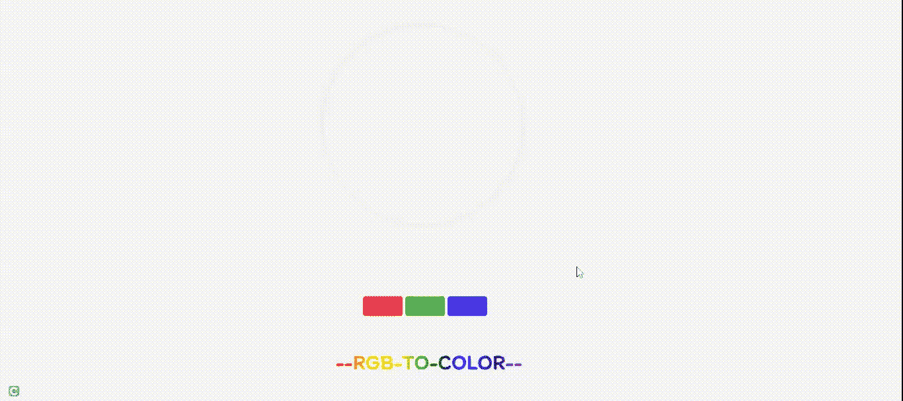

# 使用 JavaScript 创建一个简单的颜色选择器

> 原文:[https://www . geesforgeks . org/create-a-simple-color-picker-use-JavaScript/](https://www.geeksforgeeks.org/create-a-simple-color-picker-using-javascript/)

开发这样的客户端应用程序非常容易。我们所知道的原色是红、绿、蓝，通过混合它们，我们可以形成任何我们想要的颜色。

在本文中，我们将学习从用户那里获取 RGB 值，并使用 CSS 使用 RGB(红、绿、蓝)属性来形成颜色。

**先决条件:**需要具备 HTML、CSS、JavaScript 等一些前端技术的基础知识。

**HTML 代码:**

## 超文本标记语言

```html
<!DOCTYPE html>
<html lang="en">

<head>
    <meta charset="UTF-8">
    <meta http-equiv="X-UA-Compatible" content="IE=edge">
    <meta name="viewport" content=
        "width=device-width, initial-scale=1.0">

    <link rel="stylesheet" href="style.css">
    <link href=
"https://fonts.googleapis.com/css2?family=Itim&display=swap"
        rel="stylesheet">
</head>

<body>
    <div class="neumorphism-3"></div>
    <div class="inpt">
        <input type="number" id="red">
        <input type="number" id="green">
        <input type="number" id="blue">
    </div>
    <h1 class="rainbow-text">--RGB-TO-COLOR--</h1>
    <script src="script.js"></script>
</body>

</html>
```

**CSS 代码:**CSS 中包含了一些额外的线条来获得一个很酷的悬停效果。以下代码是上述 HTML 代码中使用的“styles.css”代码的内容。

**文件名:style.css**

## 半铸钢ˌ钢性铸铁(Cast Semi-Steel)

```html
* {
    padding: 0;
    margin: 0;
    box-sizing: border-box;
}

body {
    background: #f7f7f7;
    padding-top: 14%;
}

.neumorphism-3 {
    width: 300px;
    height: 300px;
    border-radius: 50%;
    box-shadow: -3px -3px 7px #e9e9e9a9,
        3px 3px 7px #e9e9e9a9;
    position: absolute;
    top: 40px;
    left: 490px;
}

.neumorphism-3:hover {
    top: 30px;
    box-shadow: -3px -3px 7px #999999a9,
        -3px -3px 12px #e9e9e9a9,
        3px 3px 7px #999999a9,
        -3px -3px 12px #e9e9e9a9;
    animation: uplift 0.1s 1 linear;
}

.neumorphism-3:not( :hover) {
    animation: downlift 0.1s 1 linear;
    top: 40px;
}

@keyframes uplift {
    0% {
        top: 40px;
    }

    25% {
        top: 37.5px;
    }

    50% {
        top: 35px;
    }

    75% {
        top: 32.5px;
    }

    100% {
        top: 30px;
    }
}

@keyframes downlift {
    0% {
        box-shadow: -3px -3px 7px #999999a9,
            -3px -3px 12px #e9e9e9a9,
            3px 3px 7px #999999a9,
            -3px -3px 12px #e9e9e9a9;
        top: 30px;
    }

    25% {
        box-shadow: -3px -3px 7px #b3b3b3a9,
            -3px -3px 12px #e9e9e9a9,
            3px 3px 7px #b3b3b3a9,
            -3px -3px 12px #e9e9e9a9;
        top: 32.5px;
    }

    50% {
        top: 35px;
        box-shadow: -3px -3px 7px #d6d6d6a9,
            -3px -3px 12px #e9e9e9a9,
            3px 3px 7px #d6d6d6a9,
            -3px -3px 12px #e9e9e9a9;
    }

    75% {
        top: 37.5px;
        box-shadow: -3px -3px 7px #f3f3f3a9,
            -3px -3px 12px #e9e9e9a9,
            3px 3px 7px #f3f3f3a9,
            -3px -3px 12px #e9e9e9a9;
    }

    100% {
        box-shadow: -3px -3px 7px #e9e9e9a9,
            3px 3px 7px #e9e9e9a9;
        top: 40px;
    }
}

div.inpt {
    position: absolute;
    top: 450px;
    left: 550px;
}

div.inpt input {
    height: 30px;
    width: 60px;
    font-size: 30px;
    color: seashell;
    text-align: center;
    opacity: 0.7;
    border: none;
    border-radius: 4px;
}

#red {
    background-color: red;
}

#green {
    background-color: green;
}

#blue {
    background-color: blue;
}

/* Chrome, Safari, Edge */

input::-webkit-outer-spin-button,
input::-webkit-inner-spin-button {
    -webkit-appearance: none;
    margin: 0;
}

/* Firefox */
input[type=number] {
    -moz-appearance: textfield;
}

.rainbow-text {
    background-image: linear-gradient (
            to left, violet, indigo, blue,
            green, yellow, orange, red);
    width: 300px;
    height: 50px;
    -webkit-background-clip: text;
    color: transparent;
    font-family: "Itim";
    text-align: center;
    position: relative;
    top: 340px;
    left: 500px;
}
```

**JavaScript 代码:**以下是上述 HTML 代码中使用的 JavaScript 代码“script.js”。

**文件名:script.js**

## java 描述语言

```html
let red = document.getElementById('red');
let green = document.getElementById('green');
let blue = document.getElementById('blue');
let box = document.querySelector('div.neumorphism-3');

let r = 0, g = 0, b = 0;

red.addEventListener("keyup", function (event) {
    r = red.value;
    if (!r)
        r = 0;
    box.style.backgroundColor = `rgb(${r}, ${g}, ${b})`;
});

green.addEventListener("keyup", function (event) {
    g = green.value;
    if (!g)
        g = 0;
    box.style.backgroundColor = `rgb(${r}, ${g}, ${b})`;
});

blue.addEventListener("keyup", function (event) {
    b = blue.value;
    if (!b)
        b = 0;
    box.style.backgroundColor = `rgb(${r}, ${g}, ${b})`;
});
```

**输出:**运行文件后，可以选择 R、G、B 的具体值，得到自己想要的颜色。



RGB