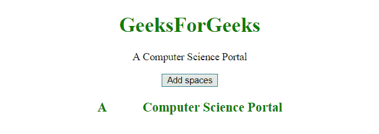
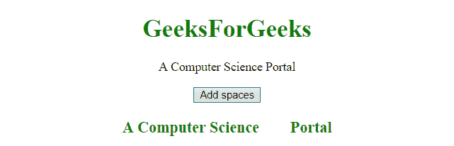

# 在 JavaScript 中创建一个有多个空格的字符串

> 原文:[https://www . geesforgeks . org/create-a-string-with-multi-space-in-JavaScript/](https://www.geeksforgeeks.org/create-a-string-with-multiple-spaces-in-javascript/)

我们有一个带有多余空格的字符串，如果我们想在浏览器中显示它，那么多余的空格将不会显示。向字符串中添加空格数可以通过以下方式完成。

**substr():**
这个方法获取字符串的一部分，从定义位置的字符开始，返回指定数量的字符。

**语法:**

```
string.substr(start, length)

```

**参数:**

*   **开始:**
    此参数为必填项。它指定开始提取的位置。第一个索引从 0 开始。
    *   如果 start 参数为正数，并且大于或等于所提供字符串的长度，则此方法将返回一个空字符串。
    *   如果 start 参数为负，此方法将其用作从字符串末尾开始的索引。
    *   如果 start 参数为负或大于字符串长度，start 将被视为 0。
*   **长度:**此参数可选。它指定要提取的字符数。如果不使用，它将提取整个字符串。

**返回值:**返回一个新字符串，该字符串包含文本的提取部分。如果长度为 0 或负数，它将返回一个空字符串。

**示例-1:** 本示例通过在字符串中添加空格。

```
<!DOCTYPE html>
<html>

<head>
    <title>
        JavaScript 
      | Create a string with multiple spaces.
    </title>
</head>

<body style="text-align:center;" id="body">
    <h1 style="color:green;">  
            GeeksForGeeks  
        </h1>
    <p id="GFG_UP" style="font-size: 16px;">
    </p>
    <button onclick="gfg_Run()">
        Add spaces
    </button>
    <p id="GFG_DOWN" 
       style="color:green;
              font-size: 20px; 
              font-weight: bold;">
    </p>
    <script>
        var el_up = document.getElementById("GFG_UP");
        var el_down = document.getElementById("GFG_DOWN");
        var string = 'A Computer Science Portal';
        el_up.innerHTML = string;

        function gfg_Run() {
            el_down.innerHTML = string.substr(0, 2) + 
              '          ' +
              string.substr(2);
        }
    </script>
</body>

</html>
```

**输出:**

*   **点击按钮前:**
    
*   **点击按钮后:**
    

**示例-2:** 本示例通过 **\xa0(它是一个无中断空格字符)**在字符串中添加空格。

```
<!DOCTYPE html>
<html>

<head>
    <title>
        JavaScript 
      | Create a string with multiple spaces.
    </title>
</head>

<body style="text-align:center;" id="body">
    <h1 style="color:green;">  
            GeeksForGeeks  
        </h1>
    <p id="GFG_UP" style="font-size: 16px;">
    </p>
    <button onclick="gfg_Run()">
        Add spaces
    </button>
    <p id="GFG_DOWN"
       style="color:green;
              font-size: 20px;
              font-weight: bold;">
    </p>
    <script>
        var el_up = document.getElementById("GFG_UP");
        var el_down = document.getElementById("GFG_DOWN");
        var string = 'A Computer Science Portal';
        el_up.innerHTML = string;

        function gfg_Run() {
            el_down.innerHTML = string.substr(0, 18) +
              '\xa0\xa0\xa0\xa0\xa0\xa0\xa0 ' +
              string.substr(18);
        }
    </script>
</body>

</html>
```

**输出:**

*   **点击按钮前:**
    
*   **点击按钮后:**
    